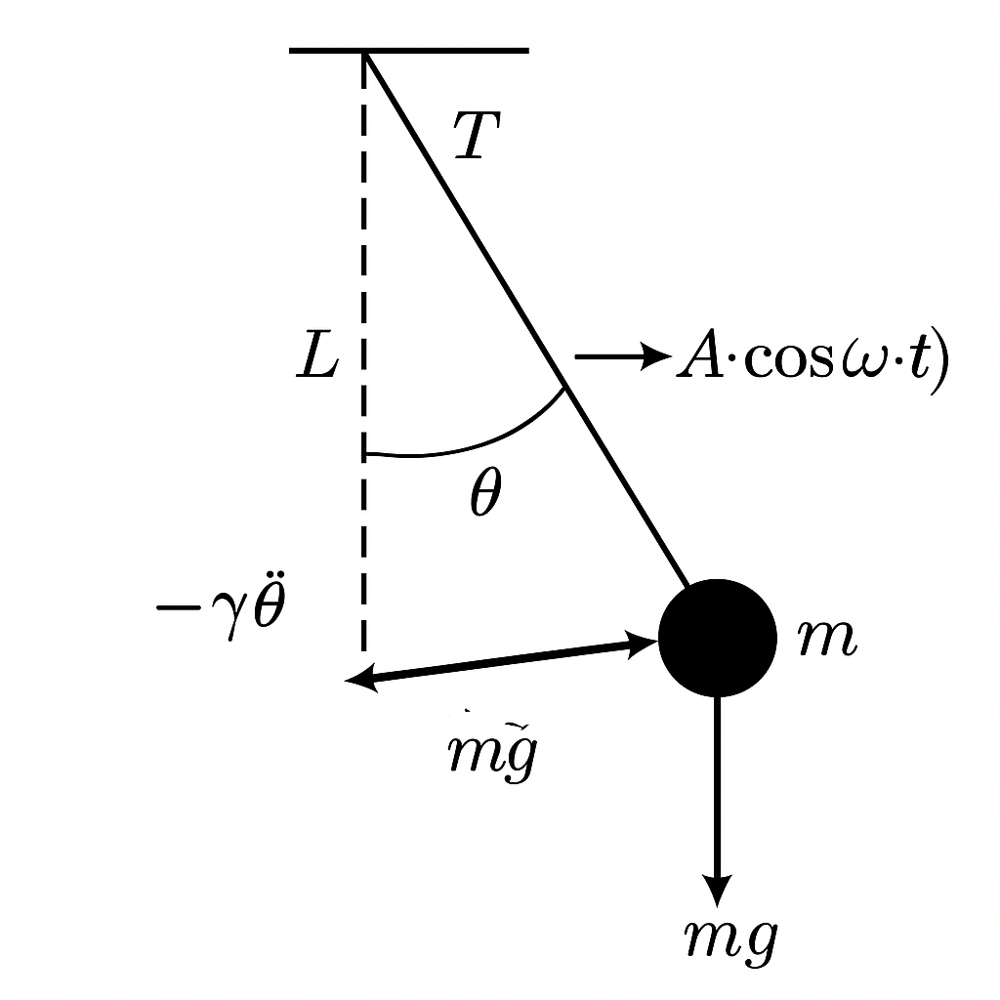

# Problem1
# Investigating the Range as a Function of the Angle of Projection

## **1. Introduction**
Projectile motion is a fundamental concept in physics, describing the motion of an object launched into the air under the influence of gravity. This study explores how the range of a projectile depends on its angle of projection, analyzing the governing equations and simulating various scenarios to derive insights into its behavior. Understanding these principles has practical applications in fields such as sports, engineering, and aerospace

## **2. Motivation**
Projectile motion is not only a fundamental topic in physics but also an essential component in real-world applications. From sports science to military engineering, the ability to predict and manipulate projectile trajectories is crucial. Analyzing the range as a function of the launch angle offers an intuitive yet mathematically rich problem that encapsulates both linear and quadratic relationships. Furthermore, varying initial conditions introduces a wide spectrum of solutions that enhance our understanding of motion in a gravitational field.

## **3. Theoretical Foundation**

### 3.1 Governing Equations

The motion of a projectile launched with an initial velocity \\( v_0 \\) at an angle \\( \\theta \\) is governed by Newton’s laws of motion. We decompose the velocity into horizontal and vertical components:

\\[
v_{0x} = v_0 \cos \theta
\\]

\\[
v_{0y} = v_0 \sin \theta
\\]

The horizontal and vertical motions are analyzed separately:

- **Horizontal Motion:**  
\\[
x = v_{0x} t = v_0 \cos \theta \cdot t
\\]  
Since there is no acceleration in the horizontal direction (assuming no air resistance), motion remains uniform.

  
Show Python Code

  <pre><code class="language-python">
import matplotlib.pyplot as plt
import numpy as np

# Initial parameters
v0 = 20  # initial velocity (m/s)
theta_deg = 45  # launch angle (degrees)
theta_rad = np.radians(theta_deg)

# Time array
t = np.linspace(0, 3.2, 100)

# Horizontal velocity component
v0x = v0 * np.cos(theta_rad)

# Horizontal position
x = v0x * t

# Plotting
plt.figure(figsize=(8, 4))
plt.plot(t, x, color='orange', linewidth=2)
plt.title("Horizontal Motion: x(t) = v₀·cos(θ)·t")
plt.xlabel("Time (s)")
plt.ylabel("Horizontal Position x (m)")
plt.grid(True)
plt.tight_layout()
plt.savefig("grafik_yatay.png")
plt.show()
  </code></pre>

 > The graph shows the horizontal position increasing linearly over time, indicating constant velocity with no horizontal acceleration.

- **Vertical Motion:**  
The vertical motion is influenced by gravity \( g \), with acceleration \( -g \):  
\\[
y = v_{0y} t - \frac{1}{2} g t^2
\\]  
The time of flight \( T \) can be determined by setting \( y = 0 \) (assuming launch and landing occur at the same height):  
\\[
T = \frac{2 v_0 \sin \theta}{g}
\\]

  
Show Python Code

  <pre><code class="language-python">
import matplotlib.pyplot as plt
import numpy as np

# Parameters
v0 = 20  # initial velocity (m/s)
theta_deg = 45
theta_rad = np.radians(theta_deg)
g = 9.81  # gravity (m/s²)

# Time of flight
T = 2 * v0 * np.sin(theta_rad) / g
t = np.linspace(0, T, 100)

# Vertical position
y = v0 * np.sin(theta_rad) * t - 0.5 * g * t**2

# Plot
plt.figure(figsize=(8, 4))
plt.plot(t, y, color='blue', linewidth=2)
plt.title("Vertical Motion: y(t) = v₀·sin(θ)·t - ½·g·t²")
plt.xlabel("Time (s)")
plt.ylabel("Vertical Position y (m)")
plt.grid(True)
plt.tight_layout()
plt.savefig("vertical_motion_simple.png")
plt.show()
  </code></pre>

> The graph shows the vertical position of a projectile over time, forming a symmetric parabola due to gravity.

- **Range Equation:**  
The range \( R \) is the horizontal distance traveled during flight:  
\\[
R = v_{0x} T = v_0 \cos \theta \cdot \frac{2 v_0 \sin \theta}{g}
\\]  
Using the identity \( 2 \sin \theta \cos \theta = \sin 2\theta \), we obtain:  
\\[
R = \frac{v_0^2 \sin 2\theta}{g}
\\]

  
Show Python Code

  <pre><code class="language-python">
import matplotlib.pyplot as plt
import numpy as np

# Parameters
v0 = 18  # example initial velocity (adjust if needed)
g = 9.81  # gravity (m/s²)

# Angle values from 0° to 90°
angles_deg = np.linspace(0, 90, 500)
angles_rad = np.radians(angles_deg)

# Range formula: R = (v0² * sin(2θ)) / g
ranges = (v0**2 * np.sin(2 * angles_rad)) / g

# Use 45° as the max point manually
max_angle = 45
max_range = (v0**2 * np.sin(2 * np.radians(max_angle))) / g

# Plot
plt.figure(figsize=(10, 6))
plt.plot(angles_deg, ranges, color='orange', label='Range')
plt.title("Projectile Range vs Launch Angle")
plt.xlabel("Launch Angle (°)")
plt.ylabel("Range (m)")
plt.grid(True)
plt.legend()

# Annotate 45° max point
plt.plot(max_angle, max_range, 'ro')
plt.text(max_angle, max_range + 2,
         f"Max Range: {max_range:.2f} m\nat {max_angle}°",
         color='red', ha='center', fontsize=10)

plt.xlim(0, 90)
plt.ylim(0, max_range + 10)
plt.tight_layout()
plt.savefig("range_vs_angle.png")
plt.show()
  </code></pre>

> The graph shows how the projectile range changes with launch angle.  
> Maximum range occurs at 45°, as predicted by the equation \( R = \frac{v_0^2 \sin 2\theta}{g} \).

### **3.2 Influence of Initial Conditions**
- **Initial Velocity \( v_0 \)**: Increasing \( v_0 \) results in a larger range since \( R \propto v_0^2 \).
- **Angle \( \theta \)**: The range is maximized at \( \theta = 45^\circ \), as \( \sin 2\theta \) is maximized at this value.
- **Gravitational Acceleration \( g \)**: A higher \( g \) decreases the range since \( R \propto \frac{1}{g} \).

  
Show Python Code

  <pre><code class="language-python">
import numpy as np
import matplotlib.pyplot as plt

# Constants
g_default = 9.81
theta_default_deg = 45
theta_default_rad = np.radians(theta_default_deg)
v0_default = 20

# 1. Range vs Initial Velocity (v0)
v0_values = np.linspace(5, 50, 200)
range_vs_v0 = (v0_values**2 * np.sin(2 * theta_default_rad)) / g_default

# 2. Range vs Launch Angle (θ)
theta_values_deg = np.linspace(0, 90, 200)
theta_values_rad = np.radians(theta_values_deg)
range_vs_theta = (v0_default**2 * np.sin(2 * theta_values_rad)) / g_default

# 3. Range vs Gravity (g)
g_values = np.linspace(1, 25, 200)
range_vs_g = (v0_default**2 * np.sin(2 * theta_default_rad)) / g_values

# Plot
fig, axs = plt.subplots(1, 3, figsize=(18, 4))

axs[0].plot(v0_values, range_vs_v0, color='blue')
axs[0].set_title("Effect of Initial Velocity $v_0$")
axs[0].set_xlabel("Initial Velocity $v_0$ (m/s)")
axs[0].set_ylabel("Range (m)")
axs[0].grid(True)

axs[1].plot(theta_values_deg, range_vs_theta, color='orange', label='Range')
axs[1].axvline(45, color='red', linestyle='--', label='Max Range at 45°')
axs[1].set_title("Effect of Launch Angle $\\theta$")
axs[1].set_xlabel("Launch Angle $\\theta$ (°)")
axs[1].set_ylabel("Range (m)")
axs[1].legend()
axs[1].grid(True)

axs[2].plot(g_values, range_vs_g, color='green')
axs[2].set_title("Effect of Gravitational Acceleration $g$")
axs[2].set_xlabel("Gravity $g$ (m/s²)")
axs[2].set_ylabel("Range (m)")
axs[2].grid(True)

plt.tight_layout()
plt.savefig("influence_of_conditions.png")
plt.show()
  </code></pre>

 
 > The plots illustrate how the projectile range is affected by initial velocity, launch angle, and gravitational acceleration:  
> - Increasing \( v_0 \) leads to a quadratic increase in range.  
> - The range is maximized at \( \theta = 45^\circ \).  
> - As gravity \( g \) increases, the range decreases inversely.

## **4. Analysis of the Range**
We simulate projectile motion for different angles and analyze how the range changes. Below is the Python implementation that computes and plots the range as a function of angle.

  
Show Python Code

  <pre><code class="language-python">
import numpy as np
import matplotlib.pyplot as plt

def compute_range(v0, g=9.81):
    angles = np.linspace(0, 90, 100)  # Angles from 0 to 90 degrees
    ranges = (v0**2 * np.sin(2 * np.radians(angles))) / g
    return angles, ranges

v0 = 20  # Initial velocity in m/s
g = 9.81  # Gravity
angles, ranges = compute_range(v0, g)

plt.figure(figsize=(8,6))
plt.plot(angles, ranges, label=f'v0={v0} m/s')
plt.xlabel("Angle (degrees)")
plt.ylabel("Range (meters)")
plt.title("Range vs Angle of Projection")
plt.legend()
plt.grid()
plt.show()
  </code></pre>

> The range is maximized at 45° for a constant initial speed of 20 m/s.

### **Observations**
- The range is maximum at \( 45^\circ \).
- Symmetry: The range for \( \theta \) and \( 90^\circ - \theta \) is the same.
- Higher initial velocity shifts the curve upward, increasing the range.

  
Show Python Code

  <pre><code class="language-python">
import numpy as np
import matplotlib.pyplot as plt

# Parameters
v0 = 20
g = 9.81
angles = np.linspace(0, 90, 500)
ranges = (v0**2 * np.sin(2 * np.radians(angles))) / g

# Complementary angles
theta1 = 30
theta2 = 60
range1 = (v0**2 * np.sin(2 * np.radians(theta1))) / g
range2 = (v0**2 * np.sin(2 * np.radians(theta2))) / g
max_range = np.max(ranges)

# Plot
fig, ax = plt.subplots(figsize=(10, 6))
ax.plot(angles, ranges, color='orange', label='Range vs Angle')
ax.axvline(45, color='red', linestyle='--', label='Max Range at 45°')

# Title and labels
plt.title("Range Symmetry for Complementary Angles", fontsize=14, pad=40)
ax.set_xlabel("Launch Angle (°)")
ax.set_ylabel("Range (m)")

# Symmetry text JUST below the title, inside the plot
ax.text(45, ax.get_ylim()[1]*0.95, 'Symmetry', color='blue', ha='center', fontsize=12, weight='bold')

# Complementary angle points
ax.plot(theta1, range1, 'bo')
ax.plot(theta2, range2, 'bo')
ax.text(theta1, range1 + 2, '30°', color='blue', ha='center', fontsize=10)
ax.text(theta2, range2 + 2, '60°', color='blue', ha='center', fontsize=10)

# Final touches
ax.legend()
ax.grid(True)
plt.tight_layout()
plt.savefig("range_symmetry_clean.png")
plt.show()
  </code></pre>

  
This graph illustrates the effect of launch angle on the projectile range.  
It clearly shows that the range is maximized at \( 45^\circ \), and that there is symmetry between complementary angles such as \( 30^\circ \) and \( 60^\circ \), which result in the same range.

## **5. Practical Applications**
This model is used in various real-world scenarios:
- **Sports Science**: Optimizing angles for long jumps, soccer kicks, or basketball shots.
- **Engineering**: Missile and rocket trajectory predictions.
- **Astrophysics**: Predicting planetary motion and interstellar object trajectories.

### **Limitations and Extensions**
- **Air Resistance**: Real-world projectiles experience drag, altering trajectories.
- **Variable Gravity**: In non-uniform gravitational fields, adjustments are required.
- **Uneven Terrain**: When launch and landing heights differ, new equations emerge.

## **6. Conclusion**
This study analyzed projectile range dependence on launch angle using fundamental physics principles and numerical simulations. The results align with theoretical predictions, showing that the range is maximized at \( 45^\circ \). The simplicity of the model makes it a valuable tool for understanding motion dynamics, though real-world factors such as air resistance and varying terrain must be considered for more accurate predictions.