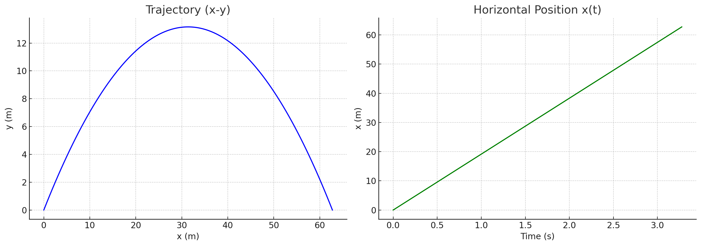
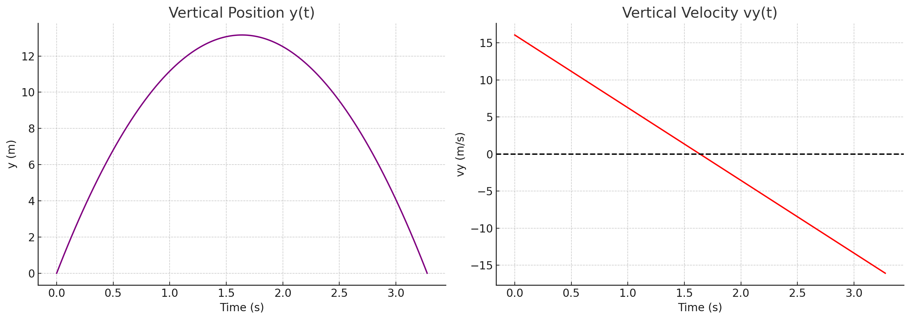
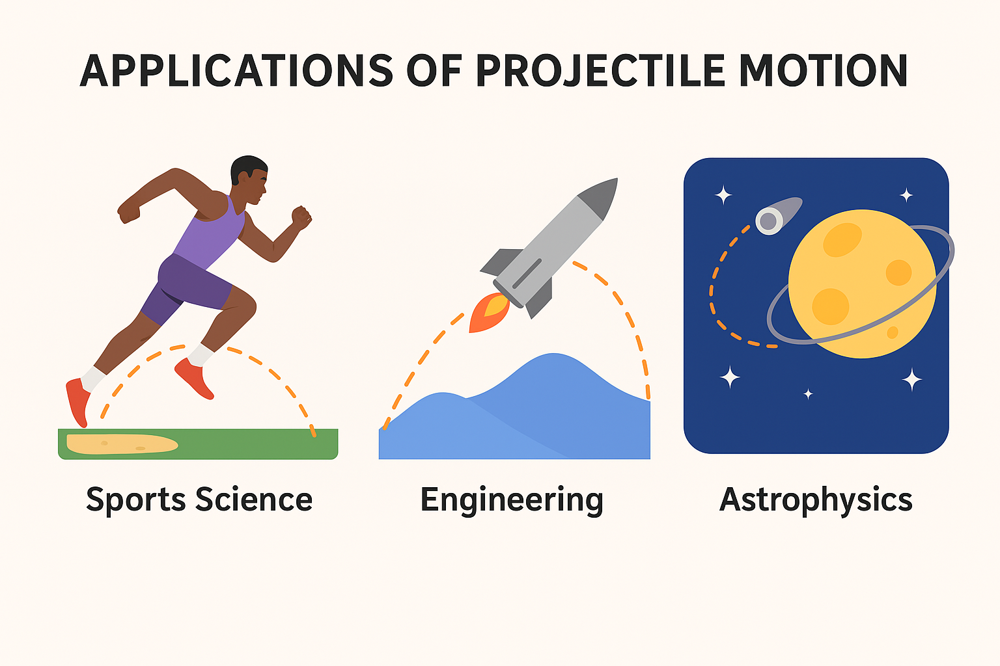

# Problem1
# Investigating the Range as a Function of the Angle of Projection

## **1. Introduction**
Projectile motion is a fundamental concept in physics, describing the motion of an object launched into the air under the influence of gravity. This study explores how the range of a projectile depends on its angle of projection, analyzing the governing equations and simulating various scenarios to derive insights into its behavior. Understanding these principles has practical applications in fields such as sports, engineering, and aerospace

*This figure illustrates projectile motion. Red arrows indicate horizontal velocity, green arrows show vertical velocity. Maximum height and range are labeled.*

## **2. Motivation**
Projectile motion is not only a fundamental topic in physics but also an essential component in real-world applications. From sports science to military engineering, the ability to predict and manipulate projectile trajectories is crucial. Analyzing the range as a function of the launch angle offers an intuitive yet mathematically rich problem that encapsulates both linear and quadratic relationships. Furthermore, varying initial conditions introduces a wide spectrum of solutions that enhance our understanding of motion in a gravitational field.

## **3. Theoretical Foundation**

### 3.1 Governing Equations

The motion of a projectile launched with an initial velocity \\( v_0 \\) at an angle \\( \\theta \\) is governed by Newton’s laws of motion. We decompose the velocity into horizontal and vertical components:

\\[
v_{0x} = v_0 \cos \theta
\\]

\\[
v_{0y} = v_0 \sin \theta
\\]

The horizontal and vertical motions are analyzed separately:


- **Horizontal Motion:**  
\\[
x = v_{0x} t = v_0 \cos \theta \cdot t
\\]  
Since there is no acceleration in the horizontal direction (assuming no air resistance), motion remains uniform.


These graphs show the projectile trajectory (left) and the horizontal displacement over time (right).
- **Vertical Motion:**  
The vertical motion is influenced by gravity \( g \), with acceleration \( -g \):  
\\[
y = v_{0y} t - \frac{1}{2} g t^2
\\]  
The time of flight \( T \) can be determined by setting \( y = 0 \) (assuming launch and landing occur at the same height):  
\\[
T = \frac{2 v_0 \sin \theta}{g}
\\]


These graphs show the vertical position over time (left) and the vertical velocity affected by gravity (right).
- **Range Equation:**  
The range \( R \) is the horizontal distance traveled during flight:  
\\[
R = v_{0x} T = v_0 \cos \theta \cdot \frac{2 v_0 \sin \theta}{g}
\\]  
Using the identity \( 2 \sin \theta \cos \theta = \sin 2\theta \), we obtain:  
\\[
R = \frac{v_0^2 \sin 2\theta}{g}
\\]


This graph shows how the launch angle affects the total range of the projectile.  
Maximum range of **63.71 meters** is achieved at a launch angle of **45°**.


### **3.2 Influence of Initial Conditions**
- **Initial Velocity \( v_0 \)**: Increasing \( v_0 \) results in a larger range since \( R \propto v_0^2 \).
- **Angle \( \theta \)**: The range is maximized at \( \theta = 45^\circ \), as \( \sin 2\theta \) is maximized at this value.
- **Gravitational Acceleration \( g \)**: A higher \( g \) decreases the range since \( R \propto \frac{1}{g} \).


These graphs demonstrate how the projectile range is influenced by each of the initial conditions:

- The left graph shows that increasing the initial velocity \( v_0 \) results in a quadratic increase in range, consistent with \( R \propto v_0^2 \).
- The center graph confirms that the optimal launch angle is \( 45^\circ \), where \( \sin 2\theta \) is maximized.
- The right graph illustrates the inverse relationship between gravitational acceleration \( g \) and range, as expected from \( R \propto \frac{1}{g} \).


## **4. Analysis of the Range**
We simulate projectile motion for different angles and analyze how the range changes. Below is the Python implementation that computes and plots the range as a function of angle.

```python
import numpy as np
import matplotlib.pyplot as plt

def compute_range(v0, g=9.81):
    angles = np.linspace(0, 90, 100)  # Angles from 0 to 90 degrees
    ranges = (v0**2 * np.sin(2 * np.radians(angles))) / g
    return angles, ranges

v0 = 20  # Initial velocity in m/s
g = 9.81  # Gravity
angles, ranges = compute_range(v0, g)

plt.figure(figsize=(8,6))
plt.plot(angles, ranges, label=f'v0={v0} m/s')
plt.xlabel("Angle (degrees)")
plt.ylabel("Range (meters)")
plt.title("Range vs Angle of Projection")
plt.legend()
plt.grid()
plt.show()
```

### **Observations**
- The range is maximum at \( 45^\circ \).
- Symmetry: The range for \( \theta \) and \( 90^\circ - \theta \) is the same.
- Higher initial velocity shifts the curve upward, increasing the range.


This graph illustrates the effect of launch angle on the projectile range.  
It clearly shows that the range is maximized at \( 45^\circ \), and that there is symmetry between complementary angles such as \( 30^\circ \) and \( 60^\circ \), which result in the same range.

## **5. Practical Applications**
This model is used in various real-world scenarios:
- **Sports Science**: Optimizing angles for long jumps, soccer kicks, or basketball shots.
- **Engineering**: Missile and rocket trajectory predictions.
- **Astrophysics**: Predicting planetary motion and interstellar object trajectories.



### **Limitations and Extensions**
- **Air Resistance**: Real-world projectiles experience drag, altering trajectories.
- **Variable Gravity**: In non-uniform gravitational fields, adjustments are required.
- **Uneven Terrain**: When launch and landing heights differ, new equations emerge.

## **6. Conclusion**
This study analyzed projectile range dependence on launch angle using fundamental physics principles and numerical simulations. The results align with theoretical predictions, showing that the range is maximized at \( 45^\circ \). The simplicity of the model makes it a valuable tool for understanding motion dynamics, though real-world factors such as air resistance and varying terrain must be considered for more accurate predictions.

