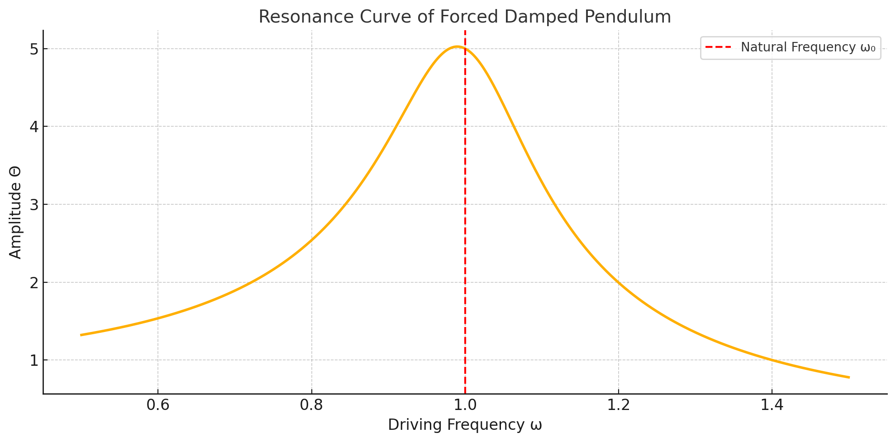

---

# **Investigating the Range as a Function of the Angle of Projection**

## **Introduction**

Projectile motion is a fundamental concept in classical mechanics that describes the motion of an object under the influence of gravity. Although seemingly simple, this problem provides deep insights into physics and mathematical modeling. This study aims to explore how the range of a projectile depends on the angle of projection, and how variations in other parameters such as initial velocity and gravitational acceleration influence the trajectory.

---

## **Newton's Laws and Governing Equations**

Newton’s laws of motion are the foundation for analyzing projectile motion. The relevant principles include:

**First Law (Inertia):**  
A projectile in motion will continue in motion unless acted upon by an external force.  
In the absence of air resistance, no external horizontal forces act on the projectile.

**Second Law (Force and Acceleration):**  
The force acting on a projectile is proportional to its mass, and the resulting acceleration is given by:  
F = m · a

For projectile motion, the only force acting is gravity, so the vertical acceleration is:  
aᵧ = −g

where `g = 9.81 m/s²` is the gravitational acceleration on Earth.

**Third Law (Action and Reaction):**  
For every action, there is an equal and opposite reaction.  
This is important when considering propulsion systems but does not affect the basic projectile motion equations.


---

## **Derivation of the Equations of Motion**

Consider a projectile launched with an initial velocity `v₀` at an angle `θ` to the horizontal. The components of the initial velocity are:

**Horizontal velocity component:**  
v₀ₓ = v₀ · cos(θ)

**Vertical velocity component:**  
v₀ᵧ = v₀ · sin(θ


  

### **Horizontal Motion**

Since there is no horizontal acceleration (ignoring air resistance), the horizontal velocity remains constant:

**Acceleration:**  
aₓ = 0

**Velocity:**  
vₓ = v₀ · cos(θ)

**Displacement:**  
x(t) = v₀ · cos(θ) · t


  

### **Vertical Motion**

The vertical motion is affected by gravity. The vertical velocity decreases over time due to the downward acceleration:

**Acceleration:**  
aᵧ = −g

**Velocity:**  
vᵧ(t) = v₀ · sin(θ) − g · t

**Displacement:**  
y(t) = v₀ · sin(θ) · t − (1/2) · g · t²

  


### **Time of Flight**

To find the total time of flight, we set the vertical displacement `y(t)` to zero when the projectile reaches the ground:

0 = v₀ · sin(θ) · t − (1/2) · g · t²

Solving for `t`, we get the total time of flight:

t = (2 · v₀ · sin(θ)) / g


### **Range Equation**

The range (R) is the horizontal distance traveled during the time of flight. Using the equation for horizontal displacement:

R = v₀ · cos(θ) · t

Substituting the expression for time (t), we get:

R = (v₀² · sin(2θ)) / g

This equation shows that the range (R) depends on the angle of projection (θ) and is maximized when θ = 45°.


---

## **Analysis of the Range**

Now, let’s analyze how the range \( R \) depends on different parameters:

### **Effect of the Angle of Projection**
The range `R(θ) = (v₀² * sin(2θ)) / g` reaches its maximum when `θ = 45°`. This is because the function `sin(2θ)` is maximized when `2θ = 90°`, or in other words, when `θ = 45°`.
Below is a visual representation of this concept:


### **Effect of the Initial Velocity**
The range increases quadratically with the initial velocity. This means that for higher initial speeds, the range will be much greater. Mathematically, this is seen in the term `v₀²` in the range equation.


*Figure 3: The range increases proportionally to the square of the initial velocity (v₀²) at a constant launch angle of 45°.*


### **Effect of Gravitational Acceleration**
The range decreases as gravitational acceleration (`g`) increases. This is evident in the denominator of the range equation, which shows an inverse relationship between `g` and `R`. On other planets with lower gravity, the range would be greater for the same initial velocity and launch angle.


---

## **Practical Applications**

Projectile motion is widely applicable in various real-world scenarios:

- **Sports:** In basketball, understanding the optimal launch angle for maximum shooting range.  
- **Engineering:** In missile or rocket trajectory design, where optimizing the launch angle is crucial for hitting a target.  
- **Astrophysics:** Understanding the trajectories of projectiles like meteorites or spacecraft within different gravitational fields.


---

## Computational Implementation

We can simulate the range as a function of the angle for different initial conditions using the following Python code:

```python
import numpy as np
import matplotlib.pyplot as plt

def projectile_range(v0, g=9.81):
    angles = np.linspace(0, 90, 100)
    ranges = (v0**2 * np.sin(2 * np.radians(angles))) / g
    return angles, ranges

v0 = 20  # Initial velocity in m/s
angles, ranges = projectile_range(v0)

plt.figure(figsize=(8, 6))
plt.plot(angles, ranges, label=f'v0 = {v0} m/s')
plt.xlabel('Angle of Projection (degrees)')
plt.ylabel('Range (meters)')
plt.title('Range as a Function of Angle of Projection')
plt.legend()
plt.grid()
plt.show()
```

## Limitations and Suggestions for Extensions

- **No Air Resistance:** The model assumes no air drag, which is not the case in real-world scenarios. Adding air resistance would require more complex modeling (e.g., using drag coefficients).
- **Uneven Terrain:** This model assumes a flat surface. For projectile motion on sloped terrain, the equations need to be adjusted.
- **Variable Gravity:** The model uses the gravitational constant `g = 9.81 m/s²`, which is specific to Earth. For other celestial bodies, the value of `g` would need to be adjusted (e.g., Mars has `g = 3.71 m/s²`).

## Conclusion

This study thoroughly examines how the range of a projectile depends on its launch angle, initial velocity, and gravitational acceleration. Theoretical calculations were coupled with computational simulations to illustrate the effect of varying parameters on the projectile's trajectory. Finally, the limitations of the idealized model were discussed, and potential extensions were suggested for more realistic scenarios.