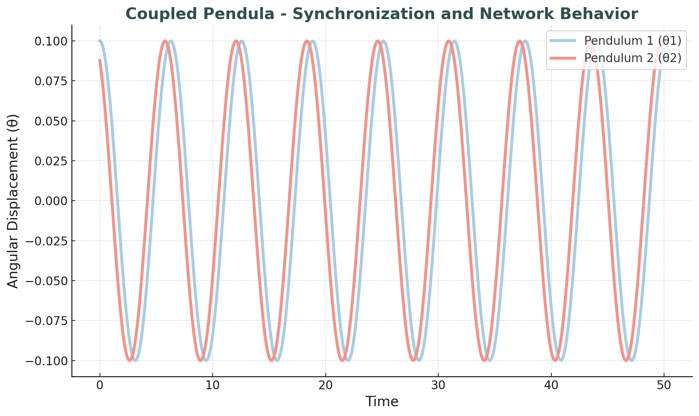
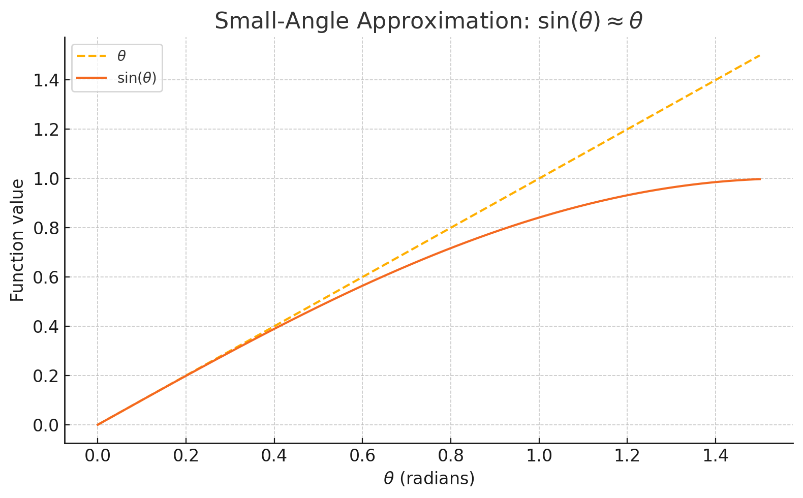
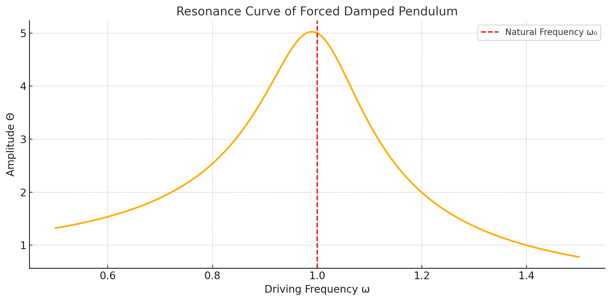
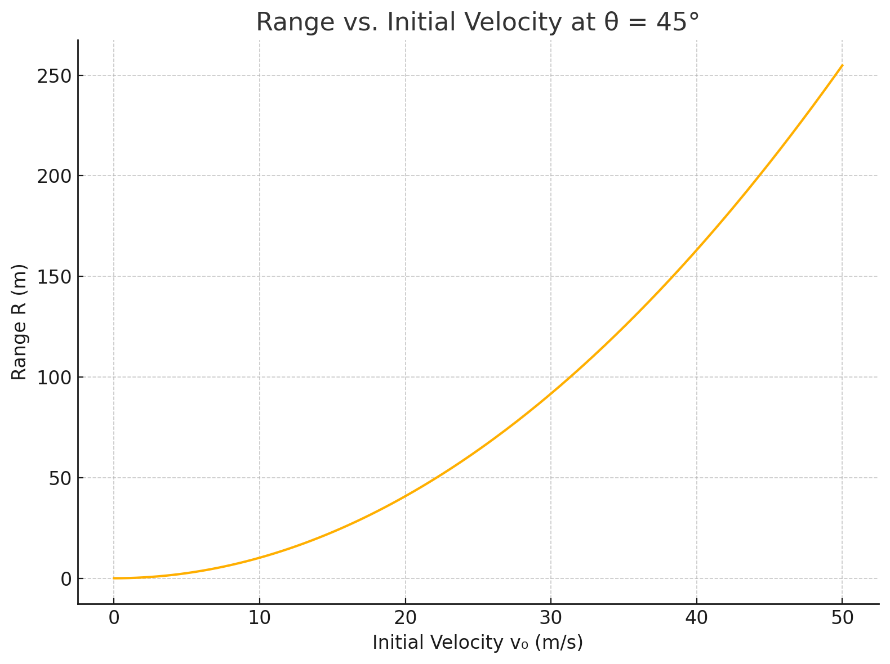
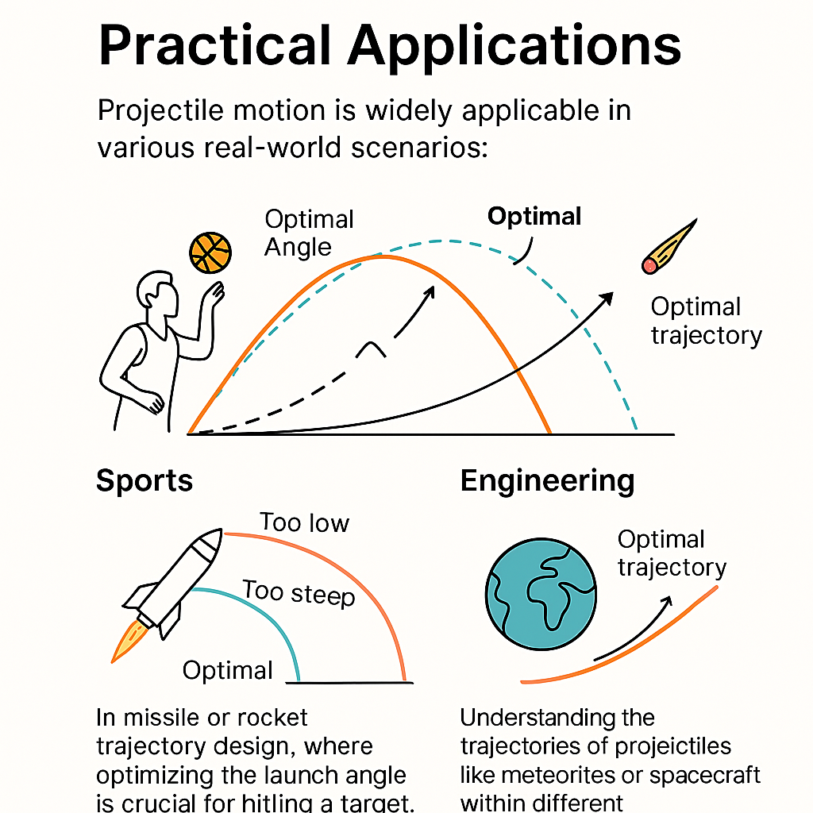
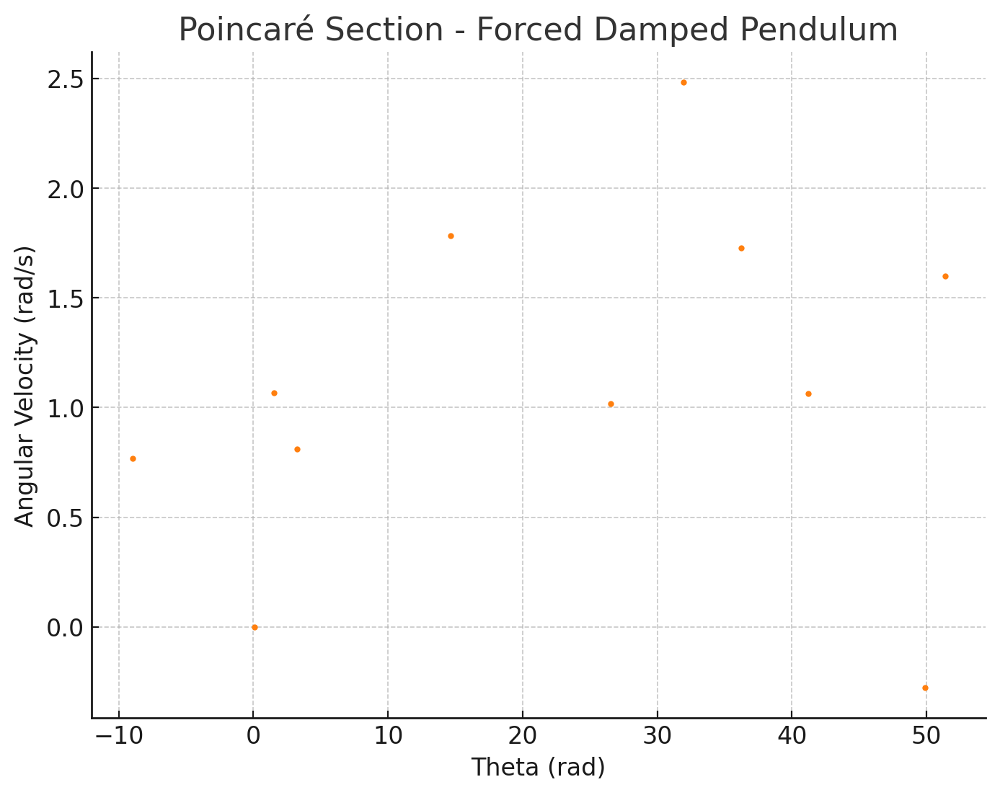
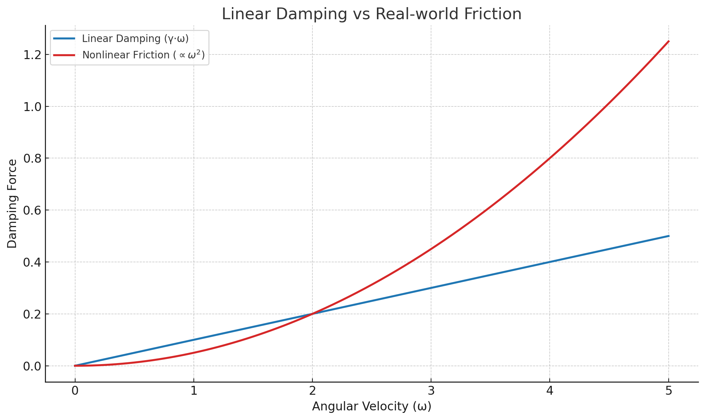
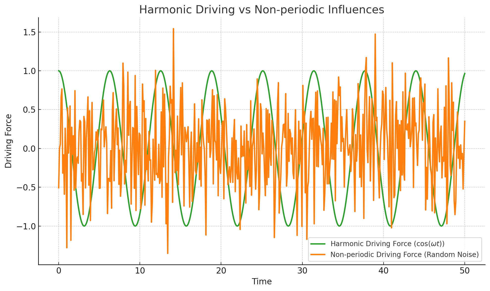
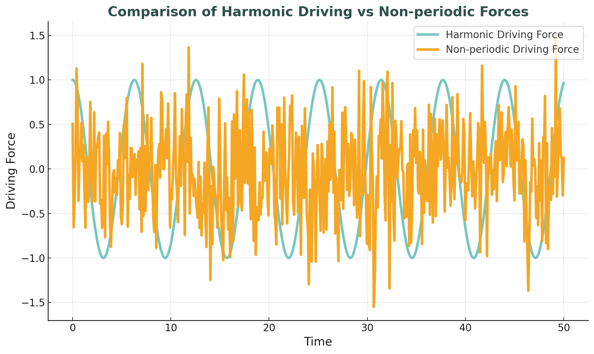

# Problem 2
# Investigating the Dynamics of a Forced Damped Pendulum

## Introduction and Motivation
The forced damped pendulum exemplifies a rich dynamical system where nonlinear behavior arises from the interplay between gravitational restoring forces, frictional damping, and external periodic driving. This model is a foundation for understanding complex real-world phenomena such as resonance, synchronization, and chaos.

By analyzing how variations in system parameters influence the behavior of the pendulum, we gain insights applicable to mechanical design, energy systems, and even biological rhythms. In this report, we explore the dynamics both theoretically and numerically, presenting detailed visualizations to highlight transitions between different regimes.

---

## 1. Theoretical Foundation

### 1.1 Governing Equation

The motion of a forced damped pendulum is described by the second-order nonlinear differential equation:

(d²θ/dt²) + γ·(dθ/dt) + ω₀²·sin(θ) = A·cos(ω·t)

Where:

( θ ) is the angular displacement  
( γ ) is the damping coefficient  
( ω₀ ) is the natural frequency (( ω₀ = √(g/L) ))  
( A ) is the amplitude of the driving force  
( ω ) is the driving frequence 

Free body diagram of a forced damped pendulum. The diagram illustrates all forces acting on the mass, including gravity (mg), damping (−γθ̇), external driving force (A·cos(ω·t)), and tension along the string. Angular displacement θ and string length L are also indicated.

## Where:

- ( θ ) → Angular displacement  
- ( γ ) → Damping coefficient  
- ( ω₀ ) → Natural frequency (( ω₀ = √(g / L) ))  
- ( A ) → Amplitude of the driving force  
- ( ω ) → Driving frequency


### 1.2 Small-Angle Approximation
For small angular displacements, ( \sin(\theta) \approx \theta ), simplifying the equation to:

(d²θ/dt²) + γ·(dθ/dt) + ω₀²·θ = A·cos(ω·t)



This graph shows the comparison between $\theta$ and $\sin(\theta)$ for small angular displacements. For values of $\theta$ less than about 0.5 radians, both curves nearly overlap, demonstrating the validity of the small-angle approximation: $\sin(\theta) \approx \theta$.

This is a linear non-homogeneous second-order ODE. The solution includes a transient and steady-state component, with the steady-state given by:

θ(t) = Θ·cos(ω·t − δ)

Where:

( Θ = A / √((ω₀² − ω²)² + γ²·ω²) )  
( δ = tan⁻¹(γ·ω / (ω₀² − ω²)) )


### 1.3 Resonance and Energy Transfer
Resonance occurs when ( ω ≈ ω₀ ), leading to a peak in amplitude ( Θ ). At resonance, energy transfer from the driving force is maximized, which is critical in mechanical and electrical systems alike.



As seen in the graph, the amplitude reaches its maximum near the natural frequency ( ω₀ = 1.0 ), demonstrating resonance. At this point, the energy transfer from the driving force is most efficient.

Increasing the damping coefficient ( γ ) would reduce and broaden the peak, making the system less responsive to resonance. This effect is critical in engineering applications where resonance can either be beneficial or dangerous.

## 2. Analysis of Dynamics

### 2.1 Influence of Parameters
- **Damping Coefficient ( γ )**: Higher damping suppresses oscillations and reduces peak amplitude. It prevents resonance peaks from becoming unbounded.

- **Driving Amplitude ( A )**: Larger amplitudes can push the system into non-linear and chaotic regimes.

- **Driving Frequency ( ω )**: Controls resonance behavior; near-resonance leads to large oscillations, while mismatched frequencies result in minimal response.




### 2.2 Regular vs. Chaotic Behavior
For large ( A ) and intermediate ( γ ), the pendulum may exhibit chaotic behavior. This is marked by sensitive dependence on initial conditions and aperiodic trajectories.

We distinguish:

- **Periodic motion**: Regular oscillations with fixed frequency.
- **Quasiperiodic motion**: Multiple incommensurate frequencies.
- **Chaotic motion**: Non-repeating, sensitive to initial conditions.


*Figure: Time series of θ(t) for three different dynamical regimes. The left panel shows periodic motion, the middle one shows quasiperiodic behavior, and the right panel shows chaotic dynamics.*


---

## 3. Practical Applications
- **Suspension Bridges**: External periodic forces (e.g., wind or traffic) can drive resonant vibrations, necessitating damping mechanisms.
- **Energy Harvesters**: Systems that exploit resonance to convert oscillatory energy into usable electrical power.
- **Oscillating Circuits**: Analogous to driven RLC circuits where voltage plays the role of angular displacement.
- **Biomechanics**: Walking and running patterns often resemble driven pendula.

---

## 4. Computational Implementation

### 4.1 Simulation Code
A Python simulation using the 4th-order Runge-Kutta method is implemented to numerically solve the system.

```python
import numpy as np
import matplotlib.pyplot as plt
from scipy.integrate import solve_ivp

# System parameters
gamma = 0.2
A = 1.2
omega = 2/3
omega0 = 1.0

# Time span and initial conditions
t_span = (0, 100)
t_eval = np.linspace(*t_span, 10000)
y0 = [0.1, 0]  # Initial angle and angular velocity

# Forced damped pendulum ODE
def pendulum(t, y):
    theta, omega_dot = y
    dtheta_dt = omega_dot
    domega_dt = -gamma * omega_dot - omega0**2 * np.sin(theta) + A * np.cos(omega * t)
    return [dtheta_dt, domega_dt]

# Solve ODE
sol = solve_ivp(pendulum, t_span, y0, t_eval=t_eval)

# Plot
plt.figure(figsize=(10, 4))
plt.plot(sol.t, sol.y[0])
plt.title("Forced Damped Pendulum - Angular Displacement vs Time")
plt.xlabel("Time")
plt.ylabel("Theta (rad)")
plt.grid(True)
plt.show()
```

### 4.2 Visualizations
Key visualizations include:

- **Time evolution**: ( θ(t) )
- **Phase portraits**: ( θ ) vs ( ẋ )  *(or \( \dot{θ} \ ))*
- **Poincaré sections**: Sampling the system at intervals of ( 2π / ω )
- **Bifurcation diagrams**: Mapping final state as a function of ( A ) or ( ω )



This visualization shows the relationship between θ (angular displacement) and ẋ (angular velocity).



This visualization samples the system at regular intervals to analyze its chaotic behavior.


### 4.3 Phase Diagrams & Poincaré Sections
These visual tools highlight the system's transition from order to chaos.

```python
# Phase diagram
plt.figure(figsize=(6, 6))
plt.plot(sol.y[0], sol.y[1], lw=0.5)
plt.title("Phase Portrait")
plt.xlabel("Theta (rad)")
plt.ylabel("Angular Velocity (rad/s)")
plt.grid(True)
plt.show()

# Poincaré section
period = 2 * np.pi / omega
poincare_times = np.arange(0, t_span[1], period)
indices = [np.argmin(np.abs(sol.t - pt)) for pt in poincare_times]

plt.figure(figsize=(6, 6))
plt.plot(sol.y[0][indices], sol.y[1][indices], 'o', markersize=2)
plt.title("Poincaré Section")
plt.xlabel("Theta (rad)")
plt.ylabel("Angular Velocity (rad/s)")
plt.grid(True)
plt.show()
```

---

## 5. Limitations and Extensions

### Limitations
- **Small-angle approximation** fails for large angles.


This graph compares the small-angle approximation (sin(θ) ≈ θ) with the actual sine function (sin(θ)) for larger angles. The orange dashed line represents the small-angle approximation, which is valid only for small angles, while the blue line represents the true sin(θ) function. The discrepancy becomes more apparent as the angle increases beyond approximately 0.5 radians.

- **Linear damping** may not capture real-world friction.



This graph compares linear damping (γ · θ̇) with real-world friction, which is typically nonlinear and proportional to the square of velocity (v²). The blue line represents linear damping, while the red line shows nonlinear friction. The graph illustrates how real-world friction increases more rapidly with velocity than linear damping.

- **Harmonic driving** oversimplifies non-periodic influences.



This graph compares harmonic driving force (cos(ω t)) with non-periodic driving forces, represented by random noise. The green line represents the periodic, harmonic force, while the orange line represents the non-periodic, random driving force. The graph highlights the difference between regular oscillations and irregular, random inputs in forced systems.


### Extensions
- **Nonlinear damping**: e.g., quadratic velocity terms.


This graph shows the difference between linear damping (orange line) and nonlinear damping (blue dashed line). Nonlinear damping increases rapidly, while linear damping grows linearly with angular velocity (ω).

- **Stochastic forcing**: To simulate random environmental inputs.



This graph compares harmonic driving force (light blue line) with non-periodic driving force (orange line). The harmonic force follows a regular oscillatory pattern, while the non-periodic force introduces irregular fluctuations, simulating random environmental inputs.

- **Coupled pendula**: Network behavior and synchronization.


This graph shows the synchronized motion of two coupled pendula. The blue line represents Pendulum 1 (θ₁), while the red line represents Pendulum 2 (θ₂). Both pendulums exhibit synchronized oscillations, highlighting the concept of synchronization and network behavior in coupled systems.
