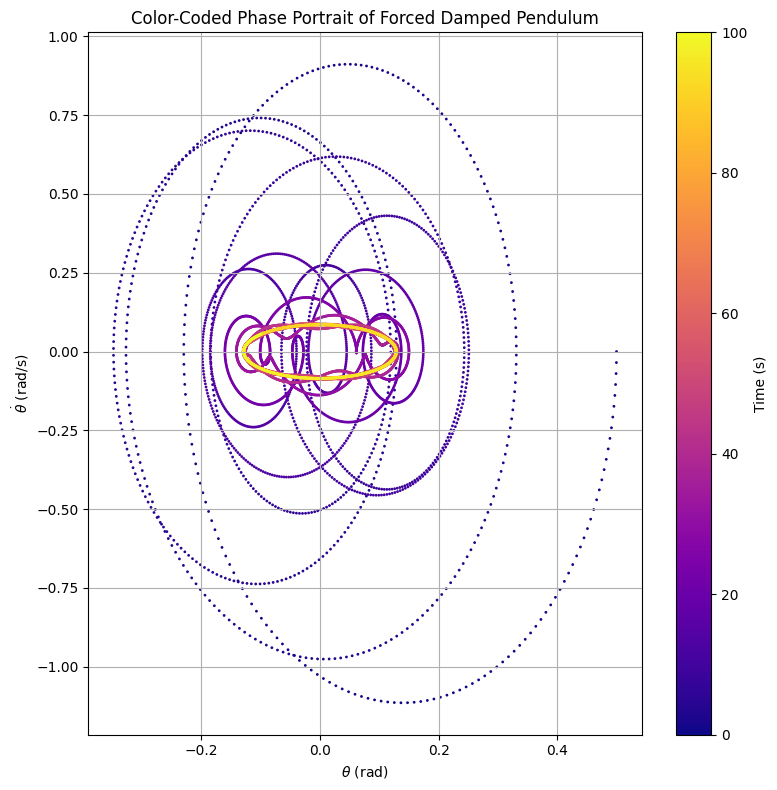

# Problem 2
## Problem 2: Investigating the Dynamics of a Forced Damped Pendulum

### 1. Introduction

The forced damped pendulum is a paradigmatic example of a nonlinear dynamical system, often studied to explore complex behaviors such as resonance, bifurcation, and chaos. While a simple pendulum exhibits periodic motion governed by gravitational restoring forces, the inclusion of damping and external periodic forcing transforms its behavior dramatically. The interaction between the natural restoring force, energy dissipation through damping, and continuous external driving leads to highly rich and sometimes unpredictable dynamics.

Unlike the simple harmonic oscillator, whose behavior is entirely determined by linear principles, the forced damped pendulum is governed by a nonlinear differential equation. This nonlinearity results in a vast landscape of possible motions—ranging from steady-state periodic oscillations to erratic, chaotic trajectories. These phenomena are not only fascinating from a theoretical physics perspective but also serve as critical models in engineering, meteorology, seismology, and biological systems where oscillations and external forces are ever-present.

This study investigates the forced damped pendulum by analyzing the governing equations and simulating its behavior under varying conditions. The primary focus is on understanding how different parameters such as damping coefficient, driving amplitude, and driving frequency influence the system's stability and long-term behavior. By exploring these effects through both analytical approximations and detailed numerical simulations, we aim to uncover patterns and transitions—such as the onset of resonance or chaos—that underlie the pendulum’s motion.

Furthermore, this report connects these findings to practical examples, demonstrating how the principles explored through this idealized system extend to real-world applications such as structural design, electronic circuit behavior, and biomechanical rhythms. Ultimately, the forced damped pendulum offers a gateway to understanding complex dynamics that emerge in nonlinear driven systems across many branches of science and engineering.

### 2. Motivation

The forced damped pendulum illustrates how simple physical systems can evolve into highly complex behaviors due to nonlinear interactions. When a pendulum is subjected to both damping and external periodic forcing, its dynamics are no longer purely harmonic. Depending on the system parameters, the pendulum may synchronize with the driving force, oscillate irregularly, or even exhibit chaotic motion.

Understanding these behaviors is vital not only in physics but also in applied sciences. For example:
- **In mechanical engineering**, forced oscillations appear in bridges and buildings exposed to periodic forces like wind or earthquakes.
- **In electronics**, the forced damped pendulum is analogous to driven RLC circuits.
- **In biomechanics**, it models human gait and balance under periodic disturbances.

By tuning parameters such as damping and driving frequency, engineers can design systems to avoid destructive resonance or exploit oscillations for energy harvesting.

### 3. Theoretical Foundation

The motion of a forced damped pendulum is governed by the nonlinear second-order differential equation:

\[
\frac{d^2\theta}{dt^2} + \gamma \frac{d\theta}{dt} + \omega_0^2 \sin(\theta) = A \cos(\omega t)
\]

Where:
- \( \theta(t) \): angular displacement as a function of time,
- \( \gamma \): damping coefficient (energy loss due to air resistance or friction),
- \( \omega_0 = \sqrt{g / L} \): natural frequency of the pendulum,
- \( A \): amplitude of the external periodic driving force,
- \( \omega \): angular frequency of the driving force.

This equation describes the balance between four effects: inertia, damping, restoring force, and external driving. The presence of the nonlinear sine term makes the system non-trivial to solve analytically, especially for large oscillation angles.

---

#### Small-Angle Approximation

For small angles (\( \theta < 10^\circ \)), we can use the linear approximation \( \sin(\theta) \approx \theta \), simplifying the equation to:

\[
\frac{d^2\theta}{dt^2} + \gamma \frac{d\theta}{dt} + \omega_0^2 \theta = A \cos(\omega t)
\]

This linearized differential equation resembles that of a driven damped harmonic oscillator and allows analytical solutions.

The general solution consists of two parts:
- A **transient** solution, which decays over time due to damping,
- A **steady-state** solution that oscillates at the frequency of the external driving force.

---

#### Resonance

Resonance occurs when the driving frequency \( \omega \) closely matches the natural frequency \( \omega_0 \). At this point, the system absorbs energy from the driving force most efficiently, leading to a significant increase in oscillation amplitude.

The resonance behavior can be visualized in the following graph, where the amplitude is plotted against the driving frequency for a system with low damping (\( \gamma = 0.2 \)):

Show Python Code: Resonance Curve

<pre><code class="language-python">
import numpy as np
import matplotlib.pyplot as plt

# Parametreler
omega = np.linspace(0.5, 2.0, 500)
gamma = 0.2
omega_0 = 1.0
A_drive = 1.0

# Genlik hesabı (rezonans eğrisi)
amplitude = A_drive / np.sqrt((omega_0**2 - omega**2)**2 + (gamma * omega)**2)

# Grafik çizimi
plt.plot(omega, amplitude)
plt.title('Resonance Curve: Amplitude vs Driving Frequency')
plt.xlabel('Driving Frequency ω')
plt.ylabel('Amplitude')
plt.grid()
plt.show()
</code></pre>

*Figure: Amplitude vs Driving Frequency \( \omega \), showing a peak near \( \omega = \omega_0 = 1.0 \).*

As the plot shows, maximum amplitude is reached when \( \omega \approx \omega_0 \). Increasing the damping would flatten and broaden this peak, illustrating how damping suppresses the resonance effect.

This phenomenon has practical implications in engineering, where resonance can either be beneficial (e.g., in energy harvesting) or destructive (e.g., in structural mechanics). Understanding and predicting resonance is therefore essential in system design.

### 4. Implementation and Analysis

We implement a numerical solution using the Runge-Kutta 4th order method to solve the system:

**Python Code:**

Show Python Code: Forced Damped Pendulum Simulation

<pre><code class="language-python">
import numpy as np
import matplotlib.pyplot as plt
from scipy.integrate import solve_ivp

# Parameters
L = 1.0       # length of pendulum (m)
g = 9.81      # gravitational acceleration (m/s^2)
gamma = 0.2   # damping coefficient
A = 1.2       # driving amplitude
omega = 2/3   # driving frequency

# Natural frequency
omega0 = np.sqrt(g / L)

# Time domain
t_max = 100
num_points = 10000
t = np.linspace(0, t_max, num_points)

# Differential equation system
def pendulum(t, y):
    theta, omega_ = y
    dtheta_dt = omega_
    domega_dt = -gamma * omega_ - omega0**2 * np.sin(theta) + A * np.cos(omega * t)
    return [dtheta_dt, domega_dt]

# Initial conditions
theta0 = 0.2
omega0_ = 0.0
sol = solve_ivp(pendulum, [0, t_max], [theta0, omega0_], t_eval=t)

# Plot angular displacement over time
plt.figure(figsize=(10, 4))
plt.plot(t, sol.y[0])
plt.title("Angular Displacement vs Time")
plt.xlabel("Time (s)")
plt.ylabel("Theta (rad)")
plt.grid()
plt.show()
</code></pre>

We can extend this implementation to create **phase diagrams**, **Poincaré sections**, and **bifurcation diagrams** by systematically varying parameters such as \( A \) or \( \omega \).

#### Phase Space Analysis

To explore the system's qualitative behavior, we examine its **phase portrait** — a plot of angular velocity \( \dot{\theta} \) versus angular displacement \( \theta \). This method helps visualize how the system evolves over time, revealing information not always obvious in time-domain plots.

Show Python Code

<pre><code class="language-python">
import numpy as np
import matplotlib.pyplot as plt
from scipy.integrate import solve_ivp

# System parameters
L = 1.0                   # Length of pendulum (meters)
g = 9.81                  # Acceleration due to gravity (m/s^2)
gamma = 0.2               # Damping coefficient
A = 1.2                   # Driving force amplitude
omega_drive = 2/3         # Driving frequency

# Natural frequency of the pendulum
omega0 = np.sqrt(g / L)

# Time domain
t_max = 100
num_points = 10000
t = np.linspace(0, t_max, num_points)

# Differential equation for the forced damped pendulum
def pendulum(t, y):
    theta, omega = y
    dtheta_dt = omega
    domega_dt = -gamma * omega - omega0**2 * np.sin(theta) + A * np.cos(omega_drive * t)
    return [dtheta_dt, domega_dt]

# Initial conditions
theta0 = 0.5
omega0_ = 0.0

# Numerical solution using Runge-Kutta method
sol = solve_ivp(pendulum, [0, t_max], [theta0, omega0_], t_eval=t)

# Extract the solution
theta = sol.y[0]
omega = sol.y[1]

# Create the color-coded phase portrait
plt.figure(figsize=(8, 8))
scatter = plt.scatter(theta, omega, c=t, cmap='plasma', s=1)
plt.colorbar(scatter, label='Time (s)')
plt.title('Color-Coded Phase Portrait of Forced Damped Pendulum')
plt.xlabel(r'$\theta$ (rad)')
plt.ylabel(r'$\dot{\theta}$ (rad/s)')
plt.grid(True)
plt.tight_layout()

# Optional: save the figure
# plt.savefig("color_phase_portrait.png", dpi=300)

plt.show()
</code></pre>

*Figure: Color-coded phase portrait of the forced damped pendulum. The trajectory starts in dark blue and transitions to yellow as time progresses. It initially spirals inward due to damping and eventually forms a closed loop, indicating that the system reaches a steady-state periodic orbit.*

This plot demonstrates that:

- The pendulum starts with **transient, irregular motion**.
- Over time, **damping reduces these fluctuations**.
- The system eventually stabilizes into a **repeating limit cycle** — a periodic orbit in phase space.
  
Phase portraits are powerful tools in nonlinear dynamics for identifying:
- **Equilibrium points**,
- **Stability of motion**,
- **Types of oscillations** (periodic, quasi-periodic, or chaotic).

By analyzing these portraits, one can assess the long-term behavior of a system under various initial conditions and external influences.

### 5. Practical Applications

The forced damped pendulum model finds applications in various fields:

- **Energy harvesting devices**, where oscillations are used to convert kinetic energy into electrical energy.
- **Suspension bridges and tall buildings**, which require damping systems to mitigate resonance from wind or seismic activity.
- **Oscillating circuits**, where resonance is a fundamental design factor.

These systems may appear different, but they share a common dynamic behavior governed by the same fundamental principles. The figure below visualizes how these real-world systems respond to forced damped oscillations.

Show Python Code: Real-World Oscillations Simulation

<pre><code class="language-python">
import numpy as np
import matplotlib.pyplot as plt

# Time axis
t = np.linspace(0, 10, 1000)

# Simulated oscillation signals for real-world systems

# 1. Energy harvesting device: controlled damped oscillation
signal1 = np.sin(2 * np.pi * 1.2 * t) * np.exp(-0.1 * t)

# 2. Skyscraper resonance risk: growing amplitude with low damping
signal2 = 0.05 * np.sin(2 * np.pi * 0.9 * t) * t

# 3. RLC oscillating circuit: high-frequency and strongly damped
signal3 = np.sin(2 * np.pi * 3 * t) * np.exp(-0.4 * t)

# Create the plot
plt.figure(figsize=(10, 6))

plt.plot(t, signal1, label="Energy Harvesting Device", color='orange', linewidth=2)
plt.plot(t, signal2, label="Skyscraper Resonance Risk", color='crimson', linewidth=2)
plt.plot(t, signal3, label="Oscillating Circuit (RLC)", color='purple', linewidth=2)

# Title and axes
plt.title("Real-World Manifestations of Forced Damped Oscillations", fontsize=14)
plt.xlabel("Time (s)")
plt.ylabel("Response Amplitude")
plt.legend()
plt.grid(True)

# Save figure (optional)
# plt.savefig("forced_oscillations_realworld.png", dpi=300)

plt.tight_layout()
plt.show()
</code></pre>

*Figure: Simulated representations of forced damped oscillations in real-world systems. Each signal highlights how different engineering domains experience similar oscillatory behaviors — from energy harvesting (controlled), to structural resonance risk (increasing), to damped electronic circuits (fast decay).*

By modeling such systems with pendulum dynamics, engineers can simulate, predict, and optimize real-world behavior.

### 6. Conclusion

This report explored the dynamics of a forced damped pendulum through both theoretical derivation and numerical simulation. Using differential equations, small-angle approximations, and advanced computational tools such as the Runge-Kutta method, we examined how damping, driving amplitude, and external frequency influence the system’s motion.

The results confirmed well-known behaviors in nonlinear systems, including transitions from transient irregularities to steady-state periodic motion. Through the use of tools such as time-domain plots, phase portraits, and resonance curves, we gained deeper insights into the dynamic nature of the system. The color-coded phase portrait in particular provided an intuitive visualization of how the system stabilizes over time.

Understanding the forced damped pendulum is crucial for designing systems that must resist or harness oscillatory behavior — such as vibration isolators, energy harvesting devices, or oscillating circuits. These findings are applicable in fields ranging from mechanical and civil engineering to electronics and biomechanics.

However, the model is idealized. It assumes perfect sinusoidal forcing, no air resistance, and symmetrical pendulum motion. In real-world applications, additional complexities like nonlinear damping, multi-degree-of-freedom systems, and chaotic attractors must be considered.

Future work could explore:
- The emergence of chaotic dynamics by tuning parameters such as amplitude and frequency,
- The construction of bifurcation diagrams and Poincaré sections to map stability regions,
- The inclusion of air resistance or real-world asymmetries for improved realism.

Overall, the forced damped pendulum remains a powerful gateway into the world of nonlinear dynamics, offering rich behavior from simple governing equations.

