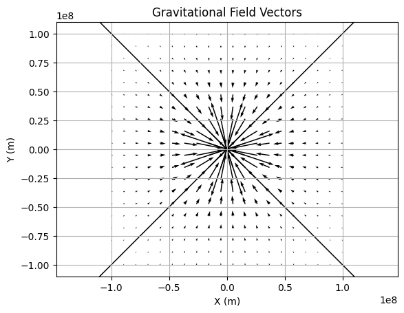
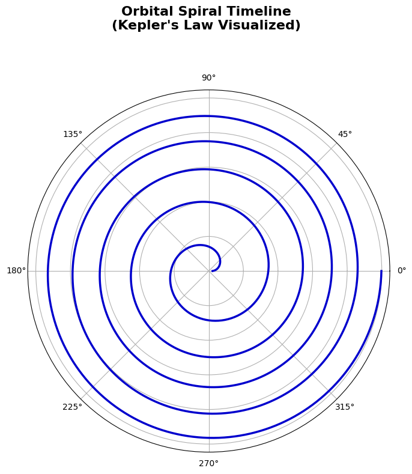
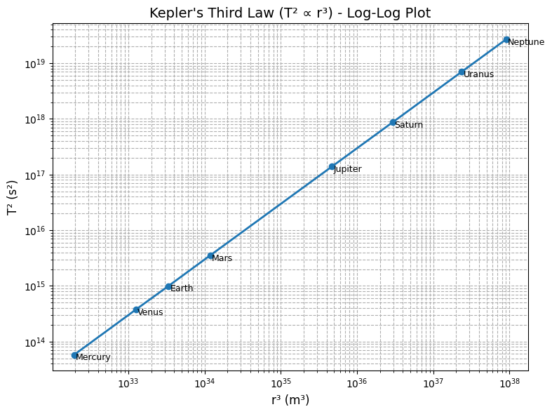
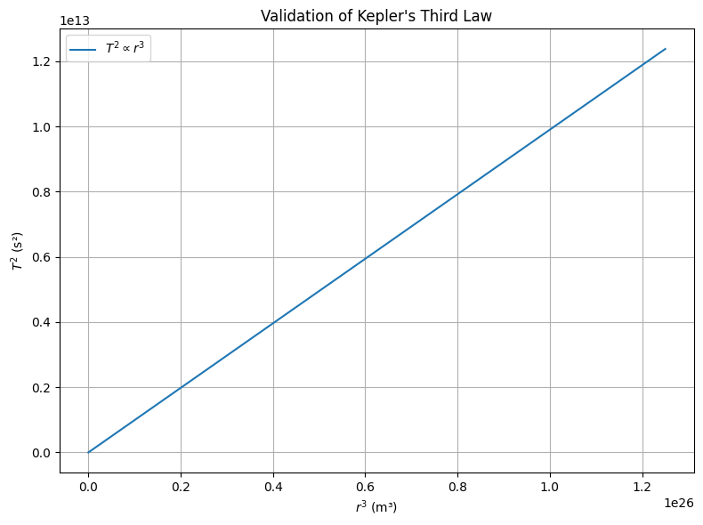
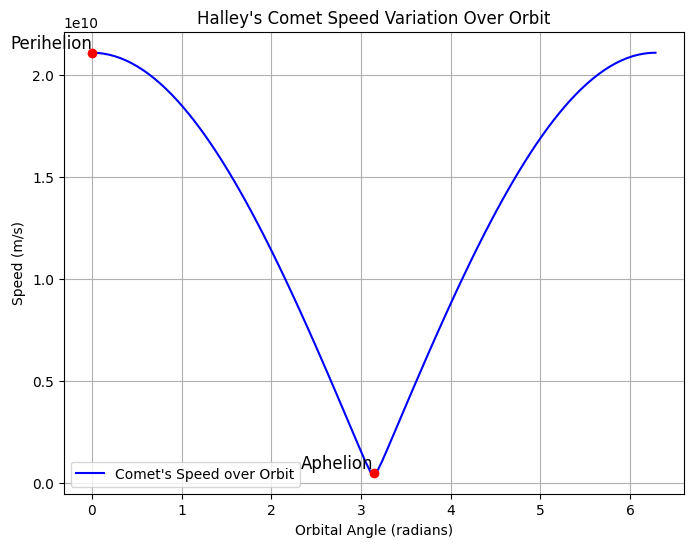

# Problem 1
# Gravity: Orbital Period and Orbital Radius

## Introduction
The study of planetary motion has been pivotal in the development of modern physics. From ancient models of celestial spheres to Newton’s laws of motion and gravitation, humanity has continuously sought to understand the forces that govern the cosmos. One of the most profound insights into this domain came from Johannes Kepler in the early 17th century. By meticulously analyzing the astronomical data of Tycho Brahe, Kepler formulated three laws of planetary motion, each capturing essential aspects of orbital mechanics.

Among these, **Kepler's Third Law** stands out due to its mathematical elegance and physical significance. It states that the square of the orbital period of a planet is proportional to the cube of the semi-major axis of its orbit. While initially empirical, this law was later derived from Newton’s law of universal gravitation, unifying terrestrial and celestial physics.

Understanding Kepler's Third Law not only provides insight into the dynamics of our solar system but also underpins critical technologies such as satellite deployment, space missions, and exoplanet detection. In this report, we aim to:

- Derive Kepler’s Third Law from first principles using Newtonian mechanics,
- Discuss its astronomical implications and practical applications,
- Analyze real-world systems such as the Earth-Moon and Earth-Sun systems,
- Validate the law computationally using Python,
- Explore its generalization to elliptical orbits.

This deep dive into the harmony of the spheres will illuminate how fundamental forces shape the universe.

## Motivation

Understanding the dynamics of orbital motion is not just an academic pursuit; it has profound implications for a wide range of scientific and technological domains. From launching satellites into stable orbits to calculating interplanetary transfer trajectories, the relationship between a celestial body's orbital period and its orbital radius forms a critical foundation. Historically, this insight emerged through the work of Johannes Kepler and later received a deeper physical explanation through Isaac Newton's theory of universal gravitation.

Today, Kepler's Third Law remains a cornerstone in astronomy, astrophysics, and aerospace engineering. It allows scientists to deduce unseen masses (such as black holes or exoplanets), determine the stability of orbits, and understand the large-scale structure of solar systems. As we continue to explore beyond our planet, mastering this relationship is essential for designing efficient space missions, interpreting astronomical data, and expanding our understanding of gravitational systems on both local and cosmic scales.

---

## Derivation of Kepler's Third Law

### Newton's Law of Universal Gravitation

The gravitational force acting between two masses \( M \) (central mass) and \( m \) (orbiting mass) separated by a distance \( r \) is:

\[
F_g = \frac{G M m}{r^2}
\]

Where:

- \( G = 6.67430 \times 10^{-11}\ \text{m}^3\,\text{kg}^{-1}\,\text{s}^{-2} \) is the gravitational constant,
- \( M \) is the mass of the central body (e.g., Earth or the Sun),
- \( m \) is the mass of the orbiting body,
- \( r \) is the radius of the circular orbit.

---

### Centripetal Force Requirement for Circular Motion

A body moving in a circular path experiences a centripetal force directed toward the center of the circle:

\[
F_c = \frac{m v^2}{r}
\]

Equating gravitational force and centripetal force:

\[
\frac{G M m}{r^2} = \frac{m v^2}{r} \Rightarrow v^2 = \frac{G M}{r}
\]

 <strong>Show Python Code</strong>

<pre><code>
# Constants
G = 6.67430e-11
M = 5.972e24
m = 1000

# Grid for Vector Field
x = np.linspace(-1e8, 1e8, 20)
y = np.linspace(-1e8, 1e8, 20)
X, Y = np.meshgrid(x, y)
R = np.sqrt(X**2 + Y**2) + 1e3  # avoid division by zero

# Gravitational Force Vectors
Fx = -G * M * m * X / R**3
Fy = -G * M * m * Y / R**3

# Quiver Plot
plt.figure()
plt.quiver(X, Y, Fx, Fy)
plt.title('Gravitational Field Vectors')
plt.xlabel('X (m)')
plt.ylabel('Y (m)')
plt.axis('equal')
plt.grid(True)
plt.show()
</code></pre>

**Figure above.** Vector field representation of gravitational force, showing its direction and magnitude around a central mass. The force is always directed towards the center of the object, indicating an attractive force that pulls objects towards the central mass.
---

### Orbital Period and Velocity

The orbital period \( T \), i.e., the time taken to complete one full revolution, is:

\[
T = \frac{2 \pi r}{v}
\]

Substituting for \( v \):

\[
T = 2 \pi r \sqrt{\frac{r}{G M}} = 2 \pi \sqrt{\frac{r^3}{G M}}
\]

Squaring both sides:

\[
T^2 = \frac{4 \pi^2}{G M} r^3
\]

This is Kepler’s Third Law in Newtonian form:

\[
T^2 \propto r^3
\]

 <strong>Show Python Code</strong>

<pre><code>
import numpy as np
import matplotlib.pyplot as plt

# Kepler's Law-inspired spiral: r ∝ T ∝ a^(3/2)
n_orbits = 5
theta = np.linspace(0, 2 * np.pi * n_orbits, 1000)
r = (theta + 0.1)**(2/3) * 1e7  # Spiral growth

# Create polar plot
fig = plt.figure(figsize=(8, 8))
ax = fig.add_subplot(111, polar=True)
ax.plot(theta, r, linewidth=2.5, color='mediumblue')

# Title above the plot
fig.suptitle("Orbital Spiral Timeline\n(Kepler's Law Visualized)", 
             fontsize=16, fontweight='bold', ha='center')

# Clean aesthetics
ax.set_yticklabels([])
ax.grid(True)

# Space for title
plt.tight_layout(rect=[0, 0, 1, 0.93])
plt.show()
</code></pre>

**Figure above.** Spiral timeline of orbital motion demonstrating how periods increase with radial distance according to Kepler’s Third Law.

---

### Dimensional Analysis

Let us verify the dimensional correctness of the equation:

\[
T = 2 \pi \sqrt{\frac{r^3}{G M}}
\]

Units:

- \( [T] = s \)
- \( [r] = m \)
- \( [G] = \text{m}^3\,\text{kg}^{-1}\,\text{s}^{-2} \)
- \( [M] = \text{kg} \)

\[
\frac{r^3}{G M} = \frac{\text{m}^3}{\text{m}^3\,\text{kg}^{-1}\,\text{s}^{-2} \cdot \text{kg}} = s^2
\]

Therefore, \( \sqrt{r^3 / GM} \) yields units of seconds, confirming dimensional consistency.

---

### Alternative Derivation Using Energy

The total mechanical energy of an object in a circular orbit is:

\[
E = K + U = \frac{1}{2}mv^2 - \frac{G M m}{r}
\]

Substitute \( v^2 = \frac{G M}{r} \):

\[
E = \frac{1}{2}m \cdot \frac{G M}{r} - \frac{G M m}{r} = -\frac{1}{2} \cdot \frac{G M m}{r}
\]

This negative total energy confirms that the orbit is bound and stable, and further emphasizes the dependence on \( r \), as expected from Kepler's Third Law.

 <strong>Show Python Code</strong>

<pre><code>
from mpl_toolkits.mplot3d import Axes3D

# Constants
G = 6.67430e-11
M = 5.972e24
m = 1000

# Coordinate Grid
x = np.linspace(-1e8, 1e8, 200)
y = np.linspace(-1e8, 1e8, 200)
X, Y = np.meshgrid(x, y)
R = np.sqrt(X**2 + Y**2)
U = -G * M * m / (R + 1e3)  # avoid divide by zero

# 3D Surface Plot
fig = plt.figure()
ax = fig.add_subplot(111, projection='3d')
ax.plot_surface(X, Y, U, cmap='viridis', edgecolor='none')
ax.set_title('Gravitational Potential Energy Surface')
ax.set_xlabel('X (m)')
ax.set_ylabel('Y (m)')
ax.set_zlabel('Potential Energy (J)')
plt.tight_layout()
plt.show()
</code></pre>

**Figure above.** 3D surface plot of gravitational potential energy showing the potential well structure that binds orbiting bodies.
---

### General Form and Interpretation

Kepler’s Third Law is often simplified to the proportional form:

\[
T^2 \propto r^3
\]

But the complete physical relationship is:

\[
T^2 = \frac{4\pi^2}{G M} r^3
\]

This shows that the constant of proportionality depends on the central mass \( M \). For objects orbiting the same mass, the ratio \( \frac{T^2}{r^3} \) is constant.

 <strong>Show Python Code</strong>

<pre><code>
import numpy as np
import matplotlib.pyplot as plt

# Planet data from the Solar System (approximate, in SI units)
planet_names = ['Mercury', 'Venus', 'Earth', 'Mars', 'Jupiter', 'Saturn', 'Uranus', 'Neptune']
radii = np.array([5.79e10, 1.08e11, 1.496e11, 2.28e11, 7.78e11, 1.43e12, 2.87e12, 4.5e12])  # m
periods = np.array([7.6e6, 1.94e7, 3.15e7, 5.94e7, 3.74e8, 9.3e8, 2.65e9, 5.2e9])  # s

T_squared = periods**2
r_cubed = radii**3

# Log-log plot
plt.figure(figsize=(8, 6))
plt.loglog(r_cubed, T_squared, 'o-', linewidth=2, markersize=6)

# Labeling the planets
for i, name in enumerate(planet_names):
    plt.text(r_cubed[i]*1.05, T_squared[i]*0.8, name, fontsize=9)

# Axis labels and title
plt.xlabel("r³ (m³)", fontsize=12)
plt.ylabel("T² (s²)", fontsize=12)
plt.title("Kepler's Third Law (T² ∝ r³) - Log-Log Plot", fontsize=14)
plt.grid(True, which='both', linestyle='--')
plt.tight_layout()
plt.show()
</code></pre>

**Figure above.** Log-log plot of \( T^2 \) versus \( r^3 \) using real planetary data from the Solar System. The linear trend confirms Kepler’s Third Law, where \( T^2 \propto r^3 \).

---

### Notes and Limitations

- This derivation assumes perfectly **circular orbits**. For elliptical orbits, the orbital radius \( r \) is replaced with the **semi-major axis** \( a \).
- Newtonian mechanics is valid for most orbital scenarios. However, in strong gravitational fields or when velocities approach the speed of light, **General Relativity** must be used for accurate modeling (e.g., Mercury’s orbit, black holes).
- This formulation also neglects effects such as atmospheric drag (for satellites), multi-body perturbations, and orbital resonance phenomena.

---

## Implications and Applications in Astronomy

### Determining Masses of Celestial Bodies

From Kepler's third law:

$$
T^2 = \frac{4 \pi^2}{G M} r^3 
$$

Rearranging to solve for the mass \( M \):

$$
M = \frac{4 \pi^2 r^3}{G T^2}
$$

By measuring the orbital radius \( r \) and period \( T \), we can compute the mass \( M \) of the central object, such as a planet, star, or black hole.

### Satellite Deployment
Communication, GPS, and observational satellites must be placed in orbits with carefully calculated radii and periods. Kepler’s Law enables mission planners to predict and design stable satellite orbits.

### Exoplanet Discovery
Astronomers infer exoplanetary properties by observing periodic dimming of stars (transits). Kepler’s Law allows them to compute the orbital radius and estimate the mass of the host star.

---

## Real-World Examples

### Example 1: The Moon Orbiting Earth
- Radius: $r = 3.844 \times 10^8$ m
- Mass of Earth: $M = 5.972 \times 10^{24}$ kg
- Gravitational constant: $G = 6.674 \times 10^{-11}$ Nm²/kg²

\[ T = 2 \pi \sqrt{\frac{(3.844 \times 10^8)^3}{6.674 \times 10^{-11} \cdot 5.972 \times 10^{24}}} \approx 2.36 \times 10^6\ \text{s} \approx 27.3\ \text{days} \]
#### Data Set Diversification:
Kepler's Law is not only valid for planets. For example, **GPS satellites** orbiting Earth and **Ceres**, an asteroid, also follow this law. The gravitational effects on GPS satellites make the calculations more complex, but Kepler's law still plays a fundamental role in these computations.

### Example 2: Earth Orbiting the Sun
- Radius: $r = 1.496 \times 10^{11}$ m
- Mass of Sun: $M = 1.989 \times 10^{30}$ kg

\[ T = 2 \pi \sqrt{\frac{(1.496 \times 10^{11})^3}{6.674 \times 10^{-11} \cdot 1.989 \times 10^{30}}} \approx 3.15 \times 10^7\ \text{s} \approx 365.25\ \text{days} \]
#### Deeper Real-World Applications:
Kepler's Law is not only a theoretical concept but also a practical tool in space exploration. For instance, **the Perseverance Rover**'s journey to Mars utilized Kepler’s law to calculate the orbital mechanics for a successful landing. These calculations are vital for interplanetary missions.

Additionally, **interplanetary transfer orbits** are designed using Kepler’s law to ensure spacecraft follow the most efficient path when traveling between planets.

---

## Computational Simulation in Python
We now simulate various orbital radii and compute the corresponding orbital periods.

 <strong>Show Python Code</strong>

<pre><code>
import numpy as np
import matplotlib.pyplot as plt

# Constants
G = 6.67430e-11  # m^3 kg^-1 s^-2
M = 5.972e24     # Earth mass in kg

# Orbital radii (m)
radii = np.linspace(1e7, 5e8, 100)

# Orbital periods (s)
periods = 2 * np.pi * np.sqrt(radii**3 / (G * M))

# Plotting T^2 vs r^3
plt.figure(figsize=(8,6))
plt.plot(radii**3, periods**2, label=r'$T^2 \propto r^3$')
plt.xlabel("$r^3$ (m³)")
plt.ylabel("$T^2$ (s²)")
plt.title("Validation of Kepler's Third Law")
plt.legend()
plt.grid(True)
plt.tight_layout()
plt.show()
</code></pre>

This plot confirms the linear relationship between $T^2$ and $r^3$.

---

## Extension to Elliptical Orbits

While our derivation in earlier sections assumes circular orbits, Kepler's original formulation of the law applies to **elliptical orbits** as well. This is an essential aspect of Kepler's work, as it helps explain the behavior of celestial bodies in real-world conditions where orbits are rarely perfectly circular.

### Kepler’s Third Law for Elliptical Orbits:

In the case of elliptical orbits, the orbital radius \( r \) is replaced by the **semi-major axis \( a \)**, which represents the long axis of the ellipse. This modification takes into account the varying distances between the orbiting object and the central mass throughout the orbit, addressing the more general case where the orbit is not circular. The modified form of Kepler’s Third Law becomes:

\[
T^2 = \frac{4 \pi^2}{G M} a^3
\]

Here, the semi-major axis \( a \) is the average distance between the orbiting body and the central body, which serves as a substitute for the radius in circular orbits.

### Key Implications of the Generalized Form:

1. **Planetary Orbits with Varying Eccentricities**:
   - In the real world, planets in the Solar System follow elliptical orbits, which are characterized by their **eccentricity**. The semi-major axis \( a \) effectively describes the "average" distance between a planet and the Sun, and this form of Kepler’s Third Law is crucial for predicting the orbital periods of planets that do not follow perfectly circular paths. 
   - For example, Earth’s orbit is slightly elliptical with an eccentricity of 0.0167, meaning the distance from the Earth to the Sun varies slightly throughout the year. However, this variation is small enough that Kepler’s Law, applied to the semi-major axis, still provides accurate predictions for Earth’s orbital period.

  
Show Python code

  
  <pre><code>
import numpy as np
import matplotlib.pyplot as plt
from matplotlib.animation import FuncAnimation
from google.colab import files

# Constants
a = 1.0  # semi-major axis (AU)
e = 0.7  # eccentricity

# Elliptical orbit equation
theta = np.linspace(0, 2 * np.pi, 100)
r = a * (1 - e**2) / (1 + e * np.cos(theta))

# Set up the figure
fig, ax = plt.subplots(figsize=(8, 6))
ax.set_xlim(-2, 2)
ax.set_ylim(-1, 1)
ax.set_xlabel("X (AU)")
ax.set_ylabel("Y (AU)")
ax.set_title("Elliptical Orbit of a Planet")

# Plot the ellipse
ax.plot(r * np.cos(theta), r * np.sin(theta), label="Elliptical Orbit", color="b")

# Create a point for the planet (initially not positioned)
planet, = ax.plot([], [], 'ro', label="Planet")

# Initialize the planet position
def init():
    planet.set_data([], [])
    return planet,

# Update function for animation
def update(frame):
    x = r[frame] * np.cos(theta[frame])
    y = r[frame] * np.sin(theta[frame])
    
    # Set data as list format (for the animation to work properly)
    planet.set_data([x], [y])  # Ensure x and y are sequences (lists)
    return planet,

# Create the animation
ani = FuncAnimation(fig, update, frames=range(100), init_func=init, blit=True, interval=50)

# Save the animation as a video (MP4 format)
ani.save('elliptical_orbit.mp4', writer='ffmpeg', fps=24)

# Download the video
files.download('elliptical_orbit.mp4')
  </code></pre>

<video width="600" controls>
  <source src="https://raw.githubusercontent.com/SelimEmre7/solutions_repo/main/elliptical_orbit%20(1).mp4" type="video/mp4">
  Your browser does not support the video tag.
</video>

This animation visualizes how planets move in elliptical orbits and how Kepler's Third Law affects their speeds and orbital periods. It clearly demonstrates how changes in distance along the orbit influence acceleration and deceleration.

2. **Cometary Trajectories**:
   - Comets, with their highly elliptical orbits, often have periods that span many years or even centuries. As they approach the Sun, they accelerate due to the Sun’s gravitational pull, and as they move farther away, they slow down. The semi-major axis in the formula allows us to calculate the orbital period of comets, despite their significant distance changes from the central mass.
   - For instance, **Halley's Comet**, with an orbital period of about 76 years, follows an elliptical path. Its distance from the Sun varies dramatically from about 0.09 AU (at perihelion) to 35 AU (at aphelion), yet Kepler’s law still applies when we use the semi-major axis to describe its orbit.
   
   ### Halley’s Comet Speed Variation Over Orbit

Below is a graph that illustrates the speed variation of Halley’s Comet as it travels along its elliptical orbit. The speed is highest near the **perihelion** (the closest point to the Sun) and lowest near the **aphelion** (the farthest point from the Sun).

  
Show Python code

  <pre><code>
import numpy as np
import matplotlib.pyplot as plt

# Constants for Halley's Comet
a = 17.8  # Semi-major axis in AU
e = 0.967  # Eccentricity of Halley's comet
G = 6.67430e-11  # Gravitational constant (m^3 kg^-1 s^-2)
M_sun = 1.989e30  # Mass of the Sun in kg
theta = np.linspace(0, 2 * np.pi, 100)

# Orbital equation for Halley's comet
r = a * (1 - e**2) / (1 + e * np.cos(theta))  # Semi-major axis formula

# Calculate the speed of Halley's comet at different positions
v = np.sqrt(G * M_sun * (2 / r - 1 / a))  # Orbital velocity equation

# Plotting the comet's speed variation
plt.figure(figsize=(8, 6))

# Plot the speed with a line
plt.plot(theta, v, label="Comet's Speed over Orbit", color='blue')

# Highlight perihelion (theta = 0) and aphelion (theta = pi)
perihelion_speed = v[0]
aphelion_speed = v[len(v)//2]
plt.scatter([0, np.pi], [perihelion_speed, aphelion_speed], color='red', zorder=5)  # Perihelion and Aphelion
plt.text(0, perihelion_speed, 'Perihelion', fontsize=12, verticalalignment='bottom', horizontalalignment='right')
plt.text(np.pi, aphelion_speed, 'Aphelion', fontsize=12, verticalalignment='bottom', horizontalalignment='right')

# Adding labels and title
plt.xlabel('Orbital Angle (radians)')
plt.ylabel('Speed (m/s)')
plt.title("Halley's Comet Speed Variation Over Orbit")
plt.legend()

# Displaying grid
plt.grid(True)
plt.show()
  </code></pre>

   

3. **Orbits in Multi-Body Systems**:
   - In complex multi-body systems, such as star clusters or galaxies, objects often follow elliptical orbits around multiple gravitational sources. Kepler’s Third Law, generalized for elliptical orbits, can be applied in these systems, but **numerical methods** are typically used to account for the interactions between the multiple bodies. 
   - For instance, in a **binary star system**, both stars orbit around their common center of mass in elliptical orbits. The generalized form of Kepler's law allows astronomers to predict the orbital periods of such systems, and advanced numerical simulations are used to account for the gravitational influences of additional bodies (such as moons or planets).

### The Importance of the Semi-Major Axis:

The semi-major axis ( \( a \) ) is fundamental not only in elliptical orbits but also in analyzing the shape and size of the orbit. The greater the semi-major axis, the longer the orbital period. In fact, the orbital period is directly proportional to the cube of the semi-major axis, making \( a \) the most crucial parameter for determining the time a body takes to complete an orbit around a central mass.

In celestial mechanics, the semi-major axis is often considered the "average" distance because it represents the balance point between the closest and farthest distances of the orbiting object.

---

### Conclusion:

The extension of Kepler's Third Law to elliptical orbits enhances its applicability to real-world astronomical systems. By replacing the radius \( r \) with the semi-major axis \( a \), we are able to account for the elliptical nature of most orbits and maintain the law's predictive power. This generalization allows scientists to study a wide range of orbital phenomena, from the movements of planets in the Solar System to the trajectories of comets and objects in multi-body gravitational systems.

Kepler’s Third Law elegantly connects time and space in the context of orbital motion. Its derivation from Newton’s law of gravity shows the power of mathematical physics in describing natural phenomena. Applications of this law span across planetary astronomy, satellite engineering, and cosmology.

Through analytical derivation, real-world application, and computational verification, we demonstrated the universal validity of this relationship. Understanding this law equips us with the tools to navigate not only our own solar system but also the broader universe, as we seek to discover and comprehend the worlds beyond.

---

### Summary:

- **Circular Orbits**: \( T^2 \propto r^3 \) (where \( r \) is constant).
- **Elliptical Orbits**: \( T^2 \propto a^3 \) (where \( a \) is the semi-major axis, the average distance).

This extended formulation provides us with a robust tool for studying and predicting orbital periods in a variety of celestial contexts, and it remains a cornerstone of celestial mechanics even in the presence of complex gravitational interactions.
