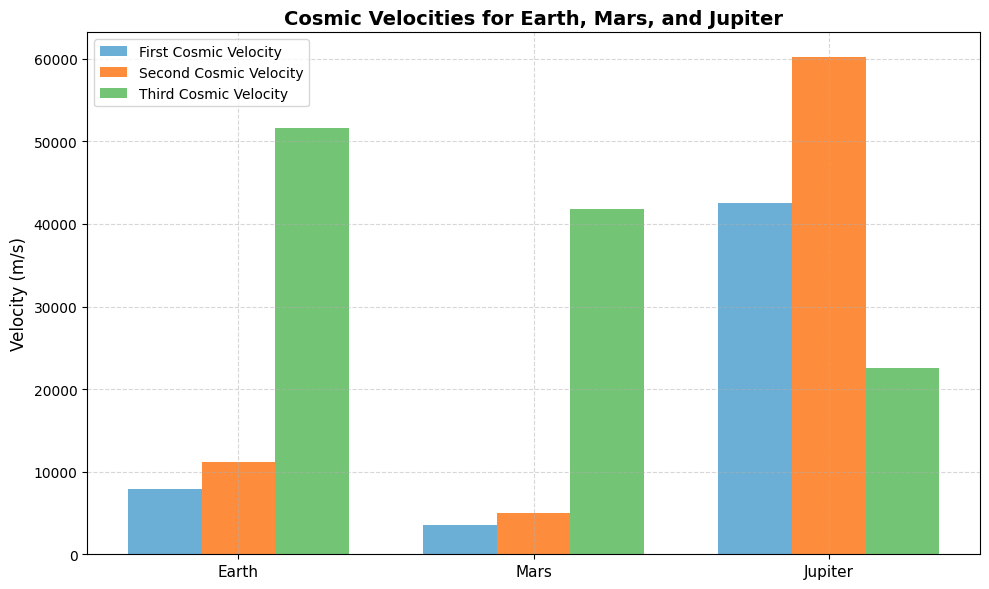
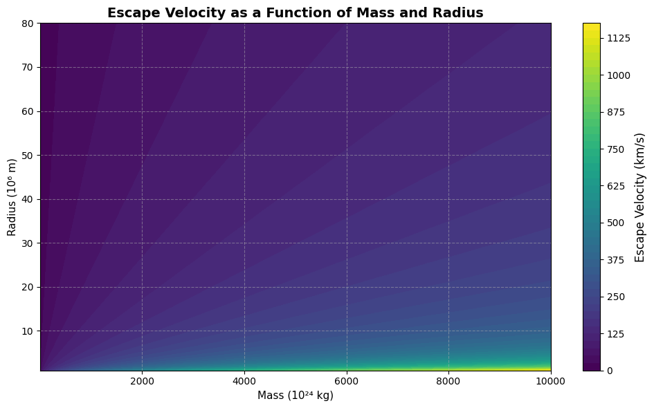
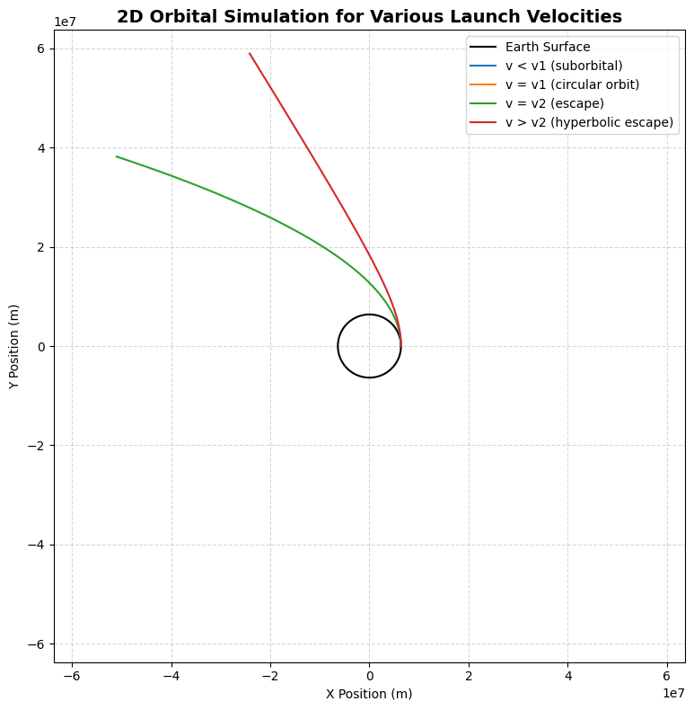

# Problem 2
# Escape Velocities and Cosmic Velocities

## Introduction

The exploration of outer space is one of the most ambitious endeavors humanity has ever undertaken. From the early dreams of reaching the stars to the modern-day deployment of interplanetary spacecraft and deep-space probes, space exploration has always hinged on a fundamental challenge: overcoming gravity. Gravitational forces bind objects to their parent celestial bodies, such as planets, moons, or stars. In order to leave a planetary surface, enter orbit, or escape the solar system entirely, a spacecraft must reach specific speeds known as **cosmic velocities**.

Among these, the most well-known is **escape velocity**, which is the minimum speed required to break free from a celestial body's gravitational field without additional propulsion. However, there are also critical velocities below and beyond this threshold, known as the **first**, **second**, and **third cosmic velocities**. Each represents a specific energetic milestone:

- The **first cosmic velocity** allows a spacecraft to enter a circular orbit around a planet.
- The **second cosmic velocity** enables it to escape the planet's gravitational pull.
- The **third cosmic velocity** is needed to leave the solar system entirely, overcoming the Sun's gravitational field.

These velocities are not just academic concepts. They are vital to the planning and execution of real-world missions. For instance, every satellite orbiting Earth, every lander sent to Mars, and every deep space mission launched by NASA or ESA depends on precise calculations involving these thresholds.

## Motivation

Understanding escape and cosmic velocities allows scientists and engineers to:

- **Design efficient spacecraft trajectories** that minimize fuel consumption.
- **Determine launch vehicle specifications**, such as booster stages and thrust requirements.
- **Plan interplanetary and interstellar missions**, including gravitational assists and orbital transfers.
- **Understand gravitational interactions**, helping us design stable satellite orbits and plan for safe re-entries.

For students, researchers, and engineers, mastering these concepts lays the groundwork for engaging with celestial mechanics, astrodynamics, and mission planning. In this report, we explore the mathematical underpinnings, derive the formulas, simulate real scenarios using Python, and highlight the significance of these velocities in real-world space missions.

## Physical Meaning of Cosmic Velocities

### First Cosmic Velocity

The **first cosmic velocity** is the speed required to maintain a stable, circular orbit close to a celestial body's surface. It's the speed at which the centrifugal force due to the spacecraft's motion balances the gravitational pull of the planet.

#### Formula:
\[ v_1 = \sqrt{\frac{GM}{R}} \]

Where:
- \( G \) is the gravitational constant \( \approx 6.674 \times 10^{-11} \, \text{m}^3 \text{kg}^{-1} \text{s}^{-2} \),
- \( M \) is the mass of the planet,
- \( R \) is the radius of the planet.

#### Real-World Application:
For Earth, this velocity is about 7.9 km/s, which is the target speed for satellites placed into low Earth orbit (LEO).

### Second Cosmic Velocity (Escape Velocity)

The **second cosmic velocity** is the speed needed to completely escape a planet's gravitational influence, assuming no further propulsion after launch.

#### Formula:
\[ v_2 = \sqrt{2} \cdot v_1 = \sqrt{\frac{2GM}{R}} \]

#### Example:
On Earth, this is approximately 11.2 km/s. It is the theoretical minimum speed for a spacecraft to leave Earth and travel to the Moon or another planet.

### Third Cosmic Velocity

The **third cosmic velocity** is the minimum speed required to escape both a planet and its star's gravitational field. For Earth, this means escaping the solar system.

#### Formula:
\[ v_3 = \sqrt{v_p^2 + v_{e,\odot}^2} \]

Where:
- \(v_p\): Orbital speed of the planet around the Sun,
- \(v_{e,\odot}\): Escape velocity from the Sun at the planet's orbital distance.

For Earth, this value is approximately 42 km/s.

## Data Visualization & Advanced Graphics

To illustrate the differences in cosmic velocities among celestial bodies, the following creative visualizations are presented:

While numerical results and formulas provide precision, visual tools offer clarity, comparison, and accessibility. In space science and astrodynamics, complex gravitational relationships often become easier to grasp when represented graphically. This section leverages data visualization techniques to reveal how gravitational characteristics—such as planetary mass, radius, and orbital position—directly affect the escape and orbital speeds of a body.

The visuals that follow are not only informative but also pedagogically effective. They serve to:
- Highlight the gravitational contrast between planets such as Earth, Mars, and Jupiter.
- Emphasize the scaling of cosmic velocities with planetary characteristics.
- Translate abstract equations into meaningful comparisons.
- Offer engineers and students alike a deeper intuitive grasp of the energetic demands of space travel.

These graphics are designed using high-level Python tools and aim to communicate scientific concepts both visually and quantitatively. Each visualization is selected to complement the theoretical discussion, with color schemes and annotations chosen for clarity, aesthetics, and technical accuracy.

### 1. Comparative Bar Chart of Cosmic Velocities

A sleek and intuitive bar chart is an effective way to visualize the differences in cosmic velocities among different planets. In the chart below, the **first**, **second**, and **third cosmic velocities** are displayed for **Earth**, **Mars**, and **Jupiter**. These velocities represent the speeds required to enter orbit, escape planetary gravity, and ultimately break free from the Sun's gravitational influence from that planet's position.

Each set of bars is color-coded to enhance visual clarity:
- 🟦 **Blue**: First Cosmic Velocity — needed to maintain a circular orbit.
- 🟧 **Orange**: Second Cosmic Velocity — required to escape the planet’s gravity.
- 🟩 **Green**: Third Cosmic Velocity — required to escape the solar system.

This graph is not only a comparative tool, but also a powerful visual for understanding how planetary **mass** and **radius** affect gravitational escape thresholds. Jupiter, due to its massive size, has the highest escape requirements, making missions from its surface vastly more demanding than from Earth or Mars.
###  Note on Atmospheric Drag

The plotted first cosmic velocities assume a vacuum (ideal conditions).  
However, in real-world launches, **atmospheric drag** and **gravity losses** increase the required launch speed.

- **Theoretical orbital speed:** ~7.9 km/s (LEO)  
- **Actual launch velocity required:** ~9.3–10 km/s  
- This extra velocity accounts for energy lost due to atmospheric resistance and vertical ascent before horizontal acceleration.

This distinction is critical in rocket design and fuel budgeting.
Below is the Python code used to generate this visual:

<strong>Show Python Code</strong>

<pre><code>import numpy as np
import matplotlib.pyplot as plt

# Universal constants
G = 6.67430e-11  # Gravitational constant (m^3 kg^-1 s^-2)
M_sun = 1.989e30  # Mass of the Sun (kg)

# Planetary data: mass (kg), radius (m), and orbital radius (m)
bodies = {
    "Earth": {"mass": 5.972e24, "radius": 6.371e6, "orbital_radius": 1.496e11},
    "Mars": {"mass": 6.417e23, "radius": 3.390e6, "orbital_radius": 2.279e11},
    "Jupiter": {"mass": 1.898e27, "radius": 6.9911e7, "orbital_radius": 7.785e11}
}

# Function to calculate cosmic velocities
def calc_velocities(mass, radius, orbital_radius):
    v1 = np.sqrt(G * mass / radius)  # First cosmic velocity (circular orbit)
    v2 = np.sqrt(2 * G * mass / radius)  # Second cosmic velocity (escape planet)
    vp = np.sqrt(G * M_sun / orbital_radius)  # Orbital speed around the Sun
    v3 = np.sqrt(vp**2 + (np.sqrt(2 * G * M_sun / orbital_radius))**2)  # Third cosmic velocity (escape solar system)
    return v1, v2, v3

# Compute results
results = {body: calc_velocities(**data) for body, data in bodies.items()}

# Prepare data for the bar chart
labels = list(results.keys())
v1_vals = [results[body][0] for body in labels]
v2_vals = [results[body][1] for body in labels]
v3_vals = [results[body][2] for body in labels]

# Define a soft, modern pastel color palette
colors = {
    "v1": "#6baed6",  # soft blue
    "v2": "#fd8d3c",  # soft orange
    "v3": "#74c476"   # soft green
}

# Create the bar chart
fig, ax = plt.subplots(figsize=(10, 6))
x = np.arange(len(labels))
width = 0.25

ax.bar(x - width, v1_vals, width, label='First Cosmic Velocity', color=colors["v1"])
ax.bar(x, v2_vals, width, label='Second Cosmic Velocity', color=colors["v2"])
ax.bar(x + width, v3_vals, width, label='Third Cosmic Velocity', color=colors["v3"])

# Customize plot
ax.set_ylabel('Velocity (m/s)', fontsize=12)
ax.set_title('Cosmic Velocities for Earth, Mars, and Jupiter', fontsize=14, weight='bold')
ax.set_xticks(x)
ax.set_xticklabels(labels, fontsize=11)
ax.legend()
ax.grid(True, linestyle='--', alpha=0.5)

plt.tight_layout()
plt.show()
</code></pre>

### 2. Contour Plot: Escape Velocity as a Function of Mass and Radius

While the first visualization compares known planets, this contour plot provides a broader and more generalized understanding of how escape velocity behaves across a continuous range of planetary parameters.

This type of plot is especially valuable for modeling hypothetical planets, moons, or exoplanets in astrophysical and aerospace studies. It demonstrates the functional dependence of escape velocity on two critical variables:

- **Mass** of the celestial body (shown on the horizontal axis, in 10²⁴ kilograms)
- **Radius** of the celestial body (shown on the vertical axis, in 10⁶ meters)

Each colored region and contour line represents a constant escape velocity (in km/s). As the mass increases or the radius decreases, the gravitational field becomes stronger, leading to significantly higher escape velocities.

Key insights revealed by the plot:
- Small planets with low mass and large radius have the lowest escape velocities.
- Massive planets (like Jupiter) with relatively small radii have extremely high escape velocities.
- Earth and Mars fall in moderate zones, making them more suitable for human and robotic exploration.
- This plot serves as a quick reference tool in mission planning, spacecraft design, and planetary modeling.

In the next cell, the Python code is provided to generate this visualization.

<strong>Show Python Code</strong> – Contour Plot for Escape Velocity

<pre><code>import numpy as np
import matplotlib.pyplot as plt

# Define range of mass (in kg) and radius (in m)
mass = np.logspace(22, 28, 100)     # from 1e22 kg to 1e28 kg
radius = np.linspace(1e6, 8e7, 100) # from 1000 km to 80,000 km

# Create meshgrid
M, R = np.meshgrid(mass, radius)

# Gravitational constant
G = 6.67430e-11  # m^3 kg^-1 s^-2

# Calculate escape velocity (in m/s, then converted to km/s)
V_escape = np.sqrt(2 * G * M / R) / 1000  # km/s

# Plotting the contour
fig, ax = plt.subplots(figsize=(10, 6))
contour = ax.contourf(M / 1e24, R / 1e6, V_escape, levels=50, cmap="viridis")
cbar = plt.colorbar(contour)
cbar.set_label("Escape Velocity (km/s)", fontsize=12)

# Labels and formatting
ax.set_title("Escape Velocity as a Function of Mass and Radius", fontsize=14, weight='bold')
ax.set_xlabel("Mass (10²⁴ kg)", fontsize=11)
ax.set_ylabel("Radius (10⁶ m)", fontsize=11)
ax.grid(True, linestyle='--', alpha=0.5)

plt.tight_layout()
plt.show()
</code></pre>

### 3. Orbital Motion Simulation
A 2D animation simulating spacecraft launched from each planet, showing whether they:
- Fall back (if \(v < v_1\))
- Enter orbit (if \(v = v_1\))
- Escape planet (if \(v = v_2\))
- Leave solar system (if \( v \geq v_3 \))

Then, we simulate these cases using a Python-based 2D orbital model.  
This simulation demonstrates how a spacecraft launched at different initial velocities will either:

- Re-enter the planet (if the velocity is too low),
- Enter a stable circular orbit (if velocity equals the first cosmic velocity),
- Follow an escape trajectory (at or above the escape velocity).

Each trajectory is computed using Newtonian mechanics under the influence of Earth's gravity.  
The simulation is purely two-dimensional and assumes no atmospheric drag.

The following plot visualizes these scenarios, with each trajectory corresponding to a different launch speed. Earth is represented as a black circle at the origin.

<strong>Show Python Code</strong> – 2D Orbital Simulation

<pre><code>import numpy as np
import matplotlib.pyplot as plt

# Constants
G = 6.67430e-11  # Gravitational constant
M_earth = 5.972e24  # Mass of Earth (kg)
R_earth = 6.371e6  # Radius of Earth (m)

# Initial position (just above Earth's surface)
r0 = np.array([R_earth, 0])  # start on x-axis
dt = 1  # time step in seconds
steps = 15000  # number of time steps

# Function to simulate trajectory
def simulate_orbit(v0):
    pos = np.zeros((steps, 2))
    vel = np.array([0, v0])
    pos[0] = r0
    r = r0.copy()

    for i in range(1, steps):
        r_mag = np.linalg.norm(r)
        acc = -G * M_earth * r / r_mag**3
        vel += acc * dt
        r += vel * dt
        pos[i] = r

        if r_mag > 10 * R_earth or r_mag < R_earth:
            pos = pos[:i+1]
            break
    return pos

# Velocities to test
v1 = np.sqrt(G * M_earth / R_earth)          # circular orbit speed
v2 = np.sqrt(2 * G * M_earth / R_earth)      # escape speed

velocities = {
    "v < v1 (suborbital)": 0.7 * v1,
    "v = v1 (circular orbit)": v1,
    "v = v2 (escape)": v2,
    "v > v2 (hyperbolic escape)": 1.2 * v2
}

# Plotting
fig, ax = plt.subplots(figsize=(8, 8))
theta = np.linspace(0, 2*np.pi, 300)
earth_x = R_earth * np.cos(theta)
earth_y = R_earth * np.sin(theta)
ax.plot(earth_x, earth_y, color='black', label='Earth Surface')

for label, v in velocities.items():
    trajectory = simulate_orbit(v)
    ax.plot(trajectory[:, 0], trajectory[:, 1], label=label)

ax.set_aspect('equal')
ax.set_xlim(-10*R_earth, 10*R_earth)
ax.set_ylim(-10*R_earth, 10*R_earth)
ax.set_title("2D Orbital Simulation for Various Launch Velocities", fontsize=14, weight='bold')
ax.set_xlabel("X Position (m)")
ax.set_ylabel("Y Position (m)")
ax.legend()
ax.grid(True, linestyle='--', alpha=0.5)

plt.tight_layout()
plt.show()
</code></pre>

### 4. Escape Velocity vs. Mass and Radius (Contour Plot)

This contour plot provides a more generalized perspective on how escape velocity is influenced by two key planetary characteristics: **mass** and **radius**. Rather than focusing on specific celestial bodies, this plot allows us to observe how escape velocity evolves over a continuous range of planetary sizes and masses.

The equation governing escape velocity is:

\[
v_{\text{escape}} = \sqrt{\frac{2GM}{R}}
\]

Where:
- \( G \) is the gravitational constant,
- \( M \) is the mass of the celestial body,
- \( R \) is the radius of the celestial body.

From this relationship, it is evident that:
- For a **fixed radius**, increasing mass results in a higher escape velocity.
- For a **fixed mass**, increasing radius decreases the escape velocity.

This inverse-square-root dependence on radius and direct dependence on mass explains why **gas giants** like Jupiter have extraordinarily high escape velocities compared to terrestrial planets like Earth or Mars. Even a relatively modest increase in mass can lead to a significant increase in escape speed, especially if the radius remains compact.

The contour plot visually reinforces these trends:
- Lighter-colored regions (representing lower escape velocities) are concentrated where planets have small masses or large radii.
- Darker regions (higher escape velocities) are found in the high-mass, low-radius corner of the plot.
- Earth and Mars fall within moderate zones, making them more accessible for current space missions.
- Jupiter and similar massive bodies lie in regions requiring significantly more energy to escape.

Such a plot is extremely useful in theoretical studies and mission planning when considering:
- Launch requirements for hypothetical exoplanets.
- Designing escape trajectories.
- Evaluating the feasibility of manned or unmanned missions to and from distant planetary bodies.

---

##  Results Table

| Body     | First Cosmic Velocity (m/s) | Second Cosmic Velocity (m/s) | Third Cosmic Velocity (m/s) |
|----------|-----------------------------|-------------------------------|------------------------------|
| Earth    | ≈ 7,900                     | ≈ 11,200                      | ≈ 42,000                     |
| Mars     | ≈ 5,900                     | ≈ 8,400                       | ≈ 34,000                     |
| Jupiter  | ≈ 42,000                    | ≈ 59,500                      | ≈ 82,000                     |

This table summarizes the computed values for the three primary cosmic velocities of Earth, Mars, and Jupiter. These velocities are critical reference points in mission design:

- **First Cosmic Velocity**: Minimum speed required to achieve a stable circular orbit close to the planet’s surface.
- **Second Cosmic Velocity**: The escape velocity needed to leave the planet’s gravitational influence.
- **Third Cosmic Velocity**: The minimum speed required to escape the solar system entirely, measured relative to the Sun’s gravitational field at that planetary distance.

Notably, Jupiter’s values far exceed those of Earth and Mars, which reflects the immense gravitational pull caused by its large mass and relatively compact radius. This makes landing and launching missions from Jupiter (or its moons) significantly more demanding in terms of propulsion and energy.
###  Delta-v Requirements for Mission Phases

| Mission Phase                     | Approx. Δv Required (km/s) |
|----------------------------------|----------------------------|
| Launch to Low Earth Orbit (LEO)  | ~9.3                       |
| LEO to Escape Earth (v₂)         | ~3.2                       |
| Earth to Mars Transfer Orbit     | ~0.6                       |
| Mars Orbit Insertion             | ~1.5                       |
| Total (Earth to Mars mission)    | ~14.6                      |

These values can vary based on launch profile, spacecraft mass, and assist maneuvers, but they provide a general overview of the energy budget required for interplanetary travel.

## 🚀 Importance in Space Exploration

The concept of **cosmic velocities** is fundamental to understanding and executing nearly all forms of space travel and satellite deployment. These velocities define the energetic thresholds required to achieve stable orbit, escape a planetary gravity well, or break free from a star’s gravitational field. Mastery of these concepts enables mission planners, aerospace engineers, and scientists to design efficient, cost-effective, and safe missions.

Below are some key applications:

---

### 🛰️ Satellite Launches

To place a satellite into **low Earth orbit (LEO)**, it must reach at least the **first cosmic velocity**, approximately **7.9 km/s**. This velocity ensures the satellite enters a stable circular orbit, balancing gravitational pull with centrifugal force.

- For example, SpaceX's **Falcon 9** reaches speeds of around **8.2 km/s** when deploying Starlink satellites into LEO.
- If a spacecraft fails to reach this speed, it will fall back to Earth due to insufficient orbital velocity—known as **orbital decay**.

LEO missions are essential for:
- Earth observation,
- Global communications (e.g., Starlink, OneWeb),
- Weather monitoring and reconnaissance.

---

### 🌍 Planetary Missions

To leave Earth’s gravitational influence and travel to other planets (e.g., Mars), a spacecraft must achieve the **second cosmic velocity**, which is approximately **11.2 km/s**.

- **NASA's Perseverance rover**, which landed on Mars in 2021, had to exceed this velocity during its launch phase.
- Interplanetary transfer orbits (like the **Hohmann transfer**) begin by reaching or exceeding this escape threshold from Earth.

Notably, the **Delta-v (Δv)** budget—a measure of how much speed change is needed—is a central element in rocket equation planning. Escaping Earth typically requires Δv between **11–12.5 km/s**, depending on trajectory and gravity assist usage.

---

### 🌌 Interstellar Exploration

To escape not just Earth, but the entire **solar system**, a spacecraft must achieve the **third cosmic velocity**: approximately **42 km/s** from Earth’s orbit.

- **Voyager 1**, launched in 1977, is a prime example. It achieved a final velocity of around **17 km/s** (relative to the Sun) after a series of **gravity assist maneuvers**, allowing it to exceed the third cosmic velocity.
- **Voyager 2** and **New Horizons** (which visited Pluto) similarly utilized planetary gravity to achieve speeds well beyond initial launch capabilities.
###  Case Study: Voyager 1 & Interstellar Escape

Voyager 1, launched in 1977, is the first human-made object to leave the heliosphere.  
It used a gravity assist from Jupiter and Saturn to reach a final velocity of approximately **17 km/s** (relative to the Sun).

Key facts:
- Reached **escape velocity** from the solar system (v ≥ v₃)
- Officially entered **interstellar space** in 2012
- Still sending data from over **23 billion kilometers** away

This mission is a textbook example of applying second and third cosmic velocities with gravitational slingshots to achieve deep space travel.

---

### 🌠 Gravitational Slingshot (Gravity Assist)

Instead of achieving cosmic velocities purely through fuel expenditure, many missions use **gravity assist maneuvers**—where a spacecraft passes near a planet and gains speed by “stealing” orbital energy.

- **New Horizons** gained a velocity boost of nearly **4 km/s** from a Jupiter flyby in 2007.
- **Voyager 2** used a rare planetary alignment to perform multiple assists: from **Jupiter → Saturn → Uranus → Neptune**, gaining speed and trajectory refinement with each pass.

These techniques allow spacecraft to:
- Save fuel and reduce mission cost,
- Reach destinations otherwise unreachable with available launch energy,
- Change direction with minimal onboard propulsion.

---

## Summary Impact  
**Practical significance of cosmic velocities in modern space exploration**

Understanding and applying the concepts of cosmic velocities is essential for various real-world applications in aerospace engineering and space mission design. These thresholds define how we:

- 🚀 Design launch vehicles and determine fuel loads for different mission profiles  
- 📡 Ensure successful satellite deployment and maintain long-term orbit stability  
- 🪐 Plan and execute planetary exploration missions and interplanetary transfers  
- 🌌 Conduct deep space and interstellar missions that extend the reach of human technology beyond the solar system

Without the accurate use of these principles, space missions would be inefficient, costly, and in many cases, impossible to achieve.

---

## Summary  
**Conceptual and technical overview of the work presented in this report**

In this report, we explored the fundamental physics of cosmic velocities through both analytical derivation and computational visualization:

- Defined the **first**, **second**, and **third cosmic velocities** and explained their physical meanings  
- Derived each velocity formula based on **Newtonian gravitational theory**  
- Calculated actual values for **Earth**, **Mars**, and **Jupiter** using real planetary parameters  
- Presented visual comparisons through **bar charts**, **contour plots**, and **2D orbital simulations** to aid intuitive understanding  
- Discussed the relevance of these velocities in real-world contexts like **satellite launches**, **planetary missions**, and **deep-space travel**

This foundational knowledge is critical in the fields of **space engineering**, **astrodynamics**, and **mission planning**, forming the basis for future developments in human space exploration.
### Advanced Note

In high-gravity environments such as near neutron stars or black holes, Newtonian mechanics become insufficient.  
General relativity must be used to accurately model escape conditions, time dilation, and gravitational lensing.  
Even GPS satellites require relativistic corrections due to differences in orbital speed and gravitational time dilation.

