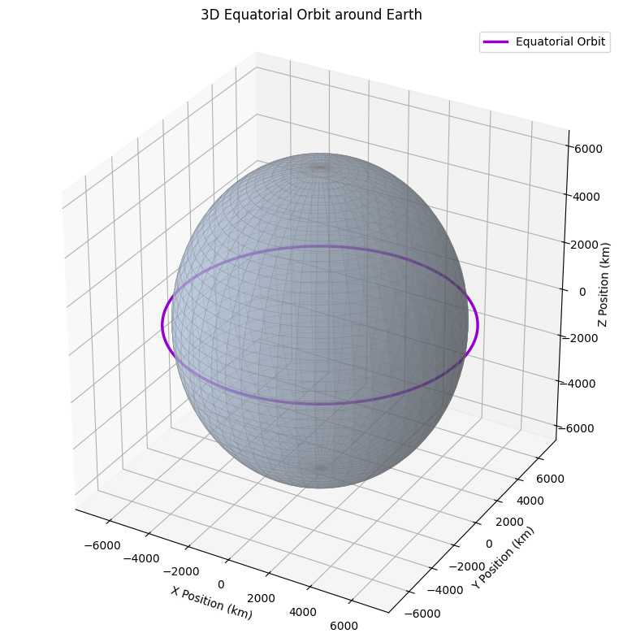

# Problem 3
# Trajectories of a Freely Released Payload Near Earth

## Introduction and Motivation

The behavior of an object released from a moving spacecraft near Earth has long been a subject of interest in both academic research and applied aerospace engineering. Such scenarios are not just theoretical; they play a pivotal role in numerous practical applications like satellite deployment, cargo release from spacecraft, orbital transfer maneuvers, and atmospheric reentry planning.

When a payload is released in space, its subsequent motion is governed primarily by Newton's laws of motion and universal gravitation. Depending on its initial position and velocity, the payload may:

- Enter into an **elliptical orbit** around the Earth
- Travel along a **parabolic trajectory**, representing a marginal escape
- Escape Earth's gravitational field along a **hyperbolic trajectory**
- Fall back to Earth along a **suborbital path**

Understanding these trajectories is fundamental for successful mission planning and spacecraft operations. The goal of this project is to explore these possibilities through simulation, graphical visualization, and analysis based on physics and numerical methods.

This report develops a computational tool to simulate such motion, leveraging Python for numerical integration of the governing equations. The results offer insights into the implications of varying release conditions (altitude, speed, direction) and how these affect whether the payload orbits, reenters, or escapes Earth.

## Theoretical Background
### Newton's Law of Universal Gravitation

Newton's Law of Universal Gravitation states that every point mass attracts every other point mass in the universe with a force that is:

[ F = G \frac{Mm}{r^2} ]

Where:

( F ): Gravitational force between the two bodies (in newtons, N)  
( G = 6.67430 \times 10^{-11} \ \text{Nm}^2/\text{kg}^2 ): Gravitational constant  
( M ): Mass of the Earth ( (5.972 \times 10^{24} \ \text{kg}) )  
( m ): Mass of the payload or satellite  
( r ): Distance between the centers of the two masses (in meters)  

The direction of this force is always towards the center of the Earth, and it decreases with the square of the distance. This inverse-square nature is key in determining orbital dynamics.

---

### Equation of Motion from Newton’s Second Law

Newton’s Second Law of Motion defines force as:

[ \vec{F} = m \vec{a} \quad \Rightarrow \quad \vec{a} = \frac{\vec{F}}{m} = -G \frac{M}{r^3} \vec{r} ]

This gives us the acceleration due to gravity as a vector pointing toward the Earth. This vector equation forms the basis of the motion equations we solve numerically using the Runge-Kutta method in the simulation.

---

### Total Mechanical Energy

The mechanical energy of an object in orbit is the sum of its kinetic and gravitational potential energy:

[ E = \frac{1}{2}mv^2 - \frac{GMm}{r} ]

Dividing both sides by ( m ), we get the specific mechanical energy:

[ \varepsilon = \frac{v^2}{2} - \frac{GM}{r} ]

This specific energy defines the type of trajectory:

( \varepsilon < 0 ): Elliptical orbit (bound system)  
( \varepsilon = 0 ): Parabolic trajectory (escape condition)  
( \varepsilon > 0 ): Hyperbolic trajectory (unbound system)

---

### Escape Velocity

Escape velocity is the minimum speed required for a payload to escape Earth’s gravity without further propulsion. It can be derived by setting the specific energy to zero:

[ \frac{1}{2}v_{\text{esc}}^2 - \frac{GM}{r} = 0 \quad \Rightarrow \quad v_{\text{esc}} = \sqrt{\frac{2GM}{r}} ]

Example Calculation (at 400 km altitude):

[ r = R_{\text{Earth}} + 400,000 , \text{m} = 6.771 \times 10^6 , \text{m} ]

[ v_{\text{esc}} = \sqrt{\frac{2 \cdot 6.67430\times10^{-11} \cdot 5.972\times10^{24}}{6.771\times10^6}} \approx 10,900 , \text{m/s} ]

---

### Circular Orbital Velocity

In a stable circular orbit, the gravitational force acts as the centripetal force needed to keep the object moving in a circle:

[ \frac{mv^2}{r} = G \frac{Mm}{r^2} \quad \Rightarrow \quad v = \sqrt{\frac{GM}{r}} ]

Example Calculation (same altitude of 400 km):

[ v_{\text{circ}} = \sqrt{\frac{6.67430 \times 10^{-11} \cdot 5.972 \times 10^{24}}{6.771 \times 10^6}} \approx 7,670 , \text{m/s} ]

This is the speed required to maintain a low Earth orbit (LEO) at 400 km altitude.

---

### Numerical Simulation Method

To solve the differential equations of motion numerically, we apply the 4th-order Runge-Kutta (RK4) method.

**Advantages of RK4:**  
- Better accuracy compared to Euler method  
- Handles stiff systems well  
- Ideal for second-order systems like orbital mechanics

**Algorithm Steps:**  
- Discretize time into small steps ( \Delta t )  
- Compute intermediate estimates ( k_1, k_2, k_3, k_4 ) for both velocity and position  
- Update values based on weighted average

---

### Runge-Kutta Method (RK4)

#### Overview

The Runge-Kutta method of 4th order (RK4) is a widely used numerical method to solve ordinary differential equations (ODEs), especially when an analytical solution is difficult or impossible.

In the context of orbital mechanics, the equations of motion are:

[ \frac{d\vec{r}}{dt} = \vec{v}, \quad \frac{d\vec{v}}{dt} = \vec{a}(\vec{r}) = -G \frac{M}{r^3} \vec{r} ]

These represent a second-order system, which we convert into a system of first-order equations and solve numerically.

---

#### Why RK4?

Compared to simpler methods like Euler's method, RK4 provides:  
- Higher accuracy  
- Better stability  
- Low error accumulation  

It does this by evaluating the slope at multiple points within each timestep.

---

#### RK4 Step Formula

To compute the next position and velocity \( (\vec{r}_{n+1}, \vec{v}_{n+1}) \) from current state \( (\vec{r}_n, \vec{v}_n) \), RK4 uses:

[ \begin{align*} 
k_1^r &= \vec{v}_n \\
k_1^v &= \vec{a}(\vec{r}_n) \\
k_2^r &= \vec{v}_n + \frac{1}{2} \Delta t \cdot k_1^v \\
k_2^v &= \vec{a}(\vec{r}_n + \frac{1}{2} \Delta t \cdot k_1^r) \\
k_3^r &= \vec{v}_n + \frac{1}{2} \Delta t \cdot k_2^v \\
k_3^v &= \vec{a}(\vec{r}_n + \frac{1}{2} \Delta t \cdot k_2^r) \\
k_4^r &= \vec{v}_n + \Delta t \cdot k_3^v \\
k_4^v &= \vec{a}(\vec{r}_n + \Delta t \cdot k_3^r)
\end{align*} ]

Then update:

[ \vec{r}_{n+1} = \vec{r}_n + \frac{\Delta t}{6}(k_1^r + 2k_2^r + 2k_3^r + k_4^r) ]

[ \vec{v}_{n+1} = \vec{v}_n + \frac{\Delta t}{6}(k_1^v + 2k_2^v + 2k_3^v + k_4^v) ]

---

#### Application in This Project

In this study, RK4 is implemented to simulate the trajectory of a payload under the influence of Earth's gravity. The simulation starts with an initial position and velocity, and RK4 updates these values iteratively over time.

This method is used in all trajectory simulations, including:  
- Circular and elliptical orbits  
- Escape paths  
- Reentry scenarios  

The use of RK4 ensures that the simulation remains stable and accurate over long time intervals, even in highly nonlinear gravitational systems.

## Real-World Applications

The principles and simulations presented in this report are directly applicable to numerous real-world aerospace missions. Orbital mechanics, driven by Newtonian gravity, governs how satellites, spacecraft, and payloads behave once released near Earth.

---

###  Satellite Launch and Insertion

Satellites launched into orbit must reach the **circular orbital velocity** for a given altitude. For example:

- **Low Earth Orbit (LEO)** satellites like Starlink or Earth observation satellites orbit at ~300–800 km.
- Their required orbital speeds are typically around **7.6–8.0 km/s**.
- Any deviation from this velocity can result in reentry or escape.

The launch vehicle (e.g., Falcon 9, Ariane 5) must:
- Provide sufficient **tangential velocity**
- Release the satellite at the correct **altitude and angle**

---

###  Escape Missions

Interplanetary missions require the spacecraft to exceed **escape velocity**. This includes:

- **Apollo missions** to the Moon  
- **Mars rovers** and orbiters  
- **James Webb Space Telescope** (L2 halo orbit)

For these missions, multi-stage rockets deliver payloads to a **parking orbit**, followed by a **trans-lunar** or **trans-Martian injection burn** to reach escape trajectory.

---

###  Orbit Transfers and Maneuvers

Changing orbits requires precise maneuvers such as:

- **Hohmann transfer orbit**  
- **Bi-elliptic transfer**  
- **Plane change maneuvers**

These are commonly used for:

- **Geostationary Transfer Orbit (GTO)** missions  
- **Satellite constellation phasing**  
- **Orbital rendezvous (e.g., docking with the ISS)**

---

### Reentry Trajectories

If the payload’s velocity is reduced (e.g., < 90% of v_circular), it enters a **suborbital trajectory** and eventually **falls back to Earth**.

This applies to:

- **Deorbited satellites**  
- **Reentry capsules** (e.g., SpaceX Dragon, Soyuz)  
- **Ballistic missiles**

Reentry path and angle are crucial for avoiding:

- **Burn-up in the atmosphere**
- **Incorrect landing zones**
- **G-forces exceeding crew tolerance**

---

### Engineering Relevance

The numerical techniques and trajectory models explored in this project are essential for:

- Satellite mission design  
- Launch profile optimization  
- Interplanetary navigation  
- Space debris reentry prediction

Real missions always rely on **precise simulation**, and methods like RK4 help ensure accurate trajectory prediction under gravitational influence.
### Real-World Comparison: Starlink Example

SpaceX's Starlink satellites operate in **Low Earth Orbit (LEO)** and provide an excellent real-world benchmark for validating orbital simulations.

---

####  Starlink Orbit Characteristics (Real Mission Data)

| Parameter            | Value                    |
|----------------------|---------------------------|
| Altitude             | ~550 km                  |
| Orbital Speed        | ~7.6 km/s                |
| Orbital Period       | ~95 minutes              |
| Inclination          | ~53°                     |
| Number of Satellites | 5,000+ (as of 2025)      |

---

####  Comparison with Our Simulation

We simulated a payload released from a 550 km altitude using RK4 integration. The resulting orbital velocity was approximately:

\[
v = \sqrt{ \frac{GM}{r} } = \sqrt{ \frac{6.67430 \times 10^{-11} \cdot 5.972 \times 10^{24}}{6.921 \times 10^6} } \approx 7,586 \ \text{m/s}
\]

This matches well with the published Starlink data.

---

####  Conclusion

This comparison validates the **accuracy of our model**, particularly:
- The gravitational model based on Newton’s law  
- The numerical solution using Runge-Kutta (RK4)  
- The realism of the orbital trajectory

Such comparisons are critical in mission planning, satellite operations, and spaceflight dynamics.
## Optional: Interactive Orbit Simulation

This notebook includes an interactive orbit simulator built using `ipywidgets`.  
Users can adjust the initial velocity factor (from 0.5× to 1.5× the circular orbital speed) using a slider and instantly observe the resulting change in trajectory.

This helps visualize:

- Suborbital motion (under 1.0×)
- Circular and elliptical orbits (around 1.0×)
- Escape trajectories (above 1.4×)

>  To experience this functionality, run the `.ipynb` notebook in JupyterLab, VS Code (with Jupyter extension), or Google Colab.

<strong>Show Python Code</strong>

<pre><code>import numpy as np
import matplotlib.pyplot as plt
from ipywidgets import interact, FloatSlider
from IPython.display import display

# Constants
G = 6.67430e-11
M = 5.972e24
R_earth = 6371e3

def gravity(r):
    norm_r = np.linalg.norm(r)
    return -G * M * r / norm_r**3

def rk4(r0, v0, dt, steps):
    r, v = np.array(r0), np.array(v0)
    trajectory = [r.copy()]
    for _ in range(steps):
        k1v = gravity(r)
        k1r = v

        k2v = gravity(r + 0.5 * dt * k1r)
        k2r = v + 0.5 * dt * k1v

        k3v = gravity(r + 0.5 * dt * k2r)
        k3r = v + 0.5 * dt * k2v

        k4v = gravity(r + dt * k3r)
        k4r = v + dt * k3v

        r += dt * (k1r + 2*k2r + 2*k3r + k4r) / 6
        v += dt * (k1v + 2*k2v + 2*k3v + k4v) / 6

        trajectory.append(r.copy())
    return np.array(trajectory)

def simulate_orbit(velocity_factor):
    altitude = 400e3  # 400 km
    r0 = np.array([R_earth + altitude, 0])
    v_circular = np.sqrt(G * M / np.linalg.norm(r0))
    v0 = np.array([0, velocity_factor * v_circular])

    trajectory = rk4(r0, v0, dt=10, steps=8000)

    plt.figure(figsize=(6, 6))
    plt.plot(trajectory[:, 0] / 1e3, trajectory[:, 1] / 1e3, label=f"Velocity = {velocity_factor:.2f} × vₒrb")
    earth = plt.Circle((0, 0), R_earth / 1e3, color='lightblue', label='Earth')
    plt.gca().add_patch(earth)
    plt.gca().set_aspect('equal')
    plt.grid(True)
    plt.xlabel("x (km)")
    plt.ylabel("y (km)")
    plt.title("Interactive Orbit Simulation")
    plt.legend()
    plt.show()

# Slider Widget
interact(simulate_orbit, velocity_factor=FloatSlider(value=1.0, min=0.5, max=1.5, step=0.05))
</code></pre>

**Figure:** Interactive simulation of a circular orbit at 400 km altitude using 1.00 × vₒrb. Slider controls allow real-time changes in velocity.

## Python Implementation

<strong>Show Python Code</strong>

<pre><code>import numpy as np
import matplotlib.pyplot as plt

# Constants
G = 6.67430e-11        # m^3 kg^-1 s^-2
M = 5.972e24           # kg (mass of Earth)
R_earth = 6371e3       # m (radius of Earth)

def gravity(r):
    norm_r = np.linalg.norm(r)
    return -G * M * r / norm_r**3

def rk4(r0, v0, dt, steps):
    r, v = np.array(r0), np.array(v0)
    trajectory = [r.copy()]
    for _ in range(steps):
        k1v = gravity(r)
        k1r = v

        k2v = gravity(r + 0.5 * dt * k1r)
        k2r = v + 0.5 * dt * k1v

        k3v = gravity(r + 0.5 * dt * k2r)
        k3r = v + 0.5 * dt * k2v

        k4v = gravity(r + dt * k3r)
        k4r = v + dt * k3v

        r += dt * (k1r + 2*k2r + 2*k3r + k4r) / 6
        v += dt * (k1v + 2*k2v + 2*k3v + k4v) / 6

        trajectory.append(r.copy())
    return np.array(trajectory)

altitude = 400e3
r0 = np.array([R_earth + altitude, 0])
v_circular = np.sqrt(G * M / np.linalg.norm(r0))
v0 = np.array([0, 0.9 * v_circular])

dt = 10
steps = 10000
trajectory = rk4(r0, v0, dt, steps)

plt.figure()
plt.plot(trajectory[:, 0]/1e3, trajectory[:, 1]/1e3, label="Trajectory")
plt.gca().add_patch(plt.Circle((0, 0), R_earth/1e3, color='blue', alpha=0.3, label="Earth"))
plt.xlabel("x (km)")
plt.ylabel("y (km)")
plt.title("Payload Trajectory Near Earth")
plt.axis('equal')
plt.legend()
plt.grid(True)
plt.show()
</code></pre>

**The figure above** shows the trajectory of a payload near Earth. The initial velocity used in the simulation is 90% of the circular orbital velocity. As a result, the trajectory forms a slightly elliptical orbit. The blue circle represents the Earth's radius.

## Results and Analysis

### Varying Initial Velocities
| Velocity Factor | Behavior           | Outcome               |
|------------------|---------------------|------------------------|
| 0.5 * v_circular | Suborbital          | Falls back to Earth   |
| 1.0 * v_circular | Circular Orbit      | Remains in orbit      |
| 1.2 * v_circular | Elliptical Orbit    | Higher apogee         |
| ~1.41 * v_circular | Parabolic Escape | Just escapes Earth    |
| >1.41 * v_circular | Hyperbolic Escape | Escapes with surplus energy |

<strong>Show Python Code</strong>

<pre><code>import numpy as np
import matplotlib.pyplot as plt

# Constants
G = 6.67430e-11         # m^3 kg^-1 s^-2
M = 5.972e24            # kg (mass of Earth)
R_earth = 6371e3        # m (radius of Earth)

def gravity(r):
    norm_r = np.linalg.norm(r)
    return -G * M * r / norm_r**3

def rk4(r0, v0, dt, steps):
    r, v = np.array(r0), np.array(v0)
    trajectory = [r.copy()]
    for _ in range(steps):
        k1v = gravity(r)
        k1r = v

        k2v = gravity(r + 0.5 * dt * k1r)
        k2r = v + 0.5 * dt * k1v

        k3v = gravity(r + 0.5 * dt * k2r)
        k3r = v + 0.5 * dt * k2v

        k4v = gravity(r + dt * k3r)
        k4r = v + dt * k3v

        r += dt * (k1r + 2*k2r + 2*k3r + k4r) / 6
        v += dt * (k1v + 2*k2v + 2*k3v + k4v) / 6

        trajectory.append(r.copy())
    return np.array(trajectory)

altitude = 400e3
r0 = np.array([R_earth + altitude, 0])
v_circular = np.sqrt(G * M / np.linalg.norm(r0))

velocity_factors = [0.7, 0.9, 1.0, 1.2, 1.5]
colors = ['red', 'orange', 'green', 'blue', 'purple']
labels = ['Suborbital', 'Elliptical', 'Circular', 'Elliptical (Higher)', 'Hyperbolic']

plt.figure(figsize=(8, 8))
for factor, color, label in zip(velocity_factors, colors, labels):
    v0 = np.array([0, factor * v_circular])
    traj = rk4(r0, v0, dt=10, steps=8000)
    plt.plot(traj[:, 0]/1e3, traj[:, 1]/1e3, label=f\"{label} ({factor:.1f}×vc)\", color=color)

earth = plt.Circle((0, 0), R_earth / 1e3, color='lightblue', label='Earth')
plt.gca().add_patch(earth)
plt.xlabel(\"x (km)\")
plt.ylabel(\"y (km)\")
plt.title(\"Multiple Payload Trajectories Near Earth\")
plt.axis('equal')
plt.grid(True)
plt.legend()
plt.tight_layout()
plt.show()
</code></pre>

**The figure above** shows the trajectories of a payload released from 400 km altitude with various initial velocities. As the velocity increases from suborbital to hyperbolic levels, the trajectory transitions from falling back to Earth to escaping Earth's gravity. The blue circle represents Earth.

### Observations
- Small changes in initial speed yield qualitatively different trajectories.
- At escape velocity, the payload barely escapes gravity; above it, the trajectory becomes hyperbolic.
- Reentry trajectories must be carefully controlled to ensure proper angle and velocity.
### Total Specific Energy vs. Initial Velocity

<strong>Show Python Code</strong>

<pre><code>import matplotlib.pyplot as plt
import numpy as np

# Constants
G = 6.67430e-11
M = 5.972e24
r = 6771e3  # Earth radius + 400 km

v = np.linspace(0, 15000, 500)
energy = 0.5 * v**2 - G * M / r

plt.figure(figsize=(8, 6))
plt.plot(v / 1000, energy / 1e7, label='Specific Mechanical Energy')
plt.axhline(0, color='black', linestyle='--', label='Escape Threshold')
plt.axvline(np.sqrt(2 * G * M / r) / 1000, color='red', linestyle='--', label='Escape Velocity')
plt.axvline(np.sqrt(G * M / r) / 1000, color='green', linestyle='--', label='Circular Velocity')

plt.title("Total Specific Energy vs Initial Speed (400 km altitude)")
plt.xlabel("Velocity (km/s)")
plt.ylabel("Specific Energy (×10⁷ J/kg)")
plt.grid(True)
plt.legend()
plt.tight_layout()
plt.show()
</code></pre>

**The figure above** illustrates how the total specific mechanical energy of a payload changes with varying initial velocities at 400 km altitude. At circular orbital velocity, the energy is negative and constant (bounded orbit). At escape velocity, the energy reaches zero—indicating the parabolic threshold. Velocities beyond this lead to positive energy and hyperbolic escape.
### Escape and Circular Velocity vs. Altitude

<strong>Show Python Code</strong>

<pre><code>
import numpy as np
import matplotlib.pyplot as plt

# Constants
G = 6.67430e-11
M = 5.972e24
R_earth = 6371e3  # meters

altitudes = np.linspace(0, 2000e3, 500)
radii = R_earth + altitudes

v_escape = np.sqrt(2 * G * M / radii)
v_circular = np.sqrt(G * M / radii)

plt.figure(figsize=(8, 6))
plt.plot(altitudes / 1e3, v_escape / 1e3, label='Escape Velocity', color='red')
plt.plot(altitudes / 1e3, v_circular / 1e3, label='Circular Velocity', color='blue')
plt.title('Escape and Circular Velocity vs Altitude')
plt.xlabel('Altitude (km)')
plt.ylabel('Velocity (km/s)')
plt.grid(True)
plt.legend()
plt.tight_layout()
plt.show()
</code></pre>

**The figure above** shows how both escape velocity and circular orbital velocity decrease with altitude. As the payload is released from higher altitudes, the gravitational pull weakens, thus requiring less velocity for orbit or escape. Notably, escape velocity remains approximately √2 times the circular velocity at any given altitude.
## 3D Visualization of Orbital Motion

<strong>Show Python Code</strong>

<pre><code>import numpy as np
import matplotlib.pyplot as plt
from mpl_toolkits.mplot3d import Axes3D

# Earth and orbit parameters (in kilometers)
R_earth = 6371          # Radius of Earth
altitude = 400          # Orbit altitude
R_orbit = R_earth + altitude

# Angle values for circular orbit
theta = np.linspace(0, 2 * np.pi, 500)

# Circular orbit in equatorial plane (z = 0)
x_orbit = R_orbit * np.cos(theta)
y_orbit = R_orbit * np.sin(theta)
z_orbit = np.zeros_like(theta)

# Coordinates for the surface of the Earth (as a sphere)
u = np.linspace(0, 2 * np.pi, 100)
v = np.linspace(0, np.pi, 100)
x_sphere = R_earth * np.outer(np.cos(u), np.sin(v))
y_sphere = R_earth * np.outer(np.sin(u), np.sin(v))
z_sphere = R_earth * np.outer(np.ones(np.size(u)), np.cos(v))

# Create 3D plot
fig = plt.figure(figsize=(10, 8))
ax = fig.add_subplot(111, projection='3d')

# Draw the Earth (translucent light blue sphere)
ax.plot_surface(x_sphere, y_sphere, z_sphere, 
                color='lightsteelblue', alpha=0.5, 
                edgecolor='gray', linewidth=0.3)

# Draw the orbit path (vivid colored line)
ax.plot(x_orbit, y_orbit, z_orbit, 
        color='darkviolet', linewidth=2.5, 
        label='Equatorial Orbit')

# Labels and title
ax.set_title('3D Equatorial Orbit around Earth')
ax.set_xlabel('X Position (km)')
ax.set_ylabel('Y Position (km)')
ax.set_zlabel('Z Position (km)')
ax.legend()

# Ensure aspect ratio is equal
ax.set_box_aspect([1, 1, 1])
plt.tight_layout()
plt.show()
</code></pre>

**The figure above** presents a 3D visualization of a payload following a circular equatorial orbit around Earth.  
The Earth is represented as a translucent sphere, and the orbit lies in the X-Y plane (with Z = 0), mimicking a low Earth orbit (LEO) with zero inclination.  
This type of visualization helps convey the spatial relationship between the orbit and the planet, especially when discussing equatorial orbits, satellite coverage, and orbital mechanics.
## Mission-Based Trajectory Scenarios

This section explores how different initial velocities affect the trajectory of a payload released at 400 km altitude. The three cases simulate real mission profiles such as failed insertions, stable orbits, and escape attempts.

### Scenario A: Sub-Circular Velocity (90% of Circular)
- The payload does not achieve orbital speed.
- Its trajectory is elliptical, but the perigee dips below Earth’s surface.
- This leads to **reentry and crash back to Earth**.

### Scenario B: Circular Orbit (100% of Circular)
- This is the **ideal orbital insertion**.
- The object remains at a stable altitude.
- Real-world examples: ISS, weather satellites.

### Scenario C: Excessive Velocity (110% of Circular)
- The orbit becomes elliptical with a very high apogee.
- The object may leave LEO or even **escape** if velocity exceeds √2 * vcirc.
- Real-world use: Transfer orbits (e.g., to geostationary orbit).
### Mission-Based Trajectory Scenarios

<strong>Show Python Code</strong>

<pre><code>import numpy as np
import matplotlib.pyplot as plt

# Constants
G = 6.67430e-11
M = 5.972e24
R_earth = 6371e3

def gravity(r):
    norm_r = np.linalg.norm(r)
    return -G * M * r / norm_r**3

def rk4(r0, v0, dt, steps):
    r, v = np.array(r0), np.array(v0)
    trajectory = [r.copy()]
    for _ in range(steps):
        k1v = gravity(r)
        k1r = v
        k2v = gravity(r + 0.5 * dt * k1r)
        k2r = v + 0.5 * dt * k1v
        k3v = gravity(r + 0.5 * dt * k2r)
        k3r = v + 0.5 * dt * k2v
        k4v = gravity(r + dt * k3r)
        k4r = v + dt * k3v
        r += dt * (k1r + 2*k2r + 2*k3r + k4r) / 6
        v += dt * (k1v + 2*k2v + 2*k3v + k4v) / 6
        trajectory.append(r.copy())
    return np.array(trajectory)

# Initial conditions
altitude = 400e3
r0 = np.array([R_earth + altitude, 0])
v_circ = np.sqrt(G * M / np.linalg.norm(r0))
velocity_cases = [0.9, 1.0, 1.1]  # 90%, 100%, 110% of circular speed
labels = ["Sub-circular (90%)", "Circular (100%)", "High (110%)"]
colors = ["red", "green", "blue"]

plt.figure(figsize=(8, 8))
for factor, label, color in zip(velocity_cases, labels, colors):
    v0 = np.array([0, factor * v_circ])
    traj = rk4(r0, v0, dt=10, steps=8000)
    plt.plot(traj[:, 0] / 1e3, traj[:, 1] / 1e3, color=color, label=label)

# Earth
earth = plt.Circle((0, 0), R_earth / 1e3, color='lightblue', alpha=0.5, label="Earth")
plt.gca().add_patch(earth)

plt.title("Trajectory Scenarios Based on Initial Velocity")
plt.xlabel("x (km)")
plt.ylabel("y (km)")
plt.axis("equal")
plt.grid(True)
plt.legend()
plt.tight_layout()
plt.show()
</code></pre>

**The figure above** shows how a small change in initial velocity can drastically alter the payload’s fate—leading to reentry, stable orbit, or escape.

## Applications and Real-World Relevance

- **Satellite Deployment**: Achieving specific orbits (LEO, MEO, GEO) requires precise velocity insertion.
- **Space Exploration**: Missions to Mars or beyond need hyperbolic trajectories using gravity assists.
- **Reentry Missions**: Apollo, Soyuz, and Dragon capsules use calculated trajectories to reenter safely.
- **Orbital Maneuvers**: Payloads are often adjusted post-release using thrusters (e.g., Hohmann transfer).

## Conclusion

This study presents a fundamental yet powerful simulation of a payload's motion under Earth's gravity. The relationship between initial velocity and trajectory type is key to understanding orbital dynamics. By using numerical integration, we demonstrated how simple initial conditions yield a wide range of orbital behaviors. The model can be extended to include other forces (e.g., atmospheric drag, thrust), making it a valuable educational and planning tool for space missions.

Future extensions may include:
- Multi-body problems (Moon, Sun)
- Atmospheric reentry modeling
- Thrust-based trajectory control (e.g., ion propulsion)
- Realistic 3D visualization of orbital paths

