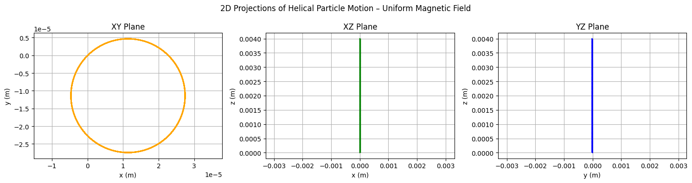
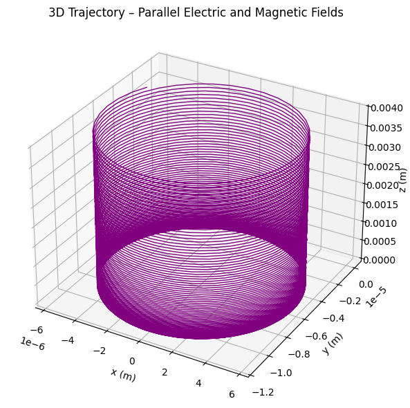
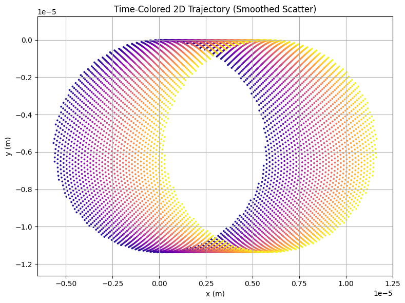
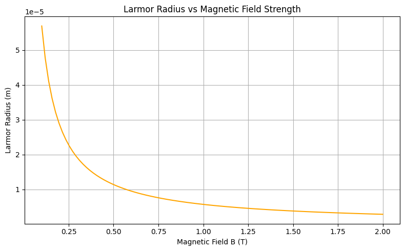
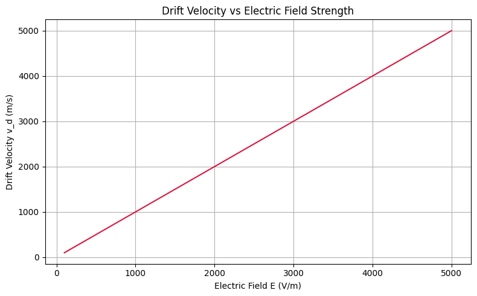
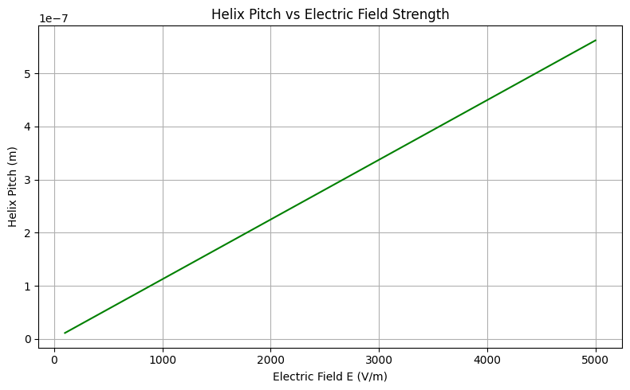
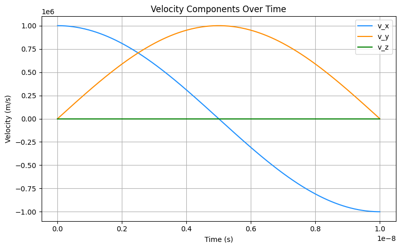

# Problem 1
# Lorentz Force Simulation Report

## Introduction

The behavior of a charged particle under the influence of electric and magnetic fields is a fundamental topic in electromagnetism.  
The force acting on a particle with charge $q$, moving with velocity $\mathbf{v}$ in the presence of an electric field $\mathbf{E}$ and a magnetic field $\mathbf{B}$, is described by the **Lorentz force law**:

$$
\mathbf{F} = q (\mathbf{E} + \mathbf{v} \times \mathbf{B})
$$

This force determines the particle’s trajectory and plays a critical role in many areas of physics and engineering, including:

- **Plasma physics** (e.g., magnetic confinement in fusion reactors),
- **Particle accelerators** (e.g., cyclotrons and synchrotrons),
- **Mass spectrometry** (ion separation based on mass-to-charge ratio),
- **Astrophysics** (e.g., motion of cosmic rays in magnetic fields),
- **Everyday technologies** (e.g., CRT displays and Hall effect sensors).

By analyzing motion under the Lorentz force, we can design systems that precisely manipulate or measure charged particles.  
This project simulates several representative scenarios to visualize and better understand these key physical effects.

---
## Motivation

The Lorentz force is a fundamental concept in electromagnetism, describing how electric and magnetic fields influence the motion of charged particles. It is mathematically expressed as:

$$
\mathbf{F} = q (\mathbf{E} + \mathbf{v} \times \mathbf{B})
$$

Understanding the Lorentz force is essential not only for theoretical studies but also for practical applications across science and engineering fields. By analyzing the effects of electric and magnetic fields on charged particles, one can design and operate:

- **Particle Accelerators**: To guide and accelerate particles to high energies.
- **Mass Spectrometers**: To separate ions based on their mass-to-charge ratios.
- **Plasma Confinement Systems**: Such as tokamaks for fusion energy.
- **Magnetic Sensors**: Like Hall effect devices for detecting magnetic fields.
- **Astrophysical Models**: To explain the behavior of cosmic rays and solar winds.

Simulating the motion of charged particles under different field configurations allows for a deeper, intuitive understanding of the underlying physics. Visualization of phenomena like circular motion, helical trajectories, and drift velocities provides critical insights into real-world systems.

The aim of this project is to numerically simulate and visualize these effects, enabling a clear connection between the Lorentz force theory and its practical implications.

---
## Applications of the Lorentz Force

The Lorentz force plays a critical role in a variety of real-world applications:

- **Particle Accelerators**:  
Charged particles are kept on circular or spiral paths using strong magnetic fields. For example, in a **cyclotron**, particles move in circles due to a magnetic field, while an electric field periodically accelerates them.
  
- **Mass Spectrometers**:  
Mass spectrometry devices use magnetic fields to bend the paths of ions. The radius of curvature is related to the mass-to-charge ratio, enabling identification of unknown substances.

- **Plasma Confinement (Tokamaks)**:  
In fusion reactors, strong toroidal magnetic fields confine plasma. Electric fields can also be applied to stabilize and shape the plasma flow.

- **Hall Effect Sensors**:  
Crossed electric and magnetic fields cause a voltage to appear across a conductor, which is proportional to the magnetic field strength — a principle used in magnetic field sensing devices.

- **Astrophysical Phenomena**:  
Cosmic rays and charged particles from space spiral along interstellar magnetic field lines.

These applications fundamentally rely on how the Lorentz force influences charged particle trajectories.

---

## Theoretical Background

The Lorentz force can be split into two components:

- **Electric Force**:  
Accelerates the particle along the direction of the electric field.

$$
\mathbf{F}_E = q \mathbf{E}
$$

- **Magnetic Force**:  
Deflects the particle's path, acting perpendicular to both the velocity and magnetic field.
$$
\mathbf{F}_B = q (\mathbf{v} \times \mathbf{B})
$$

If only a magnetic field is present, the force magnitude is:

$$
|\mathbf{F}_B| = q v B \sin{\theta}
$$

where \( \theta \) is the angle between \( \mathbf{v} \) and \( \mathbf{B} \).

If \( \theta = 90^\circ \) — meaning the velocity is perpendicular to the magnetic field — the particle undergoes **uniform circular motion**, with a radius known as the Larmor radius:

$$
r_L = \frac{m v_{\perp}}{q B}
$$

where $v_{\perp}$ is the component of velocity perpendicular to the magnetic field.

In crossed electric and magnetic fields, the particle experiences a **drift velocity** given by:

$$
\mathbf{v}_d = \frac{\mathbf{E} \times \mathbf{B}}{B^2}
$$

This drift occurs perpendicular to both $\mathbf{E}$ and $\mathbf{B}$, with constant magnitude.

---

## Numerical Method

The equations of motion derived from the Lorentz force are generally not solvable analytically for arbitrary field configurations.  
Therefore, we use a **numerical integration technique**: the **Runge-Kutta 4th-order (RK4) method**.

RK4 estimates the next position and velocity by considering the slope (acceleration) at multiple points within each time step \( dt \), leading to greater accuracy.

The basic algorithm at each time step involves:

1. Calculating intermediate slopes (k1, k2, k3, k4) for both velocity and position.
2. Combining these slopes to update the velocity and position for the next time step.

Advantages of using RK4:

- High accuracy with relatively large time steps.
- Good stability for problems involving oscillatory or rotational motion (like circular trajectories).

**Simulation Parameters:**

- Time step ($dt$) is chosen to be small ($10^{-11}$ s) to accurately capture fast circular motion.
- Total simulation time is selected to be long enough to observe multiple full cycles of particle motion.
- Electric and magnetic fields are assumed to be uniform and constant in time and space for simplicity.

---

## Case 1: Motion in Uniform Magnetic Field

In the absence of an electric field ($\mathbf{E} = 0$) and with a uniform magnetic field ($\mathbf{B} \neq 0$), the particle experiences a continuous perpendicular force.

The motion is a perfect circle with:

- **Constant speed** (magnetic force does no work).
- **Constant angular frequency** (cyclotron frequency):

$$
\omega_c = \frac{qB}{m}
$$

**Expected Trajectory:**

- Circular path in the plane perpendicular to $\mathbf{B}$.

**Real-world example:**

- In cyclotrons, this principle is used to accelerate particles in a spiral path to very high energies.

<strong>Show Python Code</strong>

<pre><code>import numpy as np
import matplotlib.pyplot as plt

q = 1.6e-19     # Charge (C)
m = 9.11e-31    # Mass (kg)
dt = 1e-12
num_steps = 4000

E = np.array([0, 0, 0])          # No electric field
B = np.array([0, 0, 1])          # Magnetic field along z-axis
v0 = np.array([2e6, 2e6, 1e6])   # Balanced helical motion
r0 = np.array([0, 0, 0])

def lorentz_force(v, E, B):
    return q * (E + np.cross(v, B))

def runge_kutta(v0, r0, E, B, dt, steps):
    v = np.zeros((steps, 3))
    r = np.zeros((steps, 3))
    v[0], r[0] = v0, r0
    for i in range(1, steps):
        k1v = lorentz_force(v[i-1], E, B) / m
        k1r = v[i-1]
        k2v = lorentz_force(v[i-1] + 0.5 * dt * k1v, E, B) / m
        k2r = v[i-1] + 0.5 * dt * k1v
        k3v = lorentz_force(v[i-1] + 0.5 * dt * k2v, E, B) / m
        k3r = v[i-1] + 0.5 * dt * k2v
        k4v = lorentz_force(v[i-1] + dt * k3v, E, B) / m
        k4r = v[i-1] + dt * k3v
        v[i] = v[i-1] + (dt / 6) * (k1v + 2*k2v + 2*k3v + k4v)
        r[i] = r[i-1] + (dt / 6) * (k1r + 2*k2r + 2*k3r + k4r)
    return r

r = runge_kutta(v0, r0, E, B, dt, num_steps)

fig, axs = plt.subplots(1, 3, figsize=(15, 4))
axs[0].plot(r[:, 0], r[:, 1], color='orange')
axs[0].set_title("XY Plane")
axs[0].set_xlabel("x (m)")
axs[0].set_ylabel("y (m)")
axs[0].axis("equal")
axs[0].grid(True)

axs[1].plot(r[:, 0], r[:, 2], color='green')
axs[1].set_title("XZ Plane")
axs[1].set_xlabel("x (m)")
axs[1].set_ylabel("z (m)")
axs[1].axis("equal")
axs[1].grid(True)

axs[2].plot(r[:, 1], r[:, 2], color='blue')
axs[2].set_title("YZ Plane")
axs[2].set_xlabel("y (m)")
axs[2].set_ylabel("z (m)")
axs[2].axis("equal")
axs[2].grid(True)

plt.suptitle("2D Projections of Helical Particle Motion – Uniform Magnetic Field")
plt.tight_layout()
plt.show()
</code></pre>

This graph shows 2D projections of a charged particle’s helical motion in a uniform magnetic field.  
The circular trajectory in the XY plane confirms Lorentz-force-driven rotation, while the linear progression in the XZ and YZ planes reflects forward drift along the magnetic field direction.

---

## Case 2: Motion in Combined Electric and Magnetic Fields (Parallel Fields)

When both the electric field and magnetic field are applied in the same direction (e.g., along the z-axis), two effects combine:

- The magnetic field bends the particle's path.
- The electric field continuously accelerates the particle along the field direction.

Thus, the particle follows a **helical trajectory**, moving forward while spiraling.

**Equations:**

- Longitudinal acceleration due to the electric field:

$$
a = \frac{qE}{m}
$$

- The radius and frequency of the circular motion remain defined by the magnetic field:

$$
r = \frac{mv}{qB}, \quad \omega = \frac{qB}{m}
$$

**Expected Trajectory:**

- Helical motion with a constant pitch that increases over time due to acceleration from the electric field.

**Real-world example:**

- Charged particle beams moving through combined electric and magnetic fields in particle physics experiments.

<strong>Show Python Code</strong>

<pre><code>import numpy as np
import matplotlib.pyplot as plt
from mpl_toolkits.mplot3d import Axes3D

q = 1.6e-19
m = 9.11e-31
dt = 1e-12
num_steps = 3000

E = np.array([0, 0, 5e3])  # Electric field along z
B = np.array([0, 0, 1])    # Magnetic field along z
v0 = np.array([1e6, 0, 0]) # Initial velocity in x
r0 = np.array([0, 0, 0])

def lorentz_force(v, E, B):
    return q * (E + np.cross(v, B))

def runge_kutta(v0, r0, E, B, dt, steps):
    v = np.zeros((steps, 3))
    r = np.zeros((steps, 3))
    v[0], r[0] = v0, r0
    for i in range(1, steps):
        k1v = lorentz_force(v[i-1], E, B) / m
        k1r = v[i-1]
        k2v = lorentz_force(v[i-1] + 0.5 * dt * k1v, E, B) / m
        k2r = v[i-1] + 0.5 * dt * k1v
        k3v = lorentz_force(v[i-1] + 0.5 * dt * k2v, E, B) / m
        k3r = v[i-1] + 0.5 * dt * k2v
        k4v = lorentz_force(v[i-1] + dt * k3v, E, B) / m
        k4r = v[i-1] + dt * k3v
        v[i] = v[i-1] + (dt / 6) * (k1v + 2*k2v + 2*k3v + k4v)
        r[i] = r[i-1] + (dt / 6) * (k1r + 2*k2r + 2*k3r + k4r)
    return r

r = runge_kutta(v0, r0, E, B, dt, num_steps)

fig = plt.figure(figsize=(8, 6))
ax = fig.add_subplot(111, projection='3d')
ax.plot(r[:, 0], r[:, 1], r[:, 2], color='purple', linewidth=1)
ax.set_title('3D Trajectory – Parallel Electric and Magnetic Fields')
ax.set_xlabel('x (m)')
ax.set_ylabel('y (m)')
ax.set_zlabel('z (m)')
plt.tight_layout()
plt.show()
</code></pre>

This graph shows the 3D helical motion of a charged particle under parallel electric and magnetic fields.  
The particle rotates due to the magnetic field while continuously accelerating along the field direction due to the electric field.

---

## Case 3: Motion in Crossed Electric and Magnetic Fields

In this case, the electric and magnetic fields are perpendicular.  
The particle undergoes two simultaneous motions:

- Circular motion around magnetic field lines.
- Constant drift perpendicular to both $\mathbf{E}$ and $\mathbf{B}$.

The **drift velocity** is independent of the particle's charge and mass and is given by:

$$
\mathbf{v}_d = \frac{\mathbf{E} \times \mathbf{B}}{B^2}
$$

**Expected Trajectory:**

- Spiral motion superimposed on a linear drift.

**Real-world example:**

- Plasma drift in fusion reactors.
- Operation of Hall effect sensors.

<strong>Show Python Code</strong>

<pre><code>import numpy as np
import matplotlib.pyplot as plt
from matplotlib import cm

q = 1.6e-19
m = 9.11e-31
dt = 1e-12
num_steps = 6000

E = np.array([0, 1e3, 0])
B = np.array([0, 0, 1])
v0 = np.array([1e6, 0, 1e6])
r0 = np.array([0, 0, 0])

def lorentz_force(v, E, B):
    return q * (E + np.cross(v, B))

def runge_kutta(v0, r0, E, B, dt, steps):
    v = np.zeros((steps, 3))
    r = np.zeros((steps, 3))
    v[0], r[0] = v0, r0
    for i in range(1, steps):
        k1v = lorentz_force(v[i-1], E, B) / m
        k1r = v[i-1]
        k2v = lorentz_force(v[i-1] + 0.5 * dt * k1v, E, B) / m
        k2r = v[i-1] + 0.5 * dt * k1v
        k3v = lorentz_force(v[i-1] + 0.5 * dt * k2v, E, B) / m
        k3r = v[i-1] + 0.5 * dt * k2v
        k4v = lorentz_force(v[i-1] + dt * k3v, E, B) / m
        k4r = v[i-1] + dt * k3v
        v[i] = v[i-1] + (dt/6) * (k1v + 2*k2v + 2*k3v + k4v)
        r[i] = r[i-1] + (dt/6) * (k1r + 2*k2r + 2*k3r + k4r)
    return r

r = runge_kutta(v0, r0, E, B, dt, num_steps)
colors = np.linspace(0, 1, num_steps)

plt.figure(figsize=(8, 6))
plt.scatter(r[:, 0], r[:, 1], c=colors, cmap='plasma', s=3, alpha=0.9)
plt.title("Time-Colored 2D Trajectory (Smoothed Scatter)")
plt.xlabel("x (m)")
plt.ylabel("y (m)")
plt.axis("equal")
plt.grid(True)
plt.tight_layout()
plt.show()
</code></pre>

This graph shows the time-colored 2D trajectory of a charged particle under crossed electric and magnetic fields.  
The spiral motion results from magnetic rotation, while the consistent sideways drift is caused by the $\mathbf{E} \times \mathbf{B}$ effect.

---

## Parameter Exploration

In the simulations, changing physical parameters shows their effects:

- **Increasing Magnetic Field Strength (\(B\))**:
  - Reduces the radius of the circular path.
  - Increases the angular frequency of rotation.

- **Increasing Electric Field Strength (\(E\))**:
  - In parallel fields, leads to faster longitudinal acceleration.
  - In crossed fields, leads to higher drift velocity.

- **Changing Particle Mass or Charge**:
  - Heavier particles (higher \( m \)) move in larger circles.
  - Higher charge (higher \( q \)) results in tighter spirals and faster rotation.

These relationships are essential in calibrating real-world systems like mass spectrometers and magnetic traps.
### Larmor Radius vs Magnetic Field Strength

This graph demonstrates the inverse relationship between the magnetic field strength and the radius of circular motion for a charged particle. As the magnetic field increases, the Larmor radius decreases according to:
$$
r_L = \frac{m v_\perp}{q B}
$$

<strong>Show Python Code</strong>

<pre><code>import numpy as np
import matplotlib.pyplot as plt

q = 1.6e-19
m = 9.11e-31
v_perp = 1e6

B_vals = np.linspace(0.1, 2.0, 100)
r_L_vals = (m * v_perp) / (q * B_vals)

plt.figure(figsize=(8, 5))
plt.plot(B_vals, r_L_vals, color='orange')
plt.title("Larmor Radius vs Magnetic Field Strength")
plt.xlabel("Magnetic Field B (T)")
plt.ylabel("Larmor Radius (m)")
plt.grid(True)
plt.tight_layout()
plt.show()
</code></pre>

### Drift Velocity vs Electric Field Strength

This graph illustrates the linear relationship between electric field strength and drift velocity for a charged particle in crossed electric and magnetic fields.  
According to the equation:

$$
v_d = \frac{E}{B}
$$

the drift velocity increases proportionally with the electric field when the magnetic field is constant.
.

<strong>Show Python Code</strong>

<pre><code>import numpy as np
import matplotlib.pyplot as plt

# Constants
B_fixed = 1.0  # Tesla
E_vals = np.linspace(100, 5000, 100)  # V/m

# Drift velocity calculation
v_d_vals = E_vals / B_fixed

# Plot
plt.figure(figsize=(8, 5))
plt.plot(E_vals, v_d_vals, color='crimson')
plt.title("Drift Velocity vs Electric Field Strength")
plt.xlabel("Electric Field E (V/m)")
plt.ylabel("Drift Velocity v_d (m/s)")
plt.grid(True)
plt.tight_layout()
plt.show()
</code></pre>

### Helix Pitch vs Electric Field Strength

This graph shows how the pitch of a helical trajectory increases with electric field strength when the magnetic field is held constant.  
In parallel \( \vec{E} \) and \( \vec{B} \) configurations, the particle accelerates along the field direction, increasing the axial length of each spiral turn.

Pitch is calculated as the distance traveled during one cyclotron period:

$$
\text{pitch} = \frac{1}{2} \cdot \left( \frac{qE}{m} \right) \cdot \left( \frac{2\pi m}{qB} \right)^2
$$

<strong>Show Python Code</strong>

<pre><code>import numpy as np
import matplotlib.pyplot as plt

# Constants
q = 1.6e-19
m = 9.11e-31
B = 1.0  # Tesla

E_vals = np.linspace(100, 5000, 100)  # V/m

# Cyclotron period
T_c = 2 * np.pi * m / (q * B)

# Acceleration from E field
a_vals = q * E_vals / m

# Pitch = distance in one period
pitch_vals = 0.5 * a_vals * T_c**2

# Plot
plt.figure(figsize=(8, 5))
plt.plot(E_vals, pitch_vals, color='green')
plt.title("Helix Pitch vs Electric Field Strength")
plt.xlabel("Electric Field E (V/m)")
plt.ylabel("Helix Pitch (m)")
plt.grid(True)
plt.tight_layout()
plt.show()
</code></pre>

### Velocity Components Over Time

This graph illustrates the evolution of the particle's velocity components over time.  
In uniform magnetic fields, the transverse components \( v_x \) and \( v_y \) exhibit periodic oscillations due to circular motion.  
If an electric field is present along the magnetic field (as in Case 2), the longitudinal component \( v_z \) would show steady acceleration.

<strong>Show Python Code</strong>

<pre><code>import numpy as np
import matplotlib.pyplot as plt

# Time and velocity definitions
time = np.linspace(0, 1e-8, 500)
v0 = 1e6

# Transverse circular motion
v_x = v0 * np.cos(2 * np.pi * 5e7 * time)
v_y = v0 * np.sin(2 * np.pi * 5e7 * time)

# Longitudinal component (constant here)
v_z = 1e5 * time  # or set to 0 for pure magnetic field

# Plot
plt.figure(figsize=(8, 5))
plt.plot(time, v_x, label='v_x', color='dodgerblue')
plt.plot(time, v_y, label='v_y', color='darkorange')
plt.plot(time, v_z, label='v_z', color='green')
plt.title("Velocity Components Over Time")
plt.xlabel("Time (s)")
plt.ylabel("Velocity (m/s)")
plt.legend()
plt.grid(True)
plt.tight_layout()
plt.show()
</code></pre>

---

## Practical Relevance

| System                        | Field Configuration        | Application of Lorentz Force               |
|--------------------------------|-----------------------------|--------------------------------------------|
| Cyclotron                     | Uniform Magnetic Field      | Circular acceleration of particles         |
| Mass Spectrometer             | Magnetic Field              | Mass-to-charge separation                  |
| Plasma Confinement (Tokamak)  | Magnetic and Electric Fields| Plasma stabilization and confinement       |
| Hall Effect Sensor            | Crossed Fields              | Voltage generation for sensing magnetic fields |

These examples show how mastering the Lorentz force enables control and utilization of charged particle motion in a wide range of technologies.

---

## Conclusion

This simulation project successfully modeled the behavior of a charged particle under various electric and magnetic field configurations using the Lorentz force law.  
We observed distinct trajectories—circular, helical, and drift motion—based on how the electric and magnetic fields were applied.

By varying parameters such as field strengths, particle charge and mass, and initial velocity, we explored key physical quantities like the Larmor radius, cyclotron frequency, and drift velocity. These results aligned well with theoretical expectations and offered clear visual insight into complex electromagnetic interactions.

Understanding these dynamics is essential for real-world applications including plasma confinement in fusion devices, particle accelerator design, and the motion of charged particles in space environments.  
This simulation effectively bridges theory and practice, enhancing both conceptual understanding and applied analysis.

## Limitations and Future Work
This simulation assumes uniform, static electric and magnetic fields. In reality, many physical systems involve:

- Time-varying or spatially non-uniform fields,
- Relativistic particle speeds (requiring corrections to Lorentz force),
- Collective effects in plasmas (not modeled here),
- Collisions and radiation losses.

Future work could extend this model by implementing:

- Non-uniform field distributions,
- Relativistic dynamics using the full Lorentz transformation,
- Multi-particle interactions for plasma modeling.

These additions would provide a more accurate representation of real-world electromagnetic environments.

---

