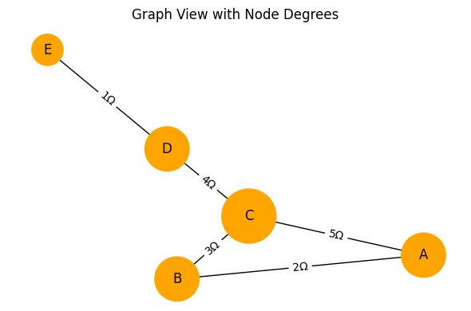
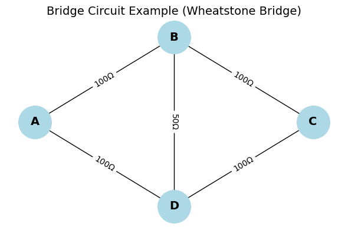
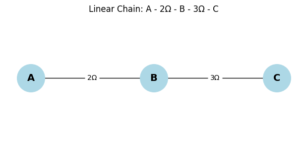
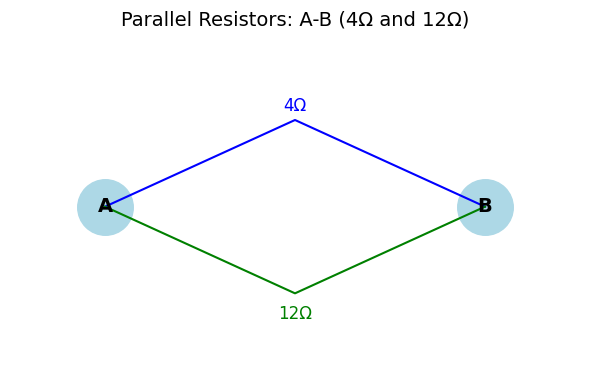
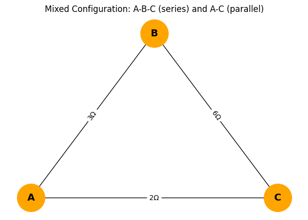
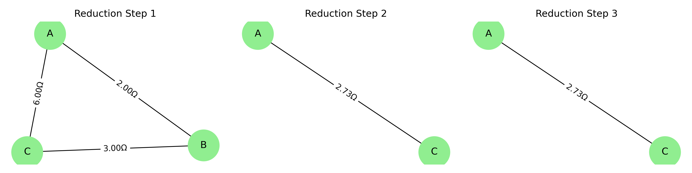
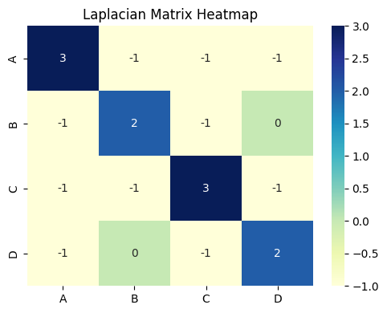

# Problem 1
# Equivalent Resistance Calculation Using Graph Theory

## Introduction

Electrical circuits form the backbone of virtually all modern technological systems, from handheld devices and home appliances to industrial machinery and aerospace control systems. One of the most crucial concepts in analyzing such circuits is understanding how current flows and how much resistance it encounters. The **equivalent resistance** between two points in a circuit determines the current response, energy dissipation, and, ultimately, the circuit’s efficiency.

In introductory physics and engineering courses, this concept is taught through the straightforward application of series and parallel resistance rules. However, such simplifications quickly become inadequate when faced with real-world applications, which often include thousands or millions of elements. Examples include:

* Printed Circuit Boards (PCBs) with dense interconnects
* Integrated Circuits (ICs) in microprocessors
* Electrical grids with redundant pathways
* Neural networks modeled with electrical analogs

In these complex settings, a scalable, algorithmic, and mathematically rigorous approach becomes essential. **Graph theory**, a field of discrete mathematics, offers a highly effective framework for addressing this challenge. By abstracting a circuit as a **weighted undirected graph**, where nodes represent junctions and edges represent resistors, we open the door to a broad array of mathematical tools for simplification, analysis, and simulation.

---

## Motivation

As electrical systems become more interconnected, dynamic, and miniaturized, traditional analysis methods face several critical limitations:

* **Scalability Issues**: Manual methods are not viable for large systems with complex topologies.
* **Automation Barriers**: Human-in-the-loop analysis is not compatible with real-time or high-frequency systems.
* **Lack of Generality**: Series-parallel methods assume identifiable patterns that may not exist in real networks.

Graph theory resolves these issues by offering:

1. **Abstraction**: Focus on topology instead of physical layout.
2. **Formalism**: Reduction steps are based on strict mathematical rules.
3. **Reusability**: Algorithms can be applied to a wide range of electrical and non-electrical networks.
4. **Integration**: Graph-based models work seamlessly with symbolic solvers and numerical methods.

This makes graph-based resistance analysis invaluable for:

* Circuit design automation
* System verification and testing
* Educational simulation environments
* Networked sensors and embedded systems

---

## Fundamental Concepts

### Ohm’s Law

The behavior of resistors is governed by Ohm’s Law:
$V = I \cdot R$
Where:

* $V$: Voltage across the resistor
* $I$: Current through the resistor
* $R$: Resistance in ohms (Ω)

This simple relation allows us to derive the behavior of combinations of resistors.

### Series Connection

In a series configuration, resistors share the same current and are connected end-to-end. The total resistance is the sum of individual resistances:
$R_{eq} = R_1 + R_2 + \cdots + R_n$

Graph representation: A degree-2 node connecting two resistors not part of the source/sink terminals can be removed and replaced by a single edge with combined resistance.

### Parallel Connection

In a parallel configuration, resistors share the same voltage. The total conductance is the sum of individual conductances:
$\frac{1}{R_{eq}} = \frac{1}{R_1} + \frac{1}{R_2} + \cdots + \frac{1}{R_n}$

In graph terms: Multiple edges between two nodes are collapsed into a single equivalent edge.

---

## Graph Representation

### From Circuit to Graph

1. **Nodes (Vertices)**: Each electrical junction becomes a graph node.
2. **Edges**: Each resistor becomes a weighted edge between two nodes.
3. **Edge Weights**: Represent resistance values in ohms.

### Example:

Given:

* A—5Ω—B—10Ω—C
* A—15Ω—C

Graph representation:

* Nodes: A, B, C
* Edges: A-B (5), B-C (10), A-C (15)

This structure can be reduced through graph simplification.

---
## Topological Insights from Graph Structures

Understanding how each node connects within a circuit graph can reveal valuable simplification opportunities. For instance, nodes with degree two are candidates for series reduction, while high-degree nodes indicate central junctions that may support parallel pathways or more complex reductions.

The diagram below visualizes a resistor network where node sizes represent their degree (number of connections). This structural perspective supports algorithmic decisions in circuit simplification.

<details>
<summary><strong>Show Python Code</strong></summary>

<pre><code>import matplotlib.pyplot as plt
import networkx as nx

# Create a graph with varying node degrees
G = nx.Graph()
G.add_edges_from([
    ('A', 'B', {'weight': 2}),
    ('B', 'C', {'weight': 3}),
    ('A', 'C', {'weight': 5}),
    ('C', 'D', {'weight': 4}),
    ('D', 'E', {'weight': 1})
])

# Generate positions for nodes
pos = nx.spring_layout(G, seed=42)

# Compute node degrees
degrees = dict(G.degree())

# Draw the graph with node size based on degree
fig, ax = plt.subplots(figsize=(6, 4))
nx.draw(G, pos, with_labels=True, 
        node_size=[v * 800 for v in degrees.values()],
        node_color='orange', font_size=12, ax=ax)

# Add resistance values as edge labels
edge_labels = nx.get_edge_attributes(G, 'weight')
nx.draw_networkx_edge_labels(G, pos, 
        edge_labels={(u, v): f"{d}Ω" for (u, v), d in edge_labels.items()}, ax=ax)

ax.set_title("Graph View with Node Degrees")
ax.axis('off')
plt.tight_layout()
plt.show()
</code></pre>

</details>


**Figure:** Graph view where node size reflects connection degree.
## Reduction Techniques

### Series Reduction

1. Identify nodes with exactly two neighbors (degree 2), not including the source/sink.
2. Merge edges: $R = R_1 + R_2$
3. Replace with a direct connection between the two neighbors.

### Parallel Reduction

1. Detect multiple edges between the same two nodes.
2. Calculate: $R_{eq} = (1/R_1 + 1/R_2 + \ldots)^{-1}$
3. Replace all edges with a single edge of resistance $R_{eq}$.

### Mixed and Nested Structures

Apply series/parallel rules recursively from the innermost elements outward. Maintain an updated graph structure throughout.

---
## Complex Topologies: Bridge Circuits

While series and parallel reductions are effective for many simple circuits, some topologies — like the classic Wheatstone bridge — cannot be simplified using these rules alone. In such cases, graph theory and matrix-based methods are required to accurately compute the equivalent resistance.

Bridge circuits typically contain a "diagonal" resistor connecting two non-adjacent nodes, forming a mesh that prevents clean separation into series or parallel components.

Below is an example of such a topology:

<details>
<summary><strong>Show Python Code</strong></summary>

<pre><code>import matplotlib.pyplot as plt
import networkx as nx

# Create a Wheatstone Bridge circuit using a graph
G = nx.Graph()

# Add resistors (edges) between nodes with weights as resistance values
G.add_edge('A', 'B', weight=100)
G.add_edge('B', 'C', weight=100)
G.add_edge('A', 'D', weight=100)
G.add_edge('D', 'C', weight=100)
G.add_edge('B', 'D', weight=50)  # bridge resistor

# Define positions for a clear layout
pos = {'A': (0, 1), 'B': (2, 2), 'C': (4, 1), 'D': (2, 0)}

# Draw the graph
fig, ax = plt.subplots(figsize=(6, 4))
nx.draw(G, pos, with_labels=True, node_color='lightblue', node_size=1600,
        font_size=14, font_weight='bold', ax=ax)

# Add edge labels (resistance values)
edge_labels = nx.get_edge_attributes(G, 'weight')
nx.draw_networkx_edge_labels(G, pos, edge_labels={(u, v): f"{w}Ω" for (u, v), w in edge_labels.items()}, ax=ax)

# Set title and hide axes
ax.set_title("Bridge Circuit Example (Wheatstone Bridge)", fontsize=14)
ax.axis('off')
plt.tight_layout()
plt.show()
</code></pre>

</details>


**Figure:** Wheatstone bridge circuit with a diagonal resistor between nodes B and D.
## Laplacian Matrix and Algebraic Analysis

The **Laplacian matrix** $L$ of a graph is central to matrix-based resistance calculations.

### Construction:

$L = D - A$

* $D$: Degree matrix (diagonal matrix of node degrees)
* $A$: Adjacency matrix (weighted by conductance)

### Effective Resistance Formula:

Let $L^+$ be the pseudoinverse of $L$, then the effective resistance between nodes $i$ and $j$ is:
$R_{ij} = (e_i - e_j)^T L^+ (e_i - e_j)$

This method can be applied to any connected graph and supports symbolic, numeric, and probabilistic interpretations.

---

## Algorithm Design

**Inputs:**

* A weighted graph **G**
* Terminal nodes **A** and **B**

**Purpose:**
This algorithm systematically reduces a resistor network using graph-based simplification rules. It is particularly useful for automating resistance calculations in complex or irregular circuit topologies where manual series-parallel identification is impractical.

**Process:**

1. Check if the graph is connected.
2. While |V| > 2:

   * Apply **series reductions**
   * Apply **parallel reductions**
3. Return the edge weight between nodes **A** and **B**

**Notes:**

* Use priority queues to select optimal reduction paths.
* Mark visited nodes to avoid redundant processing.

---

### Pseudocode: Graph-Based Resistance Simplification

The following pseudocode demonstrates how series and parallel rules can be applied iteratively to simplify the graph:

```
Function CalculateEquivalentResistance(Graph G, Node A, Node B):

    While the graph has more than two nodes:

        # --- Series Reduction ---
        For each node N in G:
            If degree(N) == 2 and N is not A or B:
                Let neighbors be U and V
                Let R1 = resistance(N to U)
                Let R2 = resistance(N to V)
                R_eq = R1 + R2
                Remove node N
                Add edge between U and V with resistance R_eq

        # --- Parallel Reduction ---
        For each pair of nodes (U, V):
            If multiple edges exist between U and V:
                Let R1, R2, ..., Rn be all resistances between U and V
                R_eq = 1 / (1/R1 + 1/R2 + ... + 1/Rn)
                Remove all edges between U and V
                Add one edge between U and V with resistance R_eq

    Return resistance between Node A and Node B
```

---
## Detailed Examples

### Example 1: Linear Chain

A --\[2Ω]-- B --\[3Ω]-- C → Result: 5Ω between A and C

<details>
<summary><strong>Show Python Code</strong></summary>

<pre><code>import matplotlib.pyplot as plt
import networkx as nx

# Create the linear chain circuit: A - 2Ω - B - 3Ω - C
G = nx.Graph()
G.add_edge('A', 'B', weight=2)
G.add_edge('B', 'C', weight=3)

# Position nodes in a straight line
pos = {'A': (0, 0), 'B': (1, 0), 'C': (2, 0)}
labels = nx.get_edge_attributes(G, 'weight')

# Plot the graph
plt.figure(figsize=(6, 2.5))
nx.draw(G, pos, with_labels=True, node_color='lightblue',
        node_size=1600, font_size=14, font_weight='bold')
nx.draw_networkx_edge_labels(
    G, pos, edge_labels={(u, v): f"{w}Ω" for (u, v), w in labels.items()}
)
plt.title("Linear Chain: A - 2Ω - B - 3Ω - C")
plt.axis('off')
plt.tight_layout()
plt.show()
</code></pre>

</details>



**This figure** shows a simple series connection of two resistors: 2Ω between A–B and 3Ω between B–C. The equivalent resistance between A and C is 5Ω.

### Example 2: Two Parallel Resistors

A --\[4Ω]-- B and A --\[12Ω]-- B → Result:
$R = \left( \frac{1}{4} + \frac{1}{12} \right)^{-1} = 3Ω$

<details>
<summary><strong>Show Python Code</strong></summary>

<pre><code>import matplotlib.pyplot as plt

# Set up the figure size
fig, ax = plt.subplots(figsize=(6, 4))

# Define node positions
positions = {
    'A': (0, 1),
    'B': (4, 1),
    'mid_top': (2, 2),
    'mid_bottom': (2, 0)
}

# Draw terminal nodes A and B
ax.scatter(*positions['A'], s=1600, color='lightblue')
ax.text(*positions['A'], 'A', fontsize=14, fontweight='bold', ha='center', va='center')

ax.scatter(*positions['B'], s=1600, color='lightblue')
ax.text(*positions['B'], 'B', fontsize=14, fontweight='bold', ha='center', va='center')

# Draw the top path with 4Ω resistor
ax.plot([positions['A'][0], positions['mid_top'][0], positions['B'][0]],
        [positions['A'][1], positions['mid_top'][1], positions['B'][1]],
        color='blue')
ax.text(2, 2.1, '4Ω', fontsize=12, ha='center', color='blue')

# Draw the bottom path with 12Ω resistor
ax.plot([positions['A'][0], positions['mid_bottom'][0], positions['B'][0]],
        [positions['A'][1], positions['mid_bottom'][1], positions['B'][1]],
        color='green')
ax.text(2, -0.3, '12Ω', fontsize=12, ha='center', color='green')

# Title and axis settings
ax.set_title("Parallel Resistors: A-B (4Ω and 12Ω)", fontsize=14)
ax.set_xlim(-1, 5)
ax.set_ylim(-1, 3)
ax.axis('off')

plt.tight_layout()
plt.show()
</code></pre>

</details>


**Figure:** Parallel resistors between nodes A and B (4Ω and 12Ω).


### Example 3: Combination

* A-B: 3Ω
* B-C: 6Ω
* A-C: 2Ω

A-B-C = 9Ω; A-C = 2Ω → parallel →
$R = \left( \frac{1}{9} + \frac{1}{2} \right)^{-1} = 1.57Ω$

<details>
<summary><strong>Show Python Code</strong></summary>

<pre><code>import matplotlib.pyplot as plt
import networkx as nx

# Create a mixed series-parallel configuration: A-B-C (series) and A-C (parallel)
G = nx.Graph()
G.add_edge('A', 'B', weight=3)
G.add_edge('B', 'C', weight=6)
G.add_edge('A', 'C', weight=2)

# Position the nodes in a triangular layout
pos = {'A': (0, 0), 'B': (1, 1.5), 'C': (2, 0)}
labels = nx.get_edge_attributes(G, 'weight')

# Plot the graph
plt.figure(figsize=(6, 4))
nx.draw(G, pos, with_labels=True, node_color='orange', node_size=1600, font_size=14, font_weight='bold')
nx.draw_networkx_edge_labels(G, pos, edge_labels={(u, v): f"{d}Ω" for (u, v), d in labels.items()})
plt.title("Mixed Configuration: A-B-C (series) and A-C (parallel)")
plt.axis('off')
plt.tight_layout()
plt.show()
</code></pre>
</details>



**This figure** illustrates a mixed resistor network where resistors between nodes A and B (3Ω) and between B and C (6Ω) are connected in series. Additionally, a 2Ω resistor directly connects A and C in parallel with the series path. The diagram represents a typical example of series-parallel simplification used to compute the equivalent resistance between A and C.
### Example 4: Progressive Reduction Steps

In more complex circuits, a combination of series and parallel resistors must be reduced gradually in steps. This example demonstrates how a circuit with both series and parallel elements is simplified in three phases.

At each step, series or parallel rules are applied until a single equivalent resistance remains.

<details>
<summary><strong>Show Python Code</strong></summary>

<pre><code>import matplotlib.pyplot as plt
import networkx as nx
from PIL import Image
import io
from IPython.display import display

# Function to draw a single reduction step and return as PIL image
def draw_step(G, step_num):
    pos = nx.spring_layout(G, seed=42)
    labels = nx.get_edge_attributes(G, 'weight')
    fig, ax = plt.subplots(figsize=(4, 3))
    nx.draw(G, pos, with_labels=True, node_color='lightgreen', node_size=1500, ax=ax)
    nx.draw_networkx_edge_labels(G, pos, edge_labels={(u, v): f"{w:.2f}Ω" for (u, v), w in labels.items()}, ax=ax)
    ax.set_title(f"Reduction Step {step_num}")
    ax.axis('off')
    plt.tight_layout()

    buf = io.BytesIO()
    plt.savefig(buf, format='png', dpi=300)
    plt.close()
    buf.seek(0)
    return Image.open(buf)

# Step 1: Original mixed circuit
G1 = nx.Graph()
G1.add_edge('A', 'B', weight=2)
G1.add_edge('B', 'C', weight=3)
G1.add_edge('A', 'C', weight=6)
img1 = draw_step(G1, 1)

# Step 2: Combine A–B–C series path (2+3=5) in parallel with A–C (6Ω)
G2 = nx.Graph()
G2.add_edge('A', 'C', weight=1 / (1/5 + 1/6))  # ≈ 2.73Ω
img2 = draw_step(G2, 2)

# Step 3: Final equivalent resistance
G3 = nx.Graph()
G3.add_edge('A', 'C', weight=2.73)
img3 = draw_step(G3, 3)

# Combine images horizontally
h = max(img1.height, img2.height, img3.height)
img1 = img1.resize((img1.width, h))
img2 = img2.resize((img2.width, h))
img3 = img3.resize((img3.width, h))

total_width = img1.width + img2.width + img3.width
combined = Image.new("RGB", (total_width, h))
combined.paste(img1, (0, 0))
combined.paste(img2, (img1.width, 0))
combined.paste(img3, (img1.width + img2.width, 0))

# Display in Colab
display(combined)
</code></pre>

</details>


**Figure:** Step-by-step simplification of a mixed resistor network.  
The original circuit includes a series path (A–B–C) and a parallel connection (A–C).  
In Step 1, the full configuration is shown.  
In Step 2, the series path is combined into a single resistor.  
Finally, in Step 3, the equivalent resistance is calculated using parallel reduction, resulting in approximately 2.73Ω between nodes A and C.
---
## Matrix-Based Resistance Analysis

In addition to topological reductions such as series and parallel simplifications, graph theory supports a matrix-based approach for calculating equivalent resistance. This method is especially powerful in complex or non-reducible circuits.

The Laplacian matrix of a graph encodes how nodes are connected and how strongly (via edge weights, or conductance). It is defined as:

\[
L = D - A
\]

**Where:**

- \( D \): Degree matrix (a diagonal matrix representing the number of edges connected to each node)
- \( A \): Adjacency matrix (weighted by conductance values between nodes)

Using the **Moore–Penrose pseudoinverse** of the Laplacian matrix, denoted \( L^{+} \), the **effective resistance** between two nodes \( i \) and \( j \) is given by:

$$
R_{ij} = (e_i - e_j)^T \cdot L^{+} \cdot (e_i - e_j)
$$


The heatmap below visualizes the Laplacian matrix of a simple connected graph:
<details>
<summary><strong>Show Python Code</strong></summary>

<pre><code>import matplotlib.pyplot as plt
import networkx as nx
import seaborn as sns

# Create a simple connected graph
G = nx.Graph()
G.add_edges_from([
    ('A', 'B'),
    ('B', 'C'),
    ('C', 'D'),
    ('D', 'A'),
    ('A', 'C')
])

# Compute the Laplacian matrix
L = nx.laplacian_matrix(G).toarray()

# Plot the heatmap
fig, ax = plt.subplots(figsize=(5, 4))
sns.heatmap(L, annot=True, fmt="d", cmap="YlGnBu", xticklabels=G.nodes(), yticklabels=G.nodes(), ax=ax)
ax.set_title("Laplacian Matrix Heatmap")
plt.tight_layout()
plt.show()
</code></pre>

</details>



**Figure:** Heatmap of the Laplacian matrix for a 4-node resistor network.
---

## Extensions

* **AC Analysis**: Replace resistance $R$ with impedance $Z = R + j\omega L - \frac{1}{j\omega C}$
* **Nonlinear Networks**: Include temperature- or voltage-dependent resistances
* **Stochastic Models**: Handle resistors with probabilistic failure rates

---

## Real-World Applications

* PCB trace optimization
* Fault-tolerant routing in microchips
* Resistance-based sensor calibration
* Analysis of resistive touchscreen matrices
* Energy distribution in smart grids

---
## Conclusion

Graph theory provides a powerful, formal, and scalable approach to calculating equivalent resistance. Whether the system consists of a few resistors or a mesh of thousands of nodes, graph-based algorithms and matrix methods enable precise and efficient analysis. As electronics become more complex and interconnected, the integration of graph theory into the toolkit of engineers and scientists becomes not only useful but essential.

Compared to traditional techniques like mesh analysis or nodal analysis—which often require solving large systems of equations—graph-based simplification offers a visual and algorithmic approach that can be automated. However, it may be less effective when dealing with dynamic components (e.g., capacitors, inductors) or circuits with non-linear behaviors.

Future directions include AI-assisted graph simplification, integration with symbolic algebra for real-time prototyping, and quantum analogues for resistance in quantum networks.