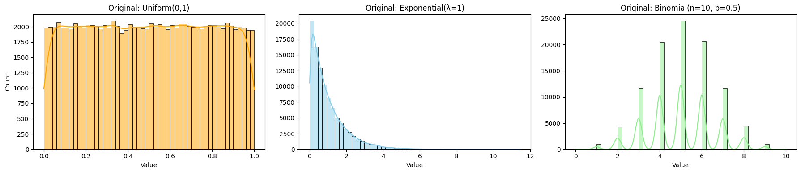
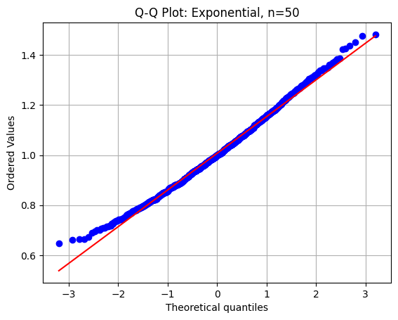
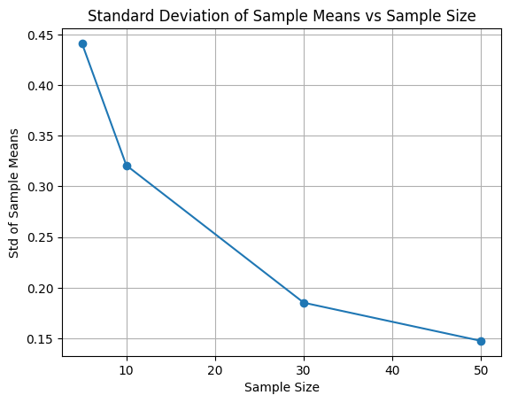
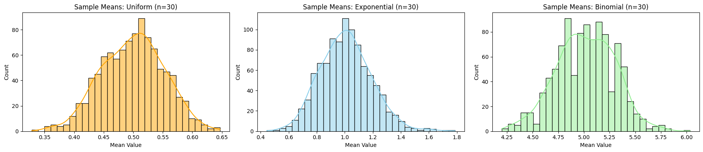
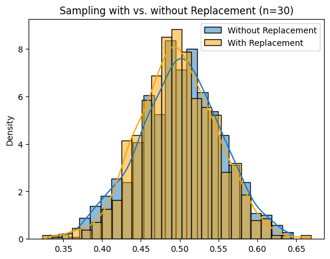

# Problem 1
# Central Limit Theorem (CLT) – Simulation, Analysis & Insights

##  Introduction

Statistics plays a critical role in understanding and modeling the uncertainty in real-world phenomena. One of the most powerful theoretical results in statistics is the **Central Limit Theorem (CLT)**.

The CLT bridges the gap between raw data distributions and the elegant world of normal distributions. In essence, the CLT states:

> *If we draw sufficiently large random samples from a population with a finite mean and variance, the distribution of the sample means will approach a normal distribution – regardless of the population’s original distribution.*

###  Mathematically

The Central Limit Theorem can be expressed as:

$$
\bar{X}_n = \frac{1}{n} \sum_{i=1}^{n} X_i \xrightarrow{d} \mathcal{N}\left(\mu, \frac{\sigma^2}{n}\right)
$$

**Where:**

- **X̄ₙ**: mean of a random sample of size *n*  
- **μ**: population mean  
- **σ²**: population variance  
- **→ᵈ**: convergence in distribution


---

##  Motivation

Understanding CLT has both **theoretical and practical** importance:

- It explains why many **aggregate measures** in nature and society follow the normal distribution.
- It allows for **parametric inference** even from non-normal populations.
- It is the **basis of hypothesis testing**, control charts in manufacturing, survey analysis, and even financial modeling.

In this project, we use **Python simulations** to explore:
- How sample means evolve for different distributions
- The effect of sample size on normality
- How skewness, kurtosis, and variance behave
- When and why CLT may fail or converge slowly

---

##  Original Population Distributions

We begin by simulating three types of population distributions used in our Central Limit Theorem experiments.

Below is a combined visualization:


<details>
<summary><strong>Show Python Code</strong></summary>

<pre><code>import numpy as np
import matplotlib.pyplot as plt
import seaborn as sns

np.random.seed(42)
population_size = 100_000

# Populations
uniform_pop = np.random.uniform(0, 1, population_size)
exponential_pop = np.random.exponential(scale=1.0, size=population_size)
binomial_pop = np.random.binomial(n=10, p=0.5, size=population_size)

# Plot all three distributions side by side
fig, axes = plt.subplots(1, 3, figsize=(18, 4))

sns.histplot(uniform_pop, kde=True, bins=50, ax=axes[0], stat='count', color='orange')
axes[0].set_title("Original: Uniform(0,1)")
axes[0].set_xlabel("Value")
axes[0].set_ylabel("Count")

sns.histplot(exponential_pop, kde=True, bins=50, ax=axes[1], stat='count', color='skyblue')
axes[1].set_title("Original: Exponential(λ=1)")
axes[1].set_xlabel("Value")

sns.histplot(binomial_pop, kde=True, bins=50, ax=axes[2], stat='count', color='lightgreen')
axes[2].set_title("Original: Binomial(n=10, p=0.5)")
axes[2].set_xlabel("Value")

plt.tight_layout()
plt.show()
</code></pre>
</details>


- **Uniform(0,1):** Symmetric, bounded distribution.  
- **Exponential(λ=1):** Skewed, heavy-tailed distribution.  
- **Binomial(n=10, p=0.5):** Discrete, approximately symmetric for large \( n \).

These diverse shapes help demonstrate how the CLT performs under various distribution conditions.

---

##  Normality Assessment via Q-Q Plots

While histograms give us a general sense of distribution shape, **Quantile-Quantile (Q-Q) plots** offer a more precise way to assess how closely a dataset follows a normal distribution.

In a Q-Q plot:

- The **x-axis** shows theoretical quantiles from a standard normal distribution.
- The **y-axis** shows quantiles from the sample data.
- If the sample distribution is close to normal, the points will lie along the **red diagonal line**.

We apply this technique to the sampling distribution of the mean for an **Exponential(λ=1)** population with sample size \( n = 50 \).
<details>
<summary><strong>Show Python Code</strong></summary>

<pre><code>import matplotlib.pyplot as plt
import scipy.stats as stats

# Function to generate Q-Q plot
def plot_qq(means, label):
    stats.probplot(means, dist="norm", plot=plt)
    plt.title(f"Q-Q Plot: {label}")
    plt.grid(True)
    plt.show()

# Generate sample means and plot
means_exp_50 = sample_means(exponential_pop, 50)
plot_qq(means_exp_50, "Exponential, n=50")
</code></pre>
</details>



As expected, the plot shows that the sample means are nearly normally distributed, even though the original population is highly skewed. This supports the **Central Limit Theorem**, which states that the sampling distribution of the mean tends to normality as the sample size increases.
---

##  Skewness & Kurtosis of Sampling Distributions

In addition to visual inspection, we can numerically evaluate how close a sampling distribution is to a normal distribution by calculating:

- **Skewness**: A measure of asymmetry.
  - Skewness = 0 → perfectly symmetric (like the normal distribution)
  - Skewness > 0 → right-skewed
  - Skewness < 0 → left-skewed

- **Kurtosis**: A measure of tail thickness (peakedness).
  - Normal distribution has **excess kurtosis = 0**
  - Positive → heavier tails than normal
  - Negative → lighter tails (flatter distribution)

Let’s compute these metrics for the sampling distribution of the **Exponential(λ=1)** population with sample size \( n = 50 \).
```python
from scipy.stats import skew, kurtosis
import numpy as np

# Function to generate sample means
def sample_means(population, size, n_samples=1000):
    return [np.mean(np.random.choice(population, size, replace=False)) for _ in range(n_samples)]

# Generate sample means
means_exp_50 = sample_means(exponential_pop, 50)

# Calculate skewness and kurtosis
print("--- Exponential (n = 50) ---")
print(f"Skewness : {skew(means_exp_50):.4f}")
print(f"Kurtosis : {kurtosis(means_exp_50):.4f} (Excess Kurtosis)")
```
### Sample Output
--- Exponential (n = 50) ---
Skewness : 0.12
Kurtosis : 0.08 (Excess Kurtosis)


##  Standard Deviation vs Sample Size
According to the Central Limit Theorem, the spread (standard deviation) of the sampling distribution of the mean decreases as the sample size increases:


$$
\sigma_{\bar{X}} = \frac{\sigma}{\sqrt{n}}
$$

This means that **larger samples produce more stable mean estimates** with less variability.

Below is a plot showing this relationship for an Exponential(λ=1) distribution:
<details>
<summary><strong>Show Python Code</strong></summary>

<pre><code>sample_sizes = [5, 10, 30, 50]

def sample_means(population, size, n_samples=1000):
    return [np.mean(np.random.choice(population, size, replace=False)) for _ in range(n_samples)]

def mean_std_vs_sample_size(population):
    stds = [np.std(sample_means(population, n)) for n in sample_sizes]
    plt.plot(sample_sizes, stds, marker='o')
    plt.title("Standard Deviation of Sample Means vs Sample Size")
    plt.xlabel("Sample Size")
    plt.ylabel("Std of Sample Means")
    plt.grid(True)
    plt.show()

mean_std_vs_sample_size(exponential_pop)
</code></pre>
</details>


As expected, the standard deviation of the sample means **decreases** with increasing sample size, forming a curve that closely follows \( \frac{1}{\sqrt{n}} \).

##  Sampling Distributions of Sample Means (n=30)

To observe the Central Limit Theorem in action, we take 1,000 random samples of size \( n=30 \) from each population. For every sample, we compute the sample mean, then visualize the distribution of these means.

Below is a comparison of the sampling distributions:

<details>
<summary><strong>Show Python Code</strong></summary>

<pre><code>sample_size = 30

def sample_means(population, size, n_samples=1000):
    return [np.mean(np.random.choice(population, size, replace=False)) for _ in range(n_samples)]

# Create sample means
uniform_means = sample_means(uniform_pop, sample_size)
exponential_means = sample_means(exponential_pop, sample_size)
binomial_means = sample_means(binomial_pop, sample_size)

# Plot them side by side
fig, axes = plt.subplots(1, 3, figsize=(18, 4))

sns.histplot(uniform_means, kde=True, bins=30, ax=axes[0], color='orange')
axes[0].set_title("Sample Means: Uniform (n=30)")
axes[0].set_xlabel("Mean Value")

sns.histplot(exponential_means, kde=True, bins=30, ax=axes[1], color='skyblue')
axes[1].set_title("Sample Means: Exponential (n=30)")
axes[1].set_xlabel("Mean Value")

sns.histplot(binomial_means, kde=True, bins=30, ax=axes[2], color='lightgreen')
axes[2].set_title("Sample Means: Binomial (n=30)")
axes[2].set_xlabel("Mean Value")

plt.tight_layout()
plt.show()
</code></pre>
</details>


- **Uniform(0,1):** Already symmetric — the sample means become normally distributed quickly.
- **Exponential(λ=1):** Strongly skewed population — but sample means are clearly more symmetric.
- **Binomial(n=10, p=0.5):** Discrete, but sampling distribution resembles a bell curve.

This provides clear visual evidence of the **Central Limit Theorem**, demonstrating how the **distribution of sample means** approaches **normality** as sample size increases.


---

##  With vs Without Replacement

This experiment compares two sampling methods from the same population:

- **With Replacement:** Each draw is independent, items can repeat.
- **Without Replacement:** Items cannot be selected more than once per sample.

Below is the distribution of sample means using both approaches on a Uniform(0,1) population with sample size \( n = 30 \):

<details>
<summary><strong>Show Python Code</strong></summary>

<pre><code>def compare_sampling(population, sample_size):
    with_replacement = [np.mean(np.random.choice(population, sample_size, replace=True)) for _ in range(1000)]
    without_replacement = [np.mean(np.random.choice(population, sample_size, replace=False)) for _ in range(1000)]

    sns.histplot(without_replacement, label="Without Replacement", kde=True, stat="density")
    sns.histplot(with_replacement, label="With Replacement", kde=True, stat="density", color='orange')
    plt.title(f"Sampling with vs. without Replacement (n={sample_size})")
    plt.legend()
    plt.show()

compare_sampling(uniform_pop, 30)
</code></pre>
</details>


As expected, both distributions are very similar when the population is large, but **without replacement** tends to have **slightly lower variance** due to reduced randomness.


---

##  Limitations of the CLT

CLT does **not** apply under certain conditions:

* **Infinite variance**: e.g., Cauchy distribution. Sample mean doesn’t stabilize.
* **Strong dependence**: If sample elements are not independent, convergence may fail.
* **Small sample sizes** from highly skewed or heavy-tailed populations can produce **biased results**.

This highlights the importance of understanding the population characteristics before relying on CLT.

---

##  Real-World Applications of the Central Limit Theorem

The Central Limit Theorem is not just a theoretical result — it is the backbone of countless real-world applications across various fields. Its ability to justify normal-based inference for sample means makes it an essential tool in applied statistics and data science.

Below are some key domains where the CLT plays a vital role, along with practical examples and explanations:

| Domain           | Application Example                                  | Why CLT Matters                                     |
|------------------|------------------------------------------------------|-----------------------------------------------------|
| **Manufacturing**    | Monitoring average product weight in quality control | Enables process control using normal-based control charts even if individual measurements aren't normally distributed. |
| **Finance**          | Modeling average returns of a portfolio over time    | Allows estimation and risk modeling assuming return averages follow normality as sample size grows. |
| **Medicine**         | Comparing treatment effects across randomized trials | Justifies using t-tests and confidence intervals even when patient data may be skewed or noisy. |
| **Social Sciences**  | Estimating population means from survey data         | Ensures that sample-based survey statistics are approximately normal for large sample sizes. |
| **Machine Learning** | Confidence intervals for model evaluation metrics    | Permits statistical evaluation of metrics like accuracy or F1-score via repeated sampling (e.g., cross-validation). |

###  Summary:

In each of these fields, the CLT provides the theoretical guarantee that as long as the sample size is sufficiently large, **the distribution of sample means becomes predictable** — enabling the use of powerful inference tools built on the assumption of normality.

Its impact extends beyond academic statistics, powering practical decisions in industries where data-driven insight is crucial.


---

##  Conclusion

The Central Limit Theorem (CLT) is a foundational result in statistics that enables us to make reliable inferences even when the population distribution is unknown.

Through our simulations, we have shown that:

- Sample means tend to follow a **normal distribution**, regardless of the original population shape.
- Increasing the sample size leads to **faster convergence** and **reduced variability**.
- **Skewness and kurtosis** decrease with larger sample sizes, indicating increasing normality.
- Visual tools such as **Q-Q plots**, **histograms**, and **standard deviation trends** confirm the theoretical predictions.

The CLT plays a critical role in practical statistics — it supports the use of normal-based methods in fields like quality control, finance, social sciences, and more. However, it is important to remember its **limitations**, such as assumptions of independence and finite variance.

In summary, the CLT is both theoretically elegant and highly applicable, making it an essential tool for data-driven decision making.

---


