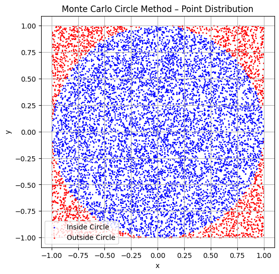
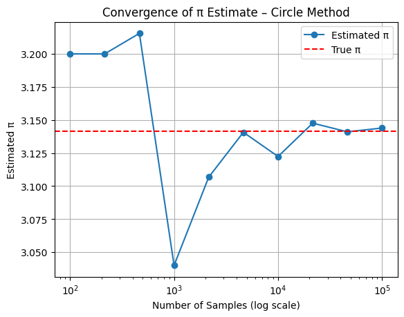
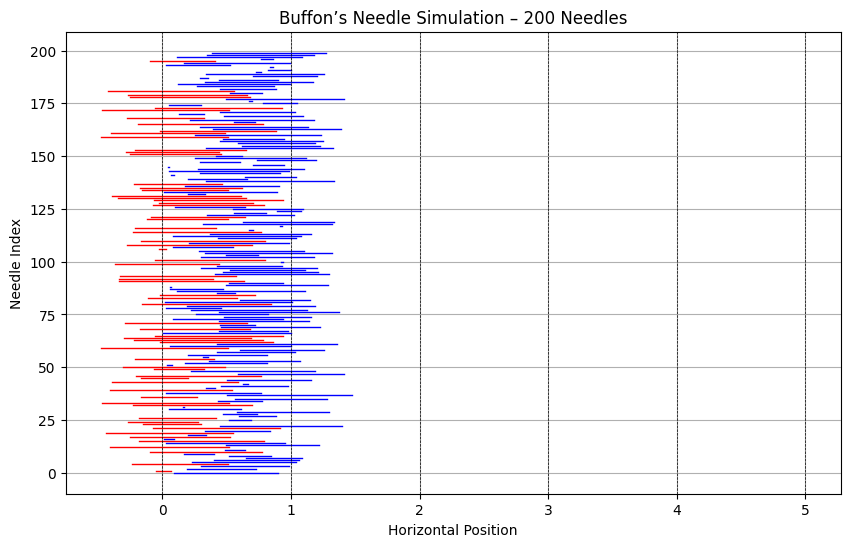
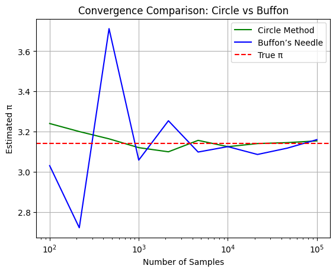
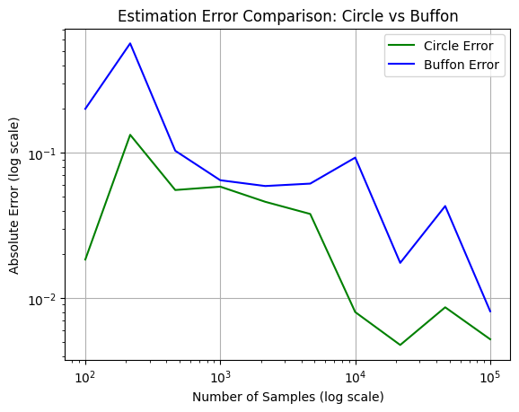

# Problem 2
#  Estimating π Using Monte Carlo Methods
##  Introduction

π (pi) is an irrational number representing the ratio of a circle’s circumference to its diameter. While known to extraordinary precision through analytical and computational techniques, its estimation via random simulation continues to serve as a cornerstone in demonstrating how **stochastic processes** can yield accurate results.

Monte Carlo methods, named after the gambling capital of Monaco, rely on **repeated random sampling** to solve deterministic problems. These techniques gained prominence during the Manhattan Project and remain vital today in fields ranging from statistical mechanics to quantitative finance.

This report focuses on two historically and mathematically significant Monte Carlo methods to estimate π:

1. **Area-based estimation** using randomly sampled points inside a square and an inscribed circle.
2. **Buffon’s Needle experiment**, a probabilistic geometric problem from the 18th century.

These two techniques offer contrasting approaches to numerical approximation, providing a rich platform to explore **probability theory**, **geometric intuition**, and **computational convergence**.

---

##  Motivation

Why estimate π using randomness when deterministic formulas exist?

Because the purpose is not just to *calculate* π, but to **understand how randomness can produce order**. These simulations demonstrate that by collecting enough random samples and applying well-founded probability theory, one can approximate constants that are otherwise infinite and non-repeating in nature.

Monte Carlo simulations are foundational in solving:

- High-dimensional integrals
- Risk and uncertainty models in finance
- Optimization under constraints
- Physical simulations of particle interactions

Estimating π this way is a **controlled microcosm** of much larger, real-world applications.

---

##  Part 1: Monte Carlo Estimation of π Using a Circle

###  Geometric Probability and Theory

Consider a square of side length 2 centered at the origin (from \(-1\) to \(1\) in both \(x\) and \(y\)). A **unit circle** (radius = 1) is inscribed within this square. The area of the square is:

$$
A_{\text{square}} = (2)^2 = 4
$$

The area of the circle is:

$$
A_{\text{circle}} = \pi r^2 = \pi \cdot 1^2 = \pi
$$

The probability that a randomly placed point in the square also lies in the circle is given by:

$$
P = \frac{\text{Area of Circle}}{\text{Area of Square}} = \frac{\pi}{4}
$$

This leads to the estimator:

$$
\pi \approx 4 \cdot \frac{\text{Number of points inside the circle}}{\text{Total number of points}}
$$

###  Numerical Illustration

If we randomly generate 1,000,000 points and 785,400 fall inside the unit circle, we compute:

$$
\pi \approx 4 \cdot \frac{785400}{1000000} = 3.1416
$$


---

###  Visual Analysis

* Blue dots represent points inside the circle.
* Red dots fall outside the circle but inside the square.

This shows how π emerges from empirical sampling.
<details>
<summary>Show Python Code</summary>

<pre><code>import os
import numpy as np
import matplotlib.pyplot as plt

# Create folder if it doesn't exist
os.makedirs("figures", exist_ok=True)

# Generate random points
n = 10000
x = np.random.uniform(-1, 1, n)
y = np.random.uniform(-1, 1, n)
inside = x**2 + y**2 <= 1

# Plot
plt.figure(figsize=(6, 6))
plt.scatter(x[inside], y[inside], color='blue', s=1, label='Inside Circle')
plt.scatter(x[~inside], y[~inside], color='red', s=1, label='Outside Circle')
plt.title("Monte Carlo Circle Method – Point Distribution")
plt.xlabel("x")
plt.ylabel("y")
plt.axis('equal')
plt.grid(True)
plt.legend()

# Save image
plt.savefig("figures/circle_scatter.png", dpi=300)
plt.show()
</code></pre>
</details>


**Figure:** Scatter plot of random points used in estimating π via the Monte Carlo circle method.  
Points inside the circle are shown in blue, outside in red.


###  Convergence Behavior

As per the **Law of Large Numbers**, the sample average converges to the expected value. The estimation error follows:

$$
\text{Standard Error} \propto \frac{1}{\sqrt{n}}
$$

This means if you want to reduce the error by a factor of 10, you need 100 times more samples.
<details>
<summary>Show Python Code</summary>

<pre><code>import os
import numpy as np
import matplotlib.pyplot as plt

# Create output folder if it doesn't exist
os.makedirs("figures", exist_ok=True)

# Sample sizes and estimates
sample_sizes = np.logspace(2, 5, 10, dtype=int)
estimates = []

for n in sample_sizes:
    x = np.random.uniform(-1, 1, n)
    y = np.random.uniform(-1, 1, n)
    inside = x**2 + y**2 <= 1
    pi_estimate = 4 * np.sum(inside) / n
    estimates.append(pi_estimate)

# Plot convergence
plt.figure()
plt.plot(sample_sizes, estimates, marker='o', label='Estimated π')
plt.axhline(np.pi, color='red', linestyle='--', label='True π')
plt.xscale('log')
plt.xlabel('Number of Samples (log scale)')
plt.ylabel('Estimated π')
plt.title('Convergence of π Estimate – Circle Method')
plt.grid(True)
plt.legend()

# Save plot
plt.savefig("figures/circle_convergence.png", dpi=300)
plt.show()
</code></pre>
</details>


**Figure:** Estimation of π as the number of random points increases using the Monte Carlo circle method.  
As the sample size grows, the estimate converges toward the true value of π, demonstrating the Law of Large Numbers.

---

##  Part 2: Monte Carlo Estimation via Buffon’s Needle

###  Historical Background

Formulated by Comte de Buffon in 1777, this problem asks: *What is the probability that a randomly dropped needle crosses one of several parallel lines?*

Let:

* $L$ be the needle length
* $d$ be the distance between parallel lines

Assuming $L \leq d$, the probability of a crossing is:

$$
P = \frac{2L}{d\pi}
$$

Solving for π:

$$
\pi \approx \frac{2L \cdot N}{d \cdot C}
$$

Where:

* $N$ = total number of needle drops
* $C$ = number of needles that cross a line

###  Derivation

Let $θ$ be the angle between the needle and the parallel lines ($0 \leq θ \leq \frac{\pi}{2}$), and $x$ be the perpendicular distance from the needle’s center to the nearest line ($0 \leq x \leq \frac{d}{2}$). A crossing occurs if:

$$
x \leq \frac{L}{2} \sin θ
$$

Integrating the probability over all θ yields the known result.

###  Numerical Illustration

For $L = 1$, $d = 2$, and 100,000 drops with 63,700 crossings:

$$
\pi \approx \frac{2 \cdot 1 \cdot 100000}{2 \cdot 63700} \approx 3.14
$$

### Python Simulation

```python
import numpy as np

# Parameters
L = 1.0           # Needle length
d = 2.0           # Distance between lines
N = 100000        # Number of needle drops

# Generate random angles and distances
theta = np.random.uniform(0, np.pi, N)
x_center = np.random.uniform(0, d / 2, N)

# Determine crossings
crossings = x_center <= (L / 2) * np.sin(theta)
C = np.sum(crossings)

# Estimate π
if C > 0:
    pi_estimate = (2 * L * N) / (d * C)
    print(f"Estimated π: {pi_estimate:.5f}")
else:
    print("No crossings detected.")
```


###  Visual Analysis

* Red needles cross lines.
* Blue needles do not.

This visualization aids in intuitively understanding geometric probability.
<details>
<summary>Show Python Code</summary>

<pre><code>import os
import numpy as np
import matplotlib.pyplot as plt

# Ensure output directory exists
os.makedirs("figures", exist_ok=True)

# Parameters
n_needles = 200
L = 1.0
d = 2.0

theta = np.random.uniform(0, np.pi, n_needles)
x_center = np.random.uniform(0, d/2, n_needles)
hits = x_center <= (L/2) * np.sin(theta)

# Plot the needles
plt.figure(figsize=(10, 6))
for i in range(n_needles):
    x0 = x_center[i]
    angle = theta[i]
    x1 = x0 + (L/2) * np.sin(angle)
    x2 = x0 - (L/2) * np.sin(angle)
    color = 'red' if hits[i] else 'blue'
    plt.plot([x1, x2], [i, i], color=color, linewidth=1)

# Draw parallel lines
for j in range(0, int(d*3)):
    plt.axvline(j, color='black', linestyle='--', linewidth=0.5)

plt.title("Buffon’s Needle Simulation – 200 Needles")
plt.xlabel("Horizontal Position")
plt.ylabel("Needle Index")
plt.grid(True)

# Save figure
plt.savefig("figures/buffon_simulation.png", dpi=300)
plt.show()
</code></pre>
</details>


**Figure:** Visualization of Buffon's Needle simulation. Red needles cross the parallel lines, blue needles do not.  
This visually demonstrates how line intersections contribute to estimating π probabilistically.

---

##  Comparative Analysis

###  Convergence: Circle vs. Buffon

| Method          | Sample Size | Estimated π | Std. Error | Complexity            |
| --------------- | ----------- | ----------- | ---------- | --------------------- |
| Circle Method   | 100,000     | ~3.1417     | Low        | $O(n)$                |
| Buffon’s Needle | 100,000     | ~3.12–3.17  | Higher     | $O(n)$ + trigonometry |

To visualize this comparison, the following graph plots π estimates from both methods  
across increasing sample sizes on a logarithmic scale.


<details>
<summary>Show Python Code</summary>

<pre><code>import os
import numpy as np
import matplotlib.pyplot as plt

# Ensure folder exists
os.makedirs("figures", exist_ok=True)

# Buffon simulation function
def simulate_buffon(n, L=1.0, d=2.0):
    theta = np.random.uniform(0, np.pi, n)
    x_center = np.random.uniform(0, d/2, n)
    hits = x_center <= (L/2) * np.sin(theta)
    count = np.sum(hits)
    if count == 0:
        return np.nan
    return (2 * L * n) / (d * count)

# Common sample sizes
sample_sizes = np.logspace(2, 5, 10, dtype=int)

# Run both estimators
circle_estimates = []
buffon_estimates = []

for n in sample_sizes:
    # Circle
    x = np.random.uniform(-1, 1, n)
    y = np.random.uniform(-1, 1, n)
    inside = x**2 + y**2 <= 1
    circle_estimates.append(4 * np.sum(inside) / n)

    # Buffon
    buffon_estimates.append(simulate_buffon(n))

# Plot comparison
plt.figure()
plt.plot(sample_sizes, circle_estimates, label='Circle Method', color='green')
plt.plot(sample_sizes, buffon_estimates, label="Buffon’s Needle", color='blue')
plt.axhline(np.pi, color='red', linestyle='--', label='True π')
plt.xscale('log')
plt.xlabel('Number of Samples')
plt.ylabel('Estimated π')
plt.title('Convergence Comparison: Circle vs Buffon')
plt.legend()
plt.grid(True)

# Save
plt.savefig("figures/convergence_comparison.png", dpi=300)
plt.show()
</code></pre>
</details>


**Figure:** Comparison of π convergence using the circle method and Buffon’s Needle.  
The circle method converges faster and more smoothly, while Buffon's method fluctuates significantly and stabilizes slowly.

### Estimation Error Behavior

* Circle Method’s error decays quickly and smoothly.  
* Buffon’s Method suffers from **higher variance**, especially with small sample sizes.

To quantify this behavior, we compute the **absolute error** as the difference between each estimated value of π  
and the true value. The graph below compares these errors across sample sizes on a log-log scale,  
highlighting how much more efficiently the circle method reduces error.

<details>
<summary>Show Python Code</summary>

<pre><code>import os
import numpy as np
import matplotlib.pyplot as plt

# Make sure output folder exists
os.makedirs("figures", exist_ok=True)

# Buffon simulation function
def simulate_buffon(n, L=1.0, d=2.0):
    theta = np.random.uniform(0, np.pi, n)
    x_center = np.random.uniform(0, d/2, n)
    hits = x_center <= (L/2) * np.sin(theta)
    count = np.sum(hits)
    if count == 0:
        return np.nan
    return (2 * L * n) / (d * count)

# Sample sizes
sample_sizes = np.logspace(2, 5, 10, dtype=int)

# Estimations
circle_errors = []
buffon_errors = []

for n in sample_sizes:
    # Circle
    x = np.random.uniform(-1, 1, n)
    y = np.random.uniform(-1, 1, n)
    inside = x**2 + y**2 <= 1
    circle_est = 4 * np.sum(inside) / n
    circle_errors.append(abs(circle_est - np.pi))

    # Buffon
    buffon_est = simulate_buffon(n)
    buffon_errors.append(abs(buffon_est - np.pi))

# Plot error comparison
plt.figure()
plt.plot(sample_sizes, circle_errors, label='Circle Error', color='green')
plt.plot(sample_sizes, buffon_errors, label="Buffon Error", color='blue')
plt.xscale('log')
plt.yscale('log')
plt.xlabel("Number of Samples (log scale)")
plt.ylabel("Absolute Error (log scale)")
plt.title("Estimation Error Comparison: Circle vs Buffon")
plt.legend()
plt.grid(True)

# Save plot
plt.savefig("figures/error_comparison.png", dpi=300)
plt.show()
</code></pre>
</details>


**Figure:** Absolute error comparison between the circle method and Buffon’s Needle for π estimation.  
The circle method achieves lower error more quickly and stabilizes earlier, while Buffon’s method fluctuates longer and converges slower.

###  Use Cases

| Aspect                | Circle-Based Method | Buffon's Needle             |
| --------------------- | ------------------- | --------------------------- |
| Visual Intuition      | Strong              | Moderate                    |
| Historical Importance | Low                 | High                        |
| Computational Load    | Low                 | Moderate (due to sin, rand) |
| Convergence Rate      | Fast                | Slow                        |

---

## Conclusion

### Summary

Both Monte Carlo methods effectively estimate π by relying on the principles of geometric and probabilistic sampling. However, their **efficiency**, **convergence**, and **practical utility** differ significantly.

* **Circle-Based Monte Carlo** is computationally efficient, converges rapidly, and produces low variance.
* **Buffon’s Needle** is elegant and historically rich, but computationally slower and statistically noisier.

### Educational Insights

These methods showcase:

* The **power of randomness** in estimation  
* How **probability distributions** manifest through physical analogies  
* The concept of **asymptotic behavior** and **variance trade-offs**

### Final Thoughts

Estimating π using Monte Carlo methods is more than an academic exercise — it encapsulates key ideas in uncertainty modeling, numerical analysis, and simulation science.  
By understanding the strengths and limitations of different approaches, we can design better simulations for complex systems in real-world applications.

Whether tossing virtual darts or metaphorical needles, we are reminded that **randomness does not imply disorder**.  
In the long run, the chaos reveals a pattern — a circle, a ratio, and a constant as profound as π.

*Beyond π estimation, these Monte Carlo techniques are widely used in fields such as computational physics, financial risk modeling, and machine learning for solving integration, optimization, and uncertainty quantification problems.*

---

