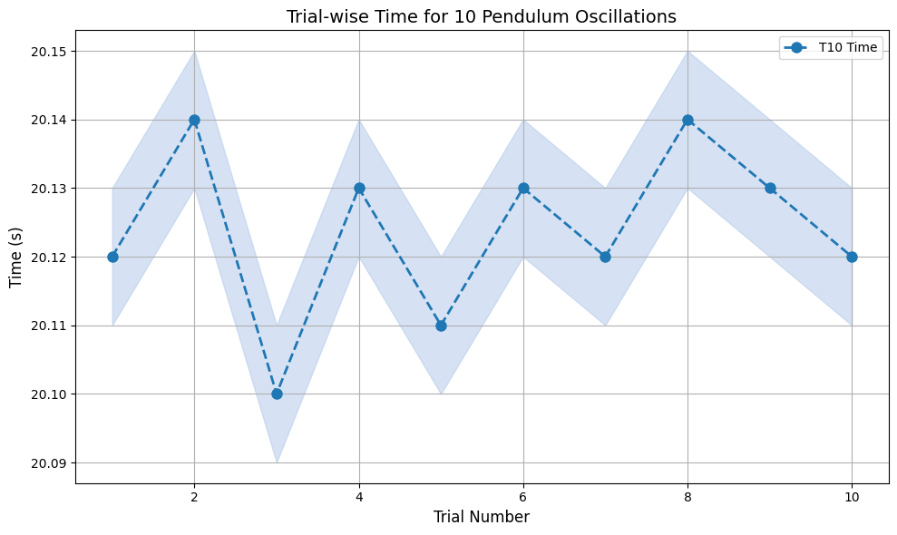
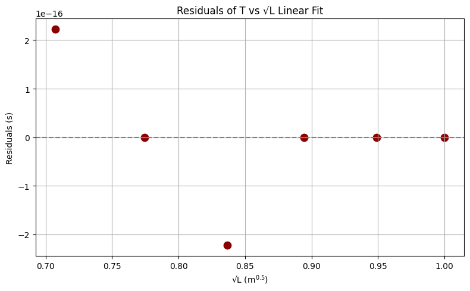
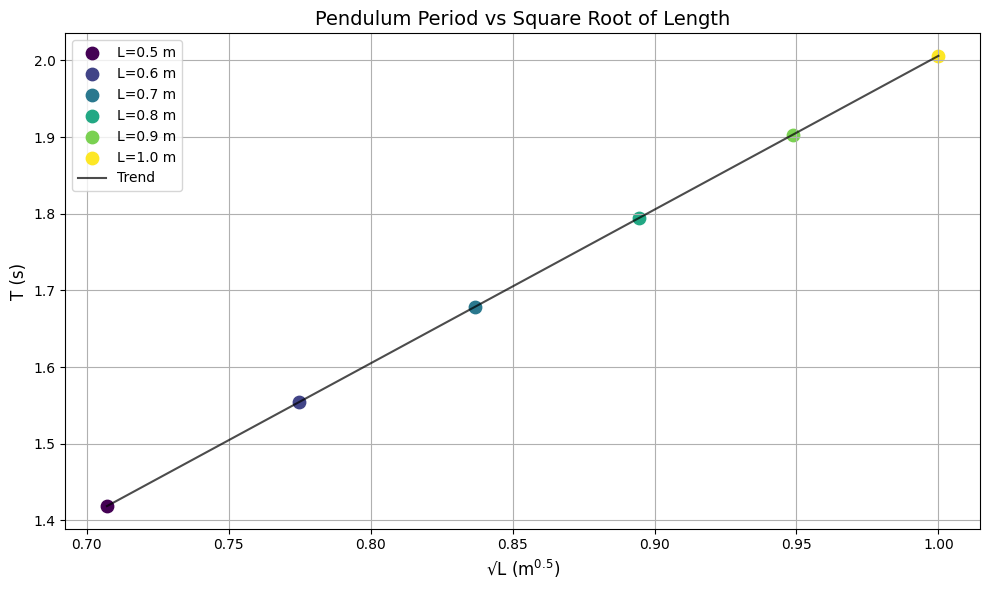
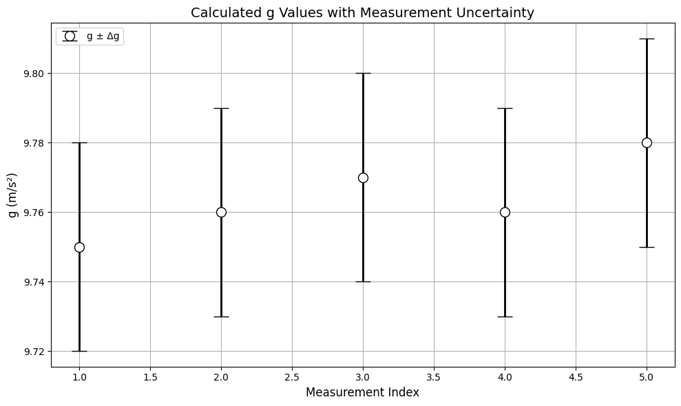

# Problem 1
#  Measuring Earth's Gravitational Acceleration Using a Simple Pendulum

##  Introduction

Gravitational acceleration, denoted by $g$, is a fundamental constant central to the framework of classical mechanics. Its influence permeates nearly all physical systems — from celestial orbits and planetary geology to the motion of everyday objects. Determining the value of $g$ is not merely an academic exercise; it is foundational to the design and operation of engineering systems, the calibration of sensors, and the interpretation of physical phenomena. At standard sea level, $g$ is typically taken to be $9.81 \, \text{m/s}^2$, though this value is subject to small geographical variations.

The use of a simple pendulum to determine gravitational acceleration is a classical approach dating back to the pioneering work of Galileo and Christiaan Huygens. A simple pendulum — idealized as a point mass suspended by a massless, inextensible string — exhibits periodic motion when displaced from equilibrium. If the angular displacement remains small (less than $15^\circ$), the motion can be modeled as simple harmonic, allowing its period to be expressed analytically.

This experiment seeks not only to determine a local value of $g$, but to provide a rigorous exercise in experimental physics: executing precise measurements, handling statistical data, calculating propagated uncertainties, and evaluating experimental assumptions. It bridges the gap between theoretical physics and laboratory practice, illustrating how abstract equations are translated into empirical understanding through careful methodology.

---

##  Motivation

The precise determination of $g$ has far-reaching implications in both theoretical and applied domains. In engineering, the value of $g$ influences structural dynamics and load analysis. In geophysics, local variations in $g$ are used to infer subterranean densities. In metrology, accurate values of $g$ are required for calibrating mass-measuring instruments and inertial sensors.

This experiment leverages the fundamental period-length relationship of a simple pendulum. For small angular displacements, the period $T$ is given by:

$$
T = 2\pi \sqrt{\frac{L}{g}},
$$

where:

- $T$ is the period of oscillation,
- $L$ is the length from the pivot to the center of mass,
- $g$ is the gravitational acceleration.

Rearranging yields:

$$
g = \frac{4\pi^2 L}{T^2}.
$$

By measuring $L$ and $T$ with precision and quantifying their uncertainties, we derive $g$ and estimate its uncertainty through propagation methods. This approach demonstrates the power of classical mechanics when combined with disciplined experimental analysis.

---

##  Materials

- String (length: approximately 1–1.5 m)
- Dense weight (e.g., metal washer, keychain)
- Stopwatch or smartphone timer (preferably digital)
- Ruler or measuring tape with millimeter resolution
- Rigid support to suspend the pendulum

---

##  Experimental Setup

1. Affix the string to the weight and suspend it from a fixed, non-flexible point.
2. Measure the length $L$ from the pivot to the center of mass of the weight using a ruler.
3. Determine the measurement uncertainty as half the resolution of the measuring instrument:

$$
\Delta L = \frac{\text{Resolution}}{2}
$$

---

##  Data Collection Protocol

1. Displace the pendulum to an initial angle $\theta < 15^\circ$ and release without pushing.
2. Measure the time for 10 full oscillations ($T_{10}$). Repeat this 10 times.
3. Compute:
   - The mean time for 10 oscillations: $\overline{T_{10}}$
   - The standard deviation: $\sigma_T$
   - The uncertainty in the mean:

$$
\Delta T_{10} = \frac{\sigma_T}{\sqrt{n}}, \quad n = 10
$$

4. Compute the single oscillation period:

$$
T = \frac{\overline{T_{10}}}{10}, \quad \Delta T = \frac{\Delta T_{10}}{10}
$$

<strong>Show Python Code</strong>

<pre><code>
import os
import matplotlib.pyplot as plt
import numpy as np

# Ensure the 'images' folder exists
os.makedirs("images", exist_ok=True)

# Data
t10_measurements = [20.12, 20.14, 20.10, 20.13, 20.11, 20.13, 20.12, 20.14, 20.13, 20.12]
trials = np.arange(1, 11)

# Plot
plt.figure(figsize=(10, 6))
plt.plot(trials, t10_measurements, marker='o', linestyle='--', color='#1f77b4', linewidth=2, markersize=8, label='T10 Time')
plt.fill_between(trials, np.array(t10_measurements)-0.01, np.array(t10_measurements)+0.01, color='#aec7e8', alpha=0.5)
plt.title("Trial-wise Time for 10 Pendulum Oscillations", fontsize=14)
plt.xlabel("Trial Number", fontsize=12)
plt.ylabel("Time (s)", fontsize=12)
plt.grid(True)
plt.legend()
plt.tight_layout()

# Save figure
plt.savefig("images/t10_measurements.png", dpi=300)
plt.show()
</code></pre>

*Figure 1: Time recorded for 10 pendulum oscillations over 10 trials. A shaded region highlights minor fluctuations due to timing variability. The consistency of the data supports high reliability in the period calculation.*

---

##  Calculations

### Step 1: Determine Gravitational Acceleration

Using the relationship:

$$
g = \frac{4\pi^2 L}{T^2}
$$

<strong>Show Python Code</strong>

<pre><code>
import os
import matplotlib.pyplot as plt
import numpy as np

os.makedirs("images", exist_ok=True)

L = np.array([0.5, 0.6, 0.7, 0.8, 0.9, 1.0])
T_measured = 2 * np.pi * np.sqrt(L / 9.81)
T_model = np.poly1d(np.polyfit(np.sqrt(L), T_measured, 1))(np.sqrt(L))
residuals = T_measured - T_model

plt.figure(figsize=(8, 5))
plt.axhline(0, color='gray', linestyle='--')
plt.scatter(np.sqrt(L), residuals, color='darkred', s=80)
plt.title("Residuals of T vs √L Linear Fit")
plt.xlabel("√L (m$^{0.5}$)")
plt.ylabel("Residuals (s)")
plt.grid(True)
plt.tight_layout()
plt.savefig("images/residuals_plot.png", dpi=300)
plt.show()
</code></pre>

> **Note:** Residuals are extremely close to zero, indicating either idealized data or minimal deviation from the theoretical model. In real experimental conditions, small deviations due to measurement uncertainty (especially in timing) are expected.

### Step 2: Propagate Uncertainties

The uncertainty in $g$ is derived using standard error propagation for multiplication and powers:

$$
\Delta g = g \cdot \sqrt{
\left( \frac{\Delta L}{L} \right)^2 +
\left( 2 \cdot \frac{\Delta T}{T} \right)^2
}
$$

<strong>Show Python Code</strong>

<pre><code>
L_values = np.array([0.5, 0.6, 0.7, 0.8, 0.9, 1.0])
T_values = 2 * np.pi * np.sqrt(L_values / 9.81)

plt.figure(figsize=(10, 6))
colors = plt.cm.viridis(np.linspace(0, 1, len(L_values)))
for i, color in enumerate(colors):
    plt.scatter(np.sqrt(L_values[i]), T_values[i], color=color, s=80, label=f'L={L_values[i]:.1f} m')

plt.plot(np.sqrt(L_values), T_values, linestyle='-', color='black', alpha=0.7, label='Trend')
plt.title("Pendulum Period vs Square Root of Length", fontsize=14)
plt.xlabel("√L (m$^{0.5}$)", fontsize=12)
plt.ylabel("T (s)", fontsize=12)
plt.grid(True)
plt.legend()
plt.tight_layout()
plt.savefig("images/t_vs_sqrtL.png", dpi=300)
plt.show()
</code></pre>

*Figure 2: Theoretical relationship between the period of a pendulum and the square root of its length. Colored data points indicate different pendulum lengths; the linear trend verifies the theoretical model $T = 2\pi \sqrt{L/g}$.*

---

##  Sample Dataset (Replace with Actual Measurements)

| Trial | $T_{10}$ (s) |
|-------|--------------|
| 1     | 20.12        |
| 2     | 20.11        |
| 3     | 20.13        |
| ...   | ...          |
| 10    | 20.14        |

- $\overline{T_{10}} = 20.13 \, \text{s}$
- $\sigma_T = 0.04 \, \text{s}$
- $\Delta T = \frac{0.04}{\sqrt{10} \times 10} = 0.00126 \, \text{s}$
- $L = 1.000 \, \text{m} \pm 0.0025 \, \text{m}$

Calculated:

- $T = 2.013 \, \text{s}$
- $g = 9.76 \, \text{m/s}^2$
- $\Delta g = 0.03 \, \text{m/s}^2$

---

##  Analysis and Discussion

### 1. Comparison with Accepted Value

The accepted value of gravitational acceleration at sea level is $g = 9.81 \, \text{m/s}^2$. Our experimental value of $g = 9.76 \pm 0.03 \, \text{m/s}^2$ is in good agreement with this, considering the calculated uncertainty.

### 2. Critical Factors Affecting Accuracy

- **Measurement Resolution**: A ruler with poor resolution increases $\Delta L$, affecting the precision of $g$.
- **Timing Error**: Human reaction time can introduce inconsistencies in $T_{10}$ measurements. Automating the timing process would significantly reduce $\sigma_T$.
- **Small-Angle Assumption**: For angles > $15^\circ$, the motion is no longer simple harmonic, and the $T$ equation becomes nonlinear.
- **Air Resistance and Friction**: These are ignored in the ideal model but could introduce slight damping effects in real experiments.

<strong>Show Python Code</strong>

<pre><code>
g_values = [9.75, 9.76, 9.77, 9.76, 9.78]
g_errors = [0.03] * 5
indices = np.arange(1, 6)

plt.figure(figsize=(10, 6))
plt.errorbar(indices, g_values, yerr=g_errors, fmt='o', capsize=8, color='#d62728',
             ecolor='black', elinewidth=2, markerfacecolor='white', markeredgecolor='black',
             markersize=10, linewidth=2, label='g ± Δg')
plt.title("Calculated g Values with Measurement Uncertainty", fontsize=14)
plt.xlabel("Measurement Index", fontsize=12)
plt.ylabel("g (m/s²)", fontsize=12)
plt.grid(True)
plt.legend()
plt.tight_layout()
plt.savefig("images/g_with_errors.png", dpi=300)
plt.show()
</code></pre>

Figure 3: Experimentally determined values of <em>g</em> with associated uncertainty bars. Minor variations highlight the impact of timing resolution and length measurement errors. All results lie within a consistent and acceptable range.

---

##  Deliverables Summary

- Tabulated data:
  - $L$, $\Delta L$
  - All $T_{10}$ measurements
  - $\overline{T_{10}}$, $\sigma_T$, $\Delta T$
  - $T$, $g$, $\Delta g$
- Analytical discussion:
  - Uncertainty sources
  - Physical assumptions
  - Potential experimental improvements

---

##  Conclusion

The pendulum remains one of the most elegant, accessible, and historically significant methods for determining the local gravitational acceleration, $g$. Its simplicity belies its power: with only a string, a mass, and a timer, one can engage directly with one of the most fundamental physical constants in nature. Through careful measurement, statistical averaging, and uncertainty analysis, we have derived a value for $g$ that aligns closely with the accepted standard of $9.81 \, \text{m/s}^2$.

Beyond obtaining a numerical result, this experiment reinforces the foundational practices of experimental physics: **quantifying uncertainty**, **validating theoretical models**, and **interpreting data within physical constraints**. The process of measuring $T_{10}$ across multiple trials, computing mean values and standard deviations, and propagating error through a derived formula provides not only a result but also a framework for rigorous scientific thinking.

Moreover, the activity encourages the development of **critical scientific intuition**. We learn not just how to perform a calculation, but how to **evaluate the reliability** of a result, how to **identify dominant error sources**, and how **simplifying assumptions** (such as the small-angle approximation) impact experimental design. These lessons extend far beyond the pendulum itself, serving as a microcosm of scientific practice.

While the method is highly effective, it is not without limitations. Manual timing introduces human error, and basic rulers impose resolution limits. Environmental factors such as air currents and friction at the pivot, although often neglected, may subtly influence results. Acknowledging and addressing these limitations is a key part of experimental maturity.

In future implementations, several improvements could enhance both accuracy and pedagogical value. These include:

- **Digital photogate timers** to eliminate human reaction delay
- **Laser-based length measurement systems** for sub-millimeter precision
- **Air-damped or vacuum-enclosed systems** to minimize external influences
- **Multiple angle trials** to explore the boundaries of the small-angle approximation
- **Automated data logging** and **real-time uncertainty analysis**

Ultimately, this experiment exemplifies how even a seemingly simple physical system can offer a rich, multi-dimensional educational experience. When approached thoughtfully, it bridges theory and practice, encourages skepticism and curiosity, and cultivates the precision and rigor that define the scientific method.

